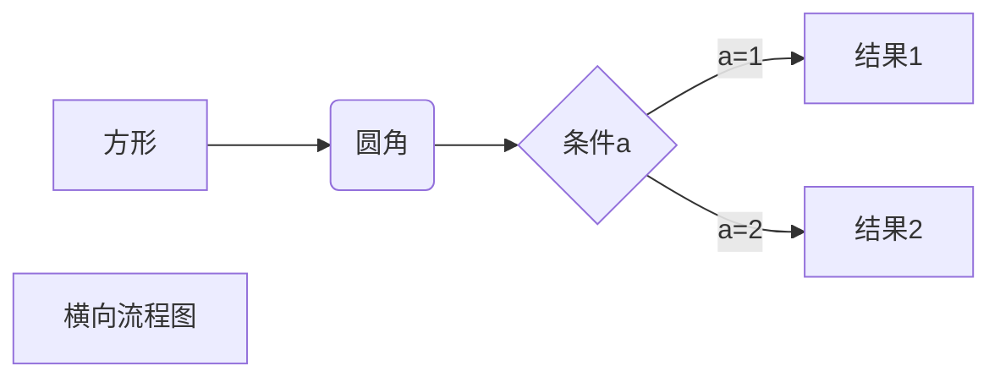

---
区域元素
---

新的元素

新的元素

新的元素<br/>新的一行

# 一级的标题

## 二级的标题

### 三级的标题

#### 四级的标题

##### 五级的标题

###### 六级的标题

*这是斜体的字体*

**这是加粗的字体**

~~这是删除的文字~~

<u>这是下划线</u>

==这是高亮==

```C++
cout<<"Hello world"<<endl;
```

在这段文字中间`cout<<"你好，世界！"<<endl;`有一段代码
$$
\lim_{x\to\infty}\exp(-x)=0
$$

H~2~O，这是~下~标

y^2^=4,这是^上^标

:smile::cry:

:see_no_evil:

| 第一列 | 第二列 |
| :----: | :----: |
|        |        |
|        |        |


---


***

> 引用~~借鉴~~

> 再引用
>
> >嵌套引用

1. 第一项

2. > 在列表里引用

>引用1

> 引用2

> ​    
>
> ```c++
> cout<<"嵌套"<<endl;
> ```


创建脚注格式类似这样[^RUNOOB]

[^这就是]: 这就是脚注

* 第一项

* 第二项

* 第三项
  + 第一项
    + 第二项 
      + 第三项

* 第一项

  > 缩进空格
  >
  > 四个空格

* 第二项

[typora](https://www.typora.io/)

<https://www.typora.io/>

这个链接用 1 作为网址变量[typora][1]

[1]: https://www.typora.io/

![alt 随便截的一张图]

这个链接用1作为网址变量[截图][1]

然后在文档的结尾为变量赋值（网址）

[1]: 

