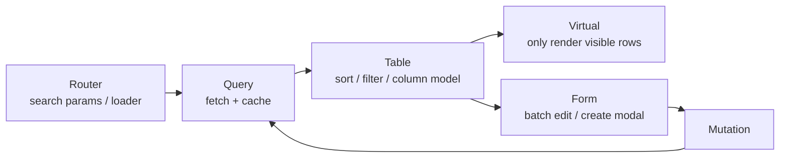

<div class="text-5xl font-bold gradient-text mb-6">
TanStack 全家桶技术分享
</div>

<div class="text-xl opacity-80 mb-10">
“从路由、服务端状态到表格与表单，把 React 应用的核心地基拆成一套可组合工具箱”
</div>

<div class="grid grid-cols-3 gap-6 max-w-5xl mx-auto">
  <div v-click="1" class="tech-card text-center float-animation" transition duration-500 forward:delay-0>
    <div class="text-4xl mb-3">🚀</div>
    <div class="font-mono text-sm">TanStack Start</div>
  </div>
  <div v-click="1" class="tech-card text-center float-animation" transition duration-500 forward:delay-200>
    <div class="text-4xl mb-3">🧭</div>
    <div class="font-mono text-sm">Router</div>
  </div>
  <div v-click="1" class="tech-card text-center float-animation" transition duration-500 forward:delay-400>
    <div class="text-4xl mb-3">⚡</div>
    <div class="font-mono text-sm">Query</div>
  </div>
  <div v-click="1" class="tech-card text-center float-animation" transition duration-500 forward:delay-600>
    <div class="text-4xl mb-3">🧱</div>
    <div class="font-mono text-sm">Table</div>
  </div>
  <div v-click="1" class="tech-card text-center float-animation" transition duration-500 forward:delay-800>
    <div class="text-4xl mb-3">📝</div>
    <div class="font-mono text-sm">Form</div>
  </div>
  <div v-click="1" class="tech-card text-center float-animation" transition duration-500 forward:delay-1000>
    <div class="text-4xl mb-3">📏</div>
    <div class="font-mono text-sm">Virtual</div>
  </div>
</div>

<div class="abs-br m-6 flex gap-2 opacity-70">
  <div class="text-sm">cycleccc</div>
  <div class="text-sm">•</div>
  <div class="text-sm">2026-03-06</div>
</div>

<!--
- 开场先定调：今天不是“安利一个新框架”，而是讲 TanStack 如何把 React 里最难管的几层拆开治理。
- 自我介绍一句即可，然后给听众预期：大约 20 到 30 分钟，偏实践，不展开源码细节。
- 点出这次核心收益：判断“我们该上哪一层”，而不是“要不要全上”。
- 过渡：下一页先给今天路线图，避免后面信息量太大跟丢。
-->

---
layout: center
---

# 今天聊什么

<div class="grid grid-cols-2 gap-6 max-w-5xl mx-auto mt-10">
  <div v-click="1" class="glass p-6 rounded-2xl" transition duration-500 forward:delay-0>
    <div class="text-lg font-semibold mb-1">🧭 产品地图</div>
    <div class="text-sm opacity-75">TanStack 到底不只是 Query</div>
  </div>
  <div v-click="1" class="glass p-6 rounded-2xl" transition duration-500 forward:delay-200>
    <div class="text-lg font-semibold mb-1">🏗️ 核心分层</div>
    <div class="text-sm opacity-75">路由、异步状态、视图模型、交互层</div>
  </div>
  <div v-click="1" class="glass p-6 rounded-2xl" transition duration-500 forward:delay-400>
    <div class="text-lg font-semibold mb-1">🧩 组合方式</div>
    <div class="text-sm opacity-75">Start / Router / Query / Table / Form / Virtual</div>
  </div>
  <div v-click="1" class="glass p-6 rounded-2xl" transition duration-500 forward:delay-600>
    <div class="text-lg font-semibold mb-1">📌 落地建议</div>
    <div class="text-sm opacity-75">什么时候值得上，什么时候不要硬上</div>
  </div>
</div>

<!--
- 先快速扫一遍四个模块：是什么、为什么、怎么组合、怎么落地。
- 提醒听众：中间会穿插“适用边界”，不只讲优点，避免会后直接盲目 all in。
- 这页控制在 30 秒内，作用是建立导航感。
- 过渡：先回答“TanStack 到底是什么”，把概念边界定清楚。
-->

---
layout: center
---

# 什么是 TanStack 全家桶？

<v-clicks>

- 它不是“一整个大框架”，而是一组 **可独立采用、也可叠加组合** 的工具。
- 最常被认到的是 **TanStack Query**，但现在主线已经扩展到多条产品线。
- **Start**：全栈 React 框架入口
- **Router / Query**：页面导航与服务端状态
- **Table / Form / Virtual**：复杂界面模型层
- **Store / Pacer / DB / Devtools / Config**：补强本地状态、交互节奏、数据建模与调试体验

</v-clicks>

<!--
- 重点句：TanStack 不是一个“替你做完所有事”的框架，而是一组可拆可合的引擎。
- 可以强调“按层引入”：先 Query，后续按复杂度补 Router/Table/Form/Virtual。
- 听众常见误解是“TanStack 就是 Query”，这里明确它已经是产品族。
- 过渡：既然可以只用一部分，为什么很多团队会继续扩到全家桶。
-->

---
layout: center
---

# 为什么很多团队会从 Query 继续扩到全家桶？

<div class="grid grid-cols-2 gap-6 max-w-5xl mx-auto mt-10">
  <div v-click="1" class="glass p-6 rounded-2xl" transition duration-500 forward:delay-0>
    <div class="text-lg font-semibold mb-2">✅ 心智统一</div>
    <div class="text-sm opacity-80 leading-relaxed">
      路由、缓存、表格、表单都走 headless + typesafe 的同一套设计语言，团队切换成本低。
    </div>
  </div>
  <div v-click="1" class="glass p-6 rounded-2xl" transition duration-500 forward:delay-200>
    <div class="text-lg font-semibold mb-2">🧷 组合灵活</div>
    <div class="text-sm opacity-80 leading-relaxed">
      不强绑 UI 组件库，不强绑后端协议；你可以接 React、接 design system、接 REST / GraphQL / tRPC。
    </div>
  </div>
  <div v-click="1" class="glass p-6 rounded-2xl" transition duration-500 forward:delay-400>
    <div class="text-lg font-semibold mb-2">⚡ 性能默认值更好</div>
    <div class="text-sm opacity-80 leading-relaxed">
      缓存、预取、虚拟列表、按需渲染都不是“后补救”，而是被设计进日常开发流。
    </div>
  </div>
  <div v-click="1" class="glass p-6 rounded-2xl" transition duration-500 forward:delay-600>
    <div class="text-lg font-semibold mb-2">🛡️ 复杂场景更稳</div>
    <div class="text-sm opacity-80 leading-relaxed">
      真正吃到红利的通常不是 demo，而是搜索页、数据表格页、运营后台、长表单、无限列表这类麻烦场景。
    </div>
  </div>
</div>

<!--
- 逐点解释“为什么会扩”：统一心智、自由组合、性能默认值、复杂场景稳定性。
- 可加一个团队痛点例子：同一页面同时有 URL 状态、缓存状态、表格状态时，分散方案容易互相打架。
- 强调“红利发生在复杂页面，不在 demo 页面”。
- 过渡：下一页用分层图把这些能力放到统一坐标系里。
-->

---
layout: two-cols-header
---

# 一张图看懂 TanStack 的分层

::left::

<div class="space-y-4 mt-8">
  <div v-click="1" class="stack-layer">
    <div class="text-sm uppercase tracking-wide opacity-60 mb-2">App Shell</div>
    <div class="text-2xl font-strong gradient-text">Start / Router</div>
    <div class="text-sm opacity-80 mt-2">页面组织、URL 状态、loader、SSR / streaming 入口</div>
  </div>
  <div v-click="1" class="stack-layer">
    <div class="text-sm uppercase tracking-wide opacity-60 mb-2">Async State</div>
    <div class="text-2xl font-strong gradient-text">Query</div>
    <div class="text-sm opacity-80 mt-2">请求、缓存、失效、重试、预取、乐观更新</div>
  </div>
  <div v-click="1" class="stack-layer">
    <div class="text-sm uppercase tracking-wide opacity-60 mb-2">View Models</div>
    <div class="text-2xl font-strong gradient-text">Table / Form / Virtual</div>
    <div class="text-sm opacity-80 mt-2">复杂组件不再塞业务逻辑，模型层和 UI 层分离</div>
  </div>
</div>

::right::

<div class="grid grid-cols-2 gap-4 mt-8">
  <div v-click="1" class="tech-card">
    <div class="text-lg font-semibold mb-2">Store / Pacer</div>
    <div class="text-sm opacity-80">本地状态与交互节奏控制，给界面层粘合剂补位</div>
  </div>
  <div v-click="1" class="tech-card">
    <div class="text-lg font-semibold mb-2">DB / Config / Devtools</div>
    <div class="text-sm opacity-80">更靠近数据建模、工程配置和可视化调试的扩展层</div>
  </div>
  <div v-click="2" class="glass p-5 rounded-2xl col-span-2">
    <div class="text-lg font-semibold mb-2">一句话</div>
    <div class="text-sm opacity-80 leading-relaxed">
      TanStack 想做的不是“再造一个 UI 框架”，而是把 <span class="font-mono">应用骨架</span>、<span class="font-mono">数据流</span>、<span class="font-mono">复杂控件模型</span> 抽成一套可复用引擎。
    </div>
  </div>
</div>

<!--
- 讲图顺序建议：先左侧三层主干，再右侧补强层，最后落到“一句话”。
- 强调分层价值：每层只处理自己负责的复杂度，避免一个库硬扛所有问题。
- 可提示听众：这张图是后面每个模块的索引页，迷路时回看这一层次。
- 过渡：先从最上层开始，Start 和 Router 负责应用骨架。
-->

---
layout: two-cols-header
---

# Start + Router：先把应用骨架搭稳

::left::

<v-clicks>

- **TanStack Start**：把 Router、服务端函数、SSR/streaming 这些入口封在一起。
- **TanStack Router**：强类型路由、参数校验、search state、loader、预加载。
- 如果你已经有 React SPA，通常可以 **先上 Router，再考虑 Start**。
- 如果你要新开一个中后台 / 内容平台，Start 是更顺手的起点。

</v-clicks>

::right::

```txt
URL
 ↓
Router
 ↓  loader / params / search
Query Cache
 ↓
Page / Layout / Components
```

<!--
- 先区分 Start 与 Router：Router 是能力核心，Start 是把 SSR/服务端函数等组合好的项目入口。
- 存量 SPA 的建议：先迁 Router，收益来自类型化路由与 search params 管理。
- 新项目建议：直接 Start 起步，减少自己拼 SSR/路由/数据入口的样板。
- 过渡：骨架有了，下一层是 Query，处理服务端状态生命周期。
-->

---
layout: two-cols-header
---

# Query：服务端状态不是本地 state

::left::

<div class="grid grid-cols-2 gap-4 mt-8">
  <div v-click="1" class="tech-card">
    <div class="text-lg font-semibold mb-2 signal-good">缓存</div>
    <div class="text-sm opacity-80">query key、stale time、gc time</div>
  </div>
  <div v-click="1" class="tech-card">
    <div class="text-lg font-semibold mb-2 signal-good">请求状态</div>
    <div class="text-sm opacity-80">loading / error / success / fetching</div>
  </div>
  <div v-click="2" class="tech-card">
    <div class="text-lg font-semibold mb-2 signal-good">预取</div>
    <div class="text-sm opacity-80">hover、router loader、进入前预热</div>
  </div>
  <div v-click="2" class="tech-card">
    <div class="text-lg font-semibold mb-2 signal-good">更新策略</div>
    <div class="text-sm opacity-80">invalidate、mutation、optimistic update</div>
  </div>
</div>

::right::

```ts
const usersQuery = useQuery({
  queryKey: ['users', filters],
  queryFn: () => fetchUsers(filters),
  staleTime: 30_000,
})

const updateUser = useMutation({
  mutationFn: patchUser,
  onSuccess: () => {
    queryClient.invalidateQueries({ queryKey: ['users'] })
  },
})
```

<!--
- 重点讲“服务端状态 != 本地 state”：它有时效、并发、失败重试和一致性问题。
- 结合代码强调三个动作：定义 queryKey、设置 staleTime、mutation 后失效回刷。
- 可以提醒：不要把 Query 当全局 store；它解决的是 server state，不是 UI 临时状态。
- 过渡：拿到数据后，复杂表格逻辑交给 Table，而不是塞进组件。
-->

---
layout: two-cols-header
---

# Table：把“表格逻辑”从 UI 组件里拆出去

::left::

<v-clicks>

- TanStack Table 是 **headless datagrid engine**，不负责长相，只负责模型。
- 排序、筛选、分页、分组、列显隐、行选择，都可以独立启用。
- 非常适合接公司自己的 design system，而不是被现成 table UI 绑死。
- 复杂后台越复杂，越能体现值。

</v-clicks>

::right::

```ts
const table = useReactTable({
  data,
  columns,
  getCoreRowModel: getCoreRowModel(),
  getSortedRowModel: getSortedRowModel(),
  getPaginationRowModel: getPaginationRowModel(),
})
```

<!--
- 关键定义：Table 是 headless 模型层，不负责 UI 长相，所以能无缝接公司 design system。
- 可强调收益：排序、筛选、分页、列状态这些逻辑从 JSX 里抽离后，可测性和复用性明显提升。
- 听众常问“是不是过重”：如果只是 10 行静态表，不值得；复杂后台才显著受益。
- 过渡：除了表格，表单与交互节奏也需要各司其职的模型层。
-->

---
layout: two-cols-header
---

# Form / Store / Pacer：把交互细节补齐

::left::

<div class="grid grid-cols-1 gap-4 mt-8">
  <div v-click="1" class="glass p-5 rounded-2xl">
    <div class="text-lg font-semibold mb-2">Form</div>
    <div class="text-sm opacity-80">字段状态、校验、提交过程抽离出来，适合长表单和动态表单。</div>
  </div>
  <div v-click="2" class="glass p-5 rounded-2xl">
    <div class="text-lg font-semibold mb-2">Store</div>
    <div class="text-sm opacity-80">轻量本地状态，适合 UI 级共享信息，不要拿它替代 Query。</div>
  </div>
  <div v-click="3" class="glass p-5 rounded-2xl">
    <div class="text-lg font-semibold mb-2">Pacer</div>
    <div class="text-sm opacity-80">给搜索、联想、批量操作这类高频交互兜住节流与批处理节奏。</div>
  </div>
</div>

::right::

<v-clicks>

- **Query 管服务端状态**
- **Store 管本地界面状态**
- **Form 管输入与校验过程**
- **Pacer 管高频触发节奏**

</v-clicks>

<!--
- 这页的目标是“边界划分”：Query、Store、Form、Pacer 各自解决不同维度的问题。
- 可以用一句口令帮助记忆：远端数据给 Query，界面共享给 Store，输入流程给 Form，高频触发给 Pacer。
- 反模式提醒：不要用 Store 缓存接口结果，也不要把复杂校验散落在组件事件里。
- 过渡：边界清楚后，性能层面通常最后补 Virtual。
-->

---
layout: two-cols-header
---

# Virtual：性能问题要前置解决

::left::

<v-clicks>

- 长列表、超长表格、日志流、聊天记录都不是“分页就完事”。
- TanStack Virtual 让渲染窗口只保留用户此刻看得到的部分。
- 通常和 Table 搭配最有价值，尤其是万级行数的后台页面。
- 如果数据量不大，不要为了技术完整度硬上虚拟化。

</v-clicks>

::right::

```ts
const rowVirtualizer = useVirtualizer({
  count: rows.length,
  getScrollElement: () => parentRef.current,
  estimateSize: () => 42,
  overscan: 8,
})
```

<!--
- 强调 Virtual 的定位：它是性能工具，不是必选项，先量化瓶颈再引入。
- 举例触发条件：万级行表格、无限滚动日志、聊天历史长列表。
- 落地提醒：`estimateSize` 和 `overscan` 需要按业务调参，动态高度场景要额外处理。
- 过渡：下一页给一个真实后台页面的组合路径，把前几页串起来。
-->

---
layout: center
---

# 一套典型组合：后台搜索页 / 数据运营页



<!--
- 按箭头讲解一次完整闭环：Router 读 URL 条件，Query 拉数据，Table 建模型，Virtual 控渲染，Form + Mutation 回写，再触发 Query 更新。
- 这页适合加一个操作故事：筛选用户、批量编辑、提交后列表自动刷新且保留筛选条件。
- 让听众看到“组合不是堆库”，而是职责分层后的协作链路。
- 过渡：理解组合后，再看什么时候值得引入这套体系。
-->

---
layout: center
---

# 什么时候值得上 TanStack 全家桶？

<div class="grid grid-cols-2 gap-6 max-w-6xl mx-auto mt-10">
  <div v-click="1" class="glass p-6 rounded-2xl">
    <div class="text-lg font-semibold mb-3 signal-good">适合</div>
    <ul class="text-sm opacity-80 leading-relaxed space-y-2">
      <li>搜索页、列表页、复杂后台、强交互运营平台</li>
      <li>团队愿意接受 headless 方案，自己掌控 UI</li>
      <li>你很在意类型、安全重构和复杂状态一致性</li>
    </ul>
  </div>
  <div v-click="1" class="glass p-6 rounded-2xl">
    <div class="text-lg font-semibold mb-3 signal-hot">不必强上</div>
    <ul class="text-sm opacity-80 leading-relaxed space-y-2">
      <li>营销官网、简单表单页、静态内容页</li>
      <li>团队只想快出页面，不想维护模型层</li>
      <li>页面复杂度太低，用原生 React 就够</li>
    </ul>
  </div>
</div>

<div v-click="2" class="mt-10 text-sm opacity-75">
  关键不是“全上才高级”，而是 <span class="font-mono">哪一层复杂，才在哪一层引入 TanStack</span>。
</div>

<!--
- 先读“适合”列：复杂列表、复杂交互、重类型安全团队。
- 再读“不必强上”列：低复杂页面、追求极速交付、缺少模型层维护意愿的场景。
- 关键句务必停顿：复杂度在哪一层，就在哪一层引入，不追求技术整齐。
- 过渡：如果决定上，下一页给建议的实施顺序。
-->

---
layout: center
---

# 推荐落地顺序

<div class="flex flex-wrap gap-4 justify-center mt-12">
  <div v-click="1" class="ecosystem-chip">1. 先上 Query</div>
  <div v-click="2" class="ecosystem-chip">2. 列表复杂了上 Table</div>
  <div v-click="3" class="ecosystem-chip">3. 路由状态复杂了上 Router</div>
  <div v-click="4" class="ecosystem-chip">4. 长表单再上 Form</div>
  <div v-click="5" class="ecosystem-chip">5. 性能瓶颈再上 Virtual</div>
  <div v-click="6" class="ecosystem-chip">6. 新项目再考虑 Start</div>
</div>

<div class="glass p-6 rounded-2xl max-w-4xl mx-auto mt-10" v-click="7">
  <div class="text-lg font-semibold mb-2">为什么是这个顺序？</div>
  <div class="text-sm opacity-80 leading-relaxed">
    Query 最通用、回报也最稳定；Table / Router / Form / Virtual 更像针对复杂页面的增量武器。Start 则更适合新项目从零定基线。
  </div>
</div>

<!--
- 这页给“实施策略”：从通用且收益稳定的 Query 起步，逐步加能力，不做一次性架构重写。
- 可以补一个节奏建议：先挑一个高价值页面试点，跑通后再沉淀脚手架和规范。
- 例外说明：如果是全新项目且确定 SSR/全栈诉求强，可以把 Start 前置。
- 过渡：最后一页小结，把决策框架收拢成三句话。
-->

---
layout: center
---

# 小结

<v-clicks>

- **TanStack 不只是 Query，而是一套应用层引擎集合**
- **核心价值不是“统一 UI”，而是统一复杂状态与复杂交互的建模方式**
- **最实用的采用策略不是 All in，而是从 Query 开始，按复杂度逐层叠加**
- **真正吃到红利的场景，往往是复杂中后台和数据密集型页面**

</v-clicks>

<!--
- 小结按“是什么、价值、方法、场景”四句收口，和开头形成闭环。
- 建议加一个行动项：会后可选一个现有复杂列表页做 Query + Table 试点。
- 如果时间超时，这页只保留前两句和“按复杂度引入”即可。
- 过渡：进入 Q&A，优先回答迁移成本、团队学习曲线和落地顺序相关问题。
-->

---
layout: center
---

# Q & A

<div class="text-2xl opacity-80 mt-8">
谢谢大家
</div>

<!--
- Q&A 可优先抛三个引导问题：
  1) 现有项目从哪里切入最稳？
  2) Query 与状态管理库如何分工？
  3) Table 和现有组件库如何集成？
- 若现场冷场，可回到“按复杂度分层引入”的主线，邀请大家带具体页面来讨论。
-->
