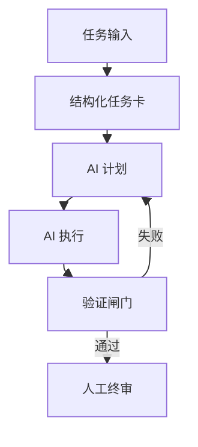

AI Agent Workflow / Fullstack Delivery

AI 全栈接管工作流分享

从“AI 辅助开发”升级到“AI 默认接管，人类做方向与验收”

  

    
Plan

    
Plan First

  

  

    
Exec

    
Agent Execute

  

  

    
Gate

    
Gate Verify

  

  

    
Judge

    
Human Judge

  

  
cycleccc

  
•

  
2026-04-26

<!--
开场先定调：今天讲的不是“怎么提效”，而是“怎么接管”。
四个词 Plan/Exec/Gate/Judge 就是整场主线，后面每一页都围绕它展开。
这页控制在 30 秒，快速拉齐预期。
-->

---
layout: center
---

# 先定一个核心问题

  

    
这件事为什么还不能被 AI 全流程接管？

    

      从这个问题出发，反推流程缺口、工具缺口、验证缺口。
    

  

<v-clicks>

- 不是“哪里能用 AI”，而是“哪里必须人做”。
- 目标不是写更快，而是把研发变成可委托流水线。
- 人从执行者切到：任务定义者 + 守门员。

</v-clicks>

<!--
这一页是价值观锚点，后面的方法论都来自这一个问题。
可以用一句话强调：把“能不能做”换成“为什么还做不了”。
讲完后过渡到“先改环境和工具”。
-->

---
layout: center
---

# 我的环境选择：为什么是 WSL

  

    
Windows + PowerShell 的痛点

    <ul class="text-sm opacity-80 leading-relaxed space-y-2">
      <li>命令组合与自动化脚本不够顺手</li>
      <li>跨工具链衔接成本高</li>
      <li>对 Agent 的“可执行性”不友好</li>
    </ul>
  

  

    
切到 WSL 后的变化

    <ul class="text-sm opacity-80 leading-relaxed space-y-2">
      <li>Linux CLI 可覆盖几乎所有研发动作</li>
      <li>脚本化 + 编排更自然，Agent 接管率更高</li>
      <li>系统任务和开发任务统一在一套终端流里</li>
    </ul>
  

<!--
这里建议加你个人对比体验，不讲抽象优劣。
核心结论：接管率先受环境限制，不先统一命令流，AI 很难稳定接管。
时长 40-50 秒。
-->

---
layout: center
---

# 工具分工：按任务类型选战场

  

    
日常系统任务

    
例如清理 C 盘：让 AI 扫描、分析、执行，不再手动点软件

  

  

    
主开发流程

    
WSL + Codex CLI：默认入口，覆盖需求拆解到代码落地

  

  

    
复杂前端例外

    
VSCode 插件 + Playwright，更适合可视化回放和截图迭代

  

  结论：不是一个工具打天下，而是针对任务类型切换“最易接管”的工作面。

<!--
这页要把“工具崇拜”转成“任务导向分工”。
强调你不是只用 CLI，也不是只用 IDE，而是分层组合。
-->

---
layout: center
---

# 接管边界：四类任务怎么分

  

    
后端开发

    
默认 AI Agent 端到端执行

  

  

    
Bug 修复

    
默认 AI Agent 主导，人工做回归确认

  

  

    
基建/工程化

    
高标准化任务，最适合批量接管

  

  

    
复杂前端交互

    
目前是主要瓶颈：AI 实现 80%，人做体验裁决

  

  
当前接管热力（主观评估）

  

<!--
这里给出你的“接管边界地图”。
接管不是全-or-无，而是可量化边界。
如果现场有人问“你是不是太激进”，用这页回应：我有边界，不是盲目自动化。
-->

---
layout: center
---

# 真实案例：重构 ai-studio 的两周

  

    
不是卡在代码量

    
业务逻辑和接口实现并非主障碍

  

  

    
卡在像素级复刻

    
复杂 UI 状态和交互细节难以一次到位

  

  

    
结论

    
AI 瓶颈正在从“写代码”转向“精细体验还原”

  

  这次复盘最重要的产出不是“写完重构”，而是明确了下一步应该优先攻克的接管瓶颈。

<!--
这是全场最有说服力的一页，用真实经历替代抽象口号。
讲清楚两周里时间消耗在哪里，听众就会理解为什么你强调前端复杂交互是瓶颈。
-->

---
layout: center
---

# 工作流 v2：让 AI 真正可接管

  

    
STEP 1

    
Plan：先写 Goal / Context / Constraints / Done-When

  

  

    
STEP 2

    
Execute：agent 先给计划，再执行编码

  

  

    
STEP 3

    
Verify：类型检查、测试、构建、截图对比做硬闸门

  

  

    
STEP 4

    
Accept：只在人必须判断的地方做人工验收

  

<!--
这是“方法论落地页”，建议慢一点讲。
要强调 Verify 是中枢，不是附属步骤。
听众如果只带走一页，就该是这页。
-->

---
layout: center
---

# 附：怎么让 AI 用 Playwright 接管任务

  

    
1. 先给 AI 明确目标页

    
告诉它要对齐的页面、关键模块和优先级，先做结构和状态对齐，再做细节。

  

  

    
2. 让 AI 自己跑一遍用户路径

    
按真实用户步骤走流程，记录每一步结果和失败点，不要只看最终页面。

  

  

    
3. 每次功能完成都做点击回归

    
固定检查关键路径：进入、输入、提交、结果反馈，确保新功能没破坏主流程。

  

  

    
4. 每次修 bug 都沉淀为长期检查

    
把这次问题转成可重复验证项，下次同类改动自动检查，避免回归。

  

  你的角色：定义验收标准和关键路径；AI 的角色：执行浏览器操作、产出证据、反复修到通过。

<!--
这页只做补充，不打断主线。
-->

---
layout: center
---

# 现在就能落地的 3 个优化

  

    
1. 任务卡模板化

    
不再“口头描述需求”，全部结构化输入 agent

  

  

    
2. 建立验收闸门

    
测试/类型检查/截图对比不过，就不算完成

  

  

    
3. 维护接管清单

    
持续更新“已可全接管 / 部分接管 / 暂不接管”任务池

  

<!--
这页是行动清单，讲法尽量“明天就能做”。
每一点都可以给一句你自己的当前实践状态。
-->

---
layout: center
---

# 结束页：一句话带走

  

    

      默认让 AI 接管，持续缩小“必须人做”的范围。
    

    

      人类工程师的核心价值，正在转向：定义问题、设置约束、构建验证系统、做最终裁决。
    

  

Q&A

<!--
收尾不要再展开新信息，回到开场主张形成闭环。
最后停 2 秒进入问答。
-->
