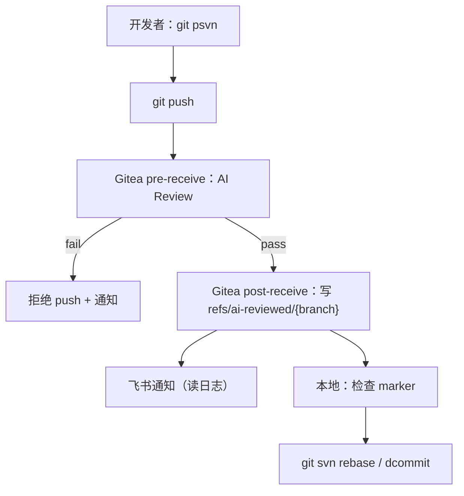

<div class="text-5xl font-bold gradient-text mb-6">
AI Review + Git/SVN 推行方案
</div>

<div class="text-xl opacity-80 mb-10">
用 <span class="font-mono">Gitea hooks</span> 做提交质量门禁，用 <span class="font-mono">refs/ai-reviewed/*</span> 解决“通过标记”，再无缝同步 SVN
</div>

<div class="grid grid-cols-4 gap-6 max-w-5xl mx-auto">
  <div v-click="1" class="tech-card text-center float-animation" transition duration-500 forward:delay-0>
    <div class="text-4xl mb-3">🛡️</div>
    <div class="font-mono text-sm">pre-receive 门禁</div>
  </div>
  <div v-click="1" class="tech-card text-center float-animation" transition duration-500 forward:delay-200>
    <div class="text-4xl mb-3">🏷️</div>
    <div class="font-mono text-sm">marker refs</div>
  </div>
  <div v-click="1" class="tech-card text-center float-animation" transition duration-500 forward:delay-400>
    <div class="text-4xl mb-3">🔔</div>
    <div class="font-mono text-sm">飞书通知</div>
  </div>
  <div v-click="1" class="tech-card text-center float-animation" transition duration-500 forward:delay-600>
    <div class="text-4xl mb-3">🔁</div>
    <div class="font-mono text-sm">git-svn 同步</div>
  </div>
</div>

<div class="abs-br m-6 flex gap-2 opacity-60">
  <div class="text-sm">cycleccc</div>
  <div class="text-sm">•</div>
  <div class="text-sm">2025</div>
</div>

---
layout: center
---

# 关键结论（开场）

<div class="grid grid-cols-2 gap-6 max-w-5xl mx-auto mt-10">
  <div v-click="1" class="glass p-6 rounded-2xl" transition duration-500 forward:delay-0>
    <div class="text-lg font-semibold mb-2">✅ 质量门禁：不合格 push 直接拒绝</div>
    <div class="text-sm opacity-80 leading-relaxed">
      通过 <span class="font-mono">pre-receive</span> 执行 AI Review；只有 <span class="font-mono">CONFIRMED</span> 明确问题才能拒绝。
    </div>
  </div>
  <div v-click="1" class="glass p-6 rounded-2xl" transition duration-500 forward:delay-200>
    <div class="text-lg font-semibold mb-2">🏷️ “通过标记”：写到独立 ref</div>
    <div class="text-sm opacity-80 leading-relaxed">
      <span class="font-mono">post-receive</span> 写 <span class="font-mono">refs/ai-reviewed/&lt;branch&gt;</span>，绕过 quarantine 阶段不可写 refs 的限制。
    </div>
  </div>
  <div v-click="1" class="glass p-6 rounded-2xl" transition duration-500 forward:delay-400>
    <div class="text-lg font-semibold mb-2">🔁 Git Push 后自动同步 SVN</div>
    <div class="text-sm opacity-80 leading-relaxed">
      本地 wrapper：push 成功后自动 <span class="font-mono">git svn rebase/dcommit</span>，作者仍是本人。
    </div>
  </div>
  <div v-click="1" class="glass p-6 rounded-2xl" transition duration-500 forward:delay-600>
    <div class="text-lg font-semibold mb-2">📊 评分归一化：避免 0/100 两极</div>
    <div class="text-sm opacity-80 leading-relaxed">
      评分主要用于展示/通知；判定以规则为准（<span class="font-mono">minScore</span> + <span class="font-mono">CONFIRMED</span>）。
    </div>
  </div>
</div>

---
layout: center
---

# 背景与目标

<div class="grid grid-cols-3 gap-8 max-w-6xl mx-auto mt-12">
  <div v-click="1" class="text-center" transition duration-500 forward:delay-0>
    <div class="text-6xl mb-6">🗂️</div>
    <div class="text-xl font-semibold mb-3 gradient-text">SVN 为主</div>
    <div class="text-sm opacity-75 leading-relaxed">
      管理层偶尔查看 SVN 记录<br/>
      但研发主流程仍希望用 Git
    </div>
  </div>
  <div v-click="1" class="text-center" transition duration-500 forward:delay-200>
    <div class="text-6xl mb-6">🧑‍💻</div>
    <div class="text-xl font-semibold mb-3 gradient-text">减少人肉操作</div>
    <div class="text-sm opacity-75 leading-relaxed">
      让“质量检查/同步 SVN”自动化<br/>
      失败时给到可执行的原因
    </div>
  </div>
  <div v-click="1" class="text-center" transition duration-500 forward:delay-400>
    <div class="text-6xl mb-6">🛡️</div>
    <div class="text-xl font-semibold mb-3 gradient-text">质量门禁</div>
    <div class="text-sm opacity-75 leading-relaxed">
      不合格 push 直接拒绝<br/>
      降低主分支引入风险
    </div>
  </div>
</div>

---
layout: center
---

# 关键约束（为什么要这样做）

<div class="grid grid-cols-2 gap-6 max-w-5xl mx-auto mt-12">
  <div v-click="1" class="glass p-6 rounded-2xl" transition duration-500 forward:delay-0>
    <div class="text-lg font-semibold mb-2">🚧 pre-receive quarantine</div>
    <div class="text-sm opacity-80 leading-relaxed">
      在 quarantine 阶段 <span class="font-mono">不能写 refs/tag</span>，否则 push 会异常。<br/>
      所以“通过标记”必须放到 <span class="font-mono">post-receive</span>。
    </div>
  </div>
  <div v-click="1" class="glass p-6 rounded-2xl" transition duration-500 forward:delay-200>
    <div class="text-lg font-semibold mb-2">🧷 Git 标准 hook 没有 post-push</div>
    <div class="text-sm opacity-80 leading-relaxed">
      客户端只能通过 wrapper（或 CI）模拟 post-push 行为；这里选择本地脚本包装。
    </div>
  </div>
  <div v-click="1" class="glass p-6 rounded-2xl" transition duration-500 forward:delay-400>
    <div class="text-lg font-semibold mb-2">👤 SVN author 绑定账号</div>
    <div class="text-sm opacity-80 leading-relaxed">
      服务器统一账号写 SVN 会丢失作者信息；<br/>
      因此 dcommit 必须在个人本地执行。
    </div>
  </div>
  <div v-click="1" class="glass p-6 rounded-2xl" transition duration-500 forward:delay-600>
    <div class="text-lg font-semibold mb-2">📌 大 diff / 无相关语言变更</div>
    <div class="text-sm opacity-80 leading-relaxed">
      对特定 paths 评审，过大 diff 默认放行但会记录/提示拆分。
    </div>
  </div>
</div>

---
layout: center
---

# 端到端流程（一个命令完成）



<v-clicks>

- 统一入口：`git psvn`
- 拒绝条件：只基于 `CONFIRMED`
- “通过标记”：`refs/ai-reviewed/*`

</v-clicks>

---
layout: center
---

# 核心机制 1：只用「CONFIRMED」才能拒绝

<div class="grid grid-cols-2 gap-6 max-w-6xl mx-auto mt-10">
  <div v-click="1" class="glass p-6 rounded-2xl" transition duration-500 forward:delay-0>
    <div class="text-lg font-semibold mb-3">规则</div>
    <ul class="text-sm opacity-80 leading-relaxed space-y-2">
      <li><span class="font-mono">CONFIRMED:</span> 明确问题（允许 <span class="font-mono">pass=false</span>）</li>
      <li><span class="font-mono">RISK:</span> 风险/信息不足（必须 <span class="font-mono">pass=true</span>）</li>
      <li>没有 CONFIRMED 时：即便模型给了 <span class="font-mono">pass=false</span>，也会被「软通过」</li>
    </ul>
  </div>
  <div v-click="1" class="glass p-6 rounded-2xl" transition duration-500 forward:delay-200>
    <div class="text-lg font-semibold mb-3">为什么</div>
    <div class="text-sm opacity-80 leading-relaxed">
      把“拦截权”收敛到可复核的明确问题，降低误杀成本；<br/>
      把更多建议留在通知里，持续迭代规则和提示词。
    </div>
  </div>
</div>

---
layout: two-cols
---

# 核心机制 2：证据要求（否则降级为 RISK）

<div class="glass p-6 rounded-2xl mt-6">
  <div class="text-lg font-semibold mb-3">为什么要“证据”</div>
  <div class="text-sm opacity-75 leading-relaxed">
    让“可拦截的问题”具备可复核性，减少误杀与争议。
  </div>
</div>

<div class="glass p-6 rounded-2xl mt-4">
  <div class="text-lg font-semibold mb-3">证据格式（任一即可）</div>
  <div class="space-y-3 text-sm opacity-80 leading-relaxed">
    <div v-click class="metric-card">
      <div class="font-semibold mb-1">方式 A：精确定位</div>
      <div class="font-mono text-xs opacity-75">path/to/file.ts:123 或 path/to/file.ts#L123</div>
    </div>
    <div v-click class="metric-card">
      <div class="font-semibold mb-1">方式 B：引用 diff 片段</div>
      <div class="opacity-75">直接贴 diff（反引号包裹）</div>
    </div>
    <div v-click class="metric-card">
      <div class="font-semibold mb-1">自动降级</div>
      <div class="opacity-75">缺少证据的 <span class="font-mono">CONFIRMED</span> 会被自动降级为 <span class="font-mono">RISK</span></div>
    </div>
  </div>
</div>

::right::

<<< @/snippets/10-ai-review.key-parts.sh bash {2-80}

---
layout: center
---

# 评分与准入规则

<v-clicks>

- 准入：`CONFIRMED` + `minScore`
- 评分：`AI_REVIEW_SCORE_MODE`

</v-clicks>

---
layout: center
---

# 开关与跳过策略（降低摩擦）

<div class="grid grid-cols-2 gap-6 max-w-6xl mx-auto mt-10">
  <div v-click="1" class="glass p-6 rounded-2xl" transition duration-500 forward:delay-0>
    <div class="text-lg font-semibold mb-3">可控跳过</div>
    <ul class="text-sm opacity-80 leading-relaxed space-y-2">
      <li>无 JS/TS 变更：直接通过（可记录日志）</li>
      <li>diff 过大：默认不拦截，但提示拆分（可记录日志）</li>
      <li>紧急场景：提交信息含 <span class="font-mono">[ai-review:force]</span> 可强制通过（建议受控开启）</li>
    </ul>
  </div>
  <div v-click="1" class="glass p-6 rounded-2xl" transition duration-500 forward:delay-200>
    <div class="text-lg font-semibold mb-3">为什么这样设计</div>
    <div class="text-sm opacity-80 leading-relaxed">
      让门禁足够“硬”，但入口足够“顺”；通过可观测与迭代，把摩擦从“日常流程”转移到“规则优化”上。
    </div>
  </div>
</div>

---
layout: two-cols
---

# 核心机制 3：marker refs（可选的二次校验）

<v-clicks>

- push 成功后，`post-receive` 写入 marker：`refs/ai-reviewed/{branch} -> {newrev}`
- marker 只做“标记”，失败不影响 push（仅影响二次校验）

</v-clicks>

::right::

<<< @/snippets/20-ai-review-mark-reviewed.sh bash {2-80}

---
layout: two-cols
---

## 环境前置：为什么要推行 WSL

<div class="grid grid-cols-3 gap-6 max-w-6xl mx-auto mt-8 auto-rows-fr">
  <div v-click="1" class="tech-card text-center flex flex-col gap-3 justify-center" transition duration-500>
    <div class="text-5xl">🪟</div>
    <div class="text-lg font-semibold">Windows 只负责 IDE</div>
    <div class="text-sm opacity-70 leading-relaxed">
      编辑 / 调试 / GUI 工具<br/>
      不强行统一终端
    </div>
  </div>
  <div v-click="1" class="tech-card text-center flex flex-col gap-3 justify-center glow-animation" transition duration-500 forward:delay-200>
    <div class="text-5xl">🐧</div>
    <div class="text-lg font-semibold gradient-text">WSL 负责命令行层</div>
    <div class="text-sm opacity-70 leading-relaxed">
      bash + Unix 工具链<br/>
      <span class="font-mono">git svn</span> / wrapper 一次写好
    </div>
  </div>
  <div v-click="1" class="tech-card text-center flex flex-col gap-3 justify-center" transition duration-500 forward:delay-400>
    <div class="text-5xl">🏭</div>
    <div class="text-lg font-semibold">对齐 CI / 生产</div>
    <div class="text-sm opacity-70 leading-relaxed">
      Linux 行为更一致<br/>
      少“只在 Win 出问题”
    </div>
  </div>
</div>

<div v-click="2" class="mt-10 text-center text-lg opacity-80">
没有 WSL：<span class="font-mono">git psvn</span> 很难成为团队统一入口（最终回到人肉同步 SVN）
</div>

::right::

<div v-click="2" class="glass p-6 rounded-2xl mt-2" transition duration-500>
  <div class="text-lg font-semibold mb-4">WSL 解决的不是“能不能做”</div>
  <div class="grid grid-cols-2 gap-4">
    <div v-click="2" class="metric-card" transition duration-500>
      <div class="font-semibold mb-1">✅ 可复制</div>
      <div class="text-sm opacity-70">安装/脚本/排障路径统一</div>
    </div>
    <div v-click="2" class="metric-card" transition duration-500 forward:delay-200>
      <div class="font-semibold mb-1">✅ 可自动化</div>
      <div class="text-sm opacity-70">命令行几行搞定（适配 AI）</div>
    </div>
    <div v-click="2" class="metric-card" transition duration-500 forward:delay-400>
      <div class="font-semibold mb-1">✅ 更少分裂</div>
      <div class="text-sm opacity-70">告别 PowerShell/Git Bash 特供</div>
    </div>
    <div v-click="2" class="metric-card" transition duration-500 forward:delay-600>
      <div class="font-semibold mb-1">✅ 更少重启</div>
      <div class="text-sm opacity-70">环境变量/依赖管理更直接</div>
    </div>
  </div>
</div>

---
layout: center
---

# 直观对比：同一件事，路径完全不同

<div class="grid grid-cols-2 gap-8 max-w-6xl mx-auto mt-10">
<div class="glass p-6 rounded-2xl">
  <div class="text-xl font-semibold mb-4">🪟 Windows 原生（我们真实踩过的坑）</div>
  <div class="space-y-3 text-sm opacity-80">
    <div v-click="1" class="metric-card flex items-center justify-between gap-4" transition duration-400>
      <div class="font-semibold">SVN 提交 / 同步</div>
      <div class="font-mono text-xs op75">慢 + 不稳定（体感）</div>
    </div>
    <div v-click="1" class="metric-card flex items-center justify-between gap-4" transition duration-400 forward:delay-200>
      <div class="font-semibold">装 PostgreSQL / 各种语言库</div>
      <div class="font-mono text-xs op75">GUI 多步 + 配环境变量 + 重启</div>
    </div>
    <div v-click="1" class="metric-card flex items-center justify-between gap-4" transition duration-400 forward:delay-400>
      <div class="font-semibold">AI 改环境/跑脚本</div>
      <div class="font-mono text-xs op75">默认 Linux -> 先报错再改</div>
    </div>
    <div v-click="1" class="metric-card flex items-center justify-between gap-4" transition duration-400 forward:delay-600>
      <div class="font-semibold">工具链差异</div>
      <div class="font-mono text-xs op75">PowerShell/Git Bash/MSYS2</div>
    </div>
    <div v-click="1" class="metric-card flex items-center justify-between gap-4" transition duration-400 forward:delay-800>
      <div class="font-semibold">编码/路径语义</div>
      <div class="font-mono text-xs op75">AI 工具更容易乱码/踩坑</div>
    </div>
  </div>
</div>

<div class="glass p-6 rounded-2xl">
  <div class="text-xl font-semibold mb-4">🐧 WSL（团队可复制的“命令行最小路径”）</div>
  <div class="space-y-3">
    <div v-click="2" class="metric-card" transition duration-400>
      <div class="flex items-center justify-between">
        <div class="font-semibold">SVN 同步（我们的目标入口）</div>
        <div class="font-mono text-xs op75">git-svn</div>
      </div>
      <pre class="mt-2 text-xs opacity-80">git psvn</pre>
    </div>
    <div v-click="2" class="metric-card" transition duration-400 forward:delay-200>
      <div class="flex items-center justify-between">
        <div class="font-semibold">装 PostgreSQL（示例）</div>
        <div class="font-mono text-xs op75">apt</div>
      </div>
      <pre class="mt-2 text-xs opacity-80">sudo apt-get update
sudo apt-get install -y postgresql</pre>
    </div>
    <div v-click="2" class="metric-card" transition duration-400 forward:delay-400>
      <div class="flex items-center justify-between">
        <div class="font-semibold">装 ffmpeg（示例）</div>
        <div class="font-mono text-xs op75">apt</div>
      </div>
      <pre class="mt-2 text-xs opacity-80">sudo apt-get install -y ffmpeg</pre>
    </div>
    <div v-click="3" class="text-sm opacity-70 leading-relaxed">
      关键点：少 GUI 点击，多「可复跑命令」；AI 才能真正做到“全权安装/改配置”
    </div>
  </div>
</div>
</div>

---
layout: center
---

# AI 时代：<span v-mark="0">WSL</span> = AI 的默认执行环境

<div class="grid grid-cols-3 gap-6 max-w-6xl mx-auto mt-10 auto-rows-fr">
  <div v-click="1" class="tech-card" transition duration-500 forward:delay-200>
    <div class="text-4xl mb-3">🔗</div>
    <div class="text-lg font-semibold">命令串联天然可用</div>
    <div class="text-sm opacity-70 leading-relaxed">
      <span class="font-mono">&&</span> / <span class="font-mono">|</span> / <span class="font-mono">grep</span> / <span class="font-mono">awk</span> / <span class="font-mono">sed</span> / <span class="font-mono">jq</span><br/>
      AI 默认就会生成这些
    </div>
  </div>
  <div v-click="1" class="tech-card" transition duration-500 forward:delay-400>
    <div class="text-4xl mb-3">🧾</div>
    <div class="text-lg font-semibold">编码/路径更一致</div>
    <div class="text-sm opacity-70 leading-relaxed">
      实践反馈：Codex 在 Windows 更容易乱码<br/>
      WSL 更接近 UTF-8 的默认语义
    </div>
  </div>
  <div v-click="1" class="tech-card glow-animation" transition duration-500 forward:delay-600>
    <div class="text-4xl mb-3">⚡</div>
    <div class="text-lg font-semibold gradient-text">少绕路，直接到结果</div>
    <div class="text-sm opacity-70 leading-relaxed">
      Win：先失败再“改成 Windows 版本”<br/>
      WSL：一次到位，减少来回
    </div>
  </div>
</div>

<div class="grid grid-cols-2 gap-6 max-w-6xl mx-auto mt-8">
  <div v-click="2" class="glass p-5 rounded-2xl" transition duration-500 forward:delay-200>
    <div class="font-semibold mb-2">真实体验（实践反馈）</div>
    <ul class="text-sm opacity-75 leading-relaxed space-y-1">
      <li>• SVN 提交：WSL 体感更快、更稳定</li>
      <li>• 安装依赖：命令行几行搞定，不用反复点 GUI/重启</li>
      <li>• ffmpeg：Linux 环境行为更一致，减少 Win 缺陷/差异</li>
    </ul>
  </div>
  <div v-click="2" class="glass p-5 rounded-2xl" transition duration-500 forward:delay-400>
    <div class="font-semibold mb-2">落地方式</div>
    <ul class="text-sm opacity-75 leading-relaxed space-y-1">
      <li>• 不强制换编辑器：Windows IDE + WSL 终端即可</li>
      <li>• 团队只维护一套脚本：<span class="font-mono">git psvn</span> 作为统一入口</li>
      <li>• 仓库放在 WSL 文件系统（更快，少跨盘 IO）</li>
    </ul>
  </div>
</div>

<div v-click="3" class="mt-8 text-center text-lg opacity-85">
结论：推行 WSL 不是“换系统”，是把 Windows 的命令行层升级成可复制的 Linux 工具链
</div>

---
layout: center
---

# 总结：WSL 的优势

<div class="grid grid-cols-3 gap-6 max-w-6xl mx-auto mt-10 auto-rows-fr">
  <div v-click="1" class="tech-card text-center flex flex-col gap-3 justify-center" transition duration-500 forward:delay-0>
    <div class="text-4xl">⚡</div>
    <div class="text-base font-semibold">更快（体感）</div>
    <div class="text-sm opacity-70">SVN / 工具链操作更顺</div>
  </div>
  <div v-click="1" class="tech-card text-center flex flex-col gap-3 justify-center" transition duration-500 forward:delay-200>
    <div class="text-4xl">📦</div>
    <div class="text-base font-semibold">更好装</div>
    <div class="text-sm opacity-70">PostgreSQL / ffmpeg / 各种依赖一条命令</div>
  </div>
  <div v-click="1" class="tech-card text-center flex flex-col gap-3 justify-center" transition duration-500 forward:delay-400>
    <div class="text-4xl">🔁</div>
    <div class="text-base font-semibold">更可复制</div>
    <div class="text-sm opacity-70">脚本一次写好，全员同路径</div>
  </div>
  <div v-click="1" class="tech-card text-center flex flex-col gap-3 justify-center" transition duration-500 forward:delay-600>
    <div class="text-4xl">🤖</div>
    <div class="text-base font-semibold">更适配 AI</div>
    <div class="text-sm opacity-70"><span class="font-mono">&&</span>/<span class="font-mono">|</span>/Unix 工具链直接可用</div>
  </div>
  <div v-click="1" class="tech-card text-center flex flex-col gap-3 justify-center" transition duration-500 forward:delay-800>
    <div class="text-4xl">🧾</div>
    <div class="text-base font-semibold">更少乱码/路径坑</div>
    <div class="text-sm opacity-70">终端/编码语义更一致</div>
  </div>
  <div v-click="1" class="tech-card text-center flex flex-col gap-3 justify-center glow-animation" transition duration-500 forward:delay-1000>
    <div class="text-4xl">🧰</div>
    <div class="text-base font-semibold gradient-text">更少维护成本</div>
    <div class="text-sm opacity-70">减少“Win 特供”与重复排障</div>
  </div>
</div>

---
layout: two-cols
---

# WSL 的边界（以及常用绕法）

<div class="glass p-6 rounded-2xl mt-6">
  <div class="text-lg font-semibold mb-3">实践中常见的两个问题</div>
  <div class="space-y-3 text-sm opacity-80 leading-relaxed">
    <div v-click class="metric-card">
      <div class="font-semibold mb-1">小程序 / 微信开发者工具热更新</div>
      <div class="opacity-75">工具监听常依赖 Windows 路径，产物放在 WSL 文件系统会监听不到</div>
    </div>
    <div v-click class="metric-card">
      <div class="font-semibold mb-1">局域网访问（手机/同网段设备访问）</div>
      <div class="opacity-75">WSL2 默认是 NAT 网络，外部设备不一定能直接打到 WSL 的端口</div>
    </div>
  </div>
</div>

<div v-click class="mt-6 text-sm opacity-70">
定位方式：先判断「问题在文件系统监听」还是「问题在网络转发」
</div>

::right::

<div class="glass p-6 rounded-2xl mt-6">
  <div class="text-lg font-semibold mb-3">解决方式（示例）</div>

  <div v-click class="text-sm opacity-75 mb-2">① 让产物落到 Windows 目录（以 Taro 为例）</div>

```bash
# WSL (Linux)
export TARO_WEAPP_OUTPUT_ROOT=/mnt/c/Users/<user>/tmp/weapp-dist
pnpm dev:weapp
```

  <div v-click class="text-sm opacity-75 mb-2 mt-4">② 让局域网访问走 Windows 端口转发（管理员权限执行）</div>

```powershell
# Windows (Admin PowerShell)
netsh interface portproxy add v4tov4 listenaddress=0.0.0.0 listenport=3000 `
  connectaddress=<wsl-ip> connectport=3000
netsh advfirewall firewall add rule name="Vite 3000" dir=in action=allow protocol=TCP localport=3000
```

  <div v-click class="text-xs opacity-70 mt-3">
  备注：服务端仍建议在 WSL 内监听 <span class="font-mono">0.0.0.0</span>（例如 Vite 的 <span class="font-mono">--host 0.0.0.0</span>）
  </div>
</div>

---
layout: center
---

# 其它常见坑（提前说清楚，减少误解）

<div class="grid grid-cols-3 gap-6 max-w-6xl mx-auto mt-10 auto-rows-fr">
  <div v-click class="tech-card">
    <div class="text-4xl mb-2">📁</div>
    <div class="font-semibold mb-1">把仓库放在 <span class="font-mono">/mnt/c</span></div>
    <div class="text-sm opacity-70 leading-relaxed">
      IO 慢、文件监听不稳<br/>
      做法：仓库放 WSL 文件系统，产物按需落盘到 Windows
    </div>
  </div>
  <div v-click class="tech-card">
    <div class="text-4xl mb-2">🌐</div>
    <div class="font-semibold mb-1">网络与代理/VPN</div>
    <div class="text-sm opacity-70 leading-relaxed">
      公司网络/分流会影响 WSL 出网<br/>
      做法：把代理配置与排障步骤文档化
    </div>
  </div>
  <div v-click class="tech-card">
    <div class="text-4xl mb-2">🔒</div>
    <div class="font-semibold mb-1">权限/大小写差异</div>
    <div class="text-sm opacity-70 leading-relaxed">
      文件权限、路径大小写更严格<br/>
      好处：更贴近 CI/生产；但需要改掉边界写法
    </div>
  </div>
  <div v-click class="tech-card">
    <div class="text-4xl mb-2">🧩</div>
    <div class="font-semibold mb-1">依赖的二进制差异</div>
    <div class="text-sm opacity-70 leading-relaxed">
      某些库在 Windows 有缺陷或行为不同（如 ffmpeg）<br/>
      WSL 里通常更稳定
    </div>
  </div>
  <div v-click class="tech-card">
    <div class="text-4xl mb-2">🧠</div>
    <div class="font-semibold mb-1">资源占用与冷启动</div>
    <div class="text-sm opacity-70 leading-relaxed">
      WSL2 会占用内存/磁盘<br/>
      做法：统一配置与清理策略（例如 wsl --shutdown）
    </div>
  </div>
  <div v-click class="tech-card glow-animation">
    <div class="text-4xl mb-2">✅</div>
    <div class="font-semibold mb-1 gradient-text">总体结论</div>
    <div class="text-sm opacity-70 leading-relaxed">
      有少量边界，但可绕过且可沉淀成模板<br/>
      换来长期一致性与自动化能力
    </div>
  </div>
</div>

---
layout: two-cols
---

# 开发者侧：一个 alias（push + svn）

alias 示例：

<pre class="mt-6 slidev-code text-sm"><code>git config --global alias.psvn '!./scripts/push-with-svn origin master:master'</code></pre>

<div class="mt-6 glass p-6 rounded-2xl">
  <div class="text-lg font-semibold mb-3">这行 alias 带来的变化</div>
  <div class="space-y-3 text-sm opacity-80 leading-relaxed">
    <div v-click class="metric-card">
      <div class="font-semibold mb-1">统一入口</div>
      <div class="opacity-75">push 主分支只用 <span class="font-mono">git psvn</span></div>
    </div>
    <div v-click class="metric-card">
      <div class="font-semibold mb-1">减少人肉步骤</div>
      <div class="opacity-75">push 成功后自动同步 SVN（失败时输出原因）</div>
    </div>
    <div v-click class="metric-card">
      <div class="font-semibold mb-1">脚本可维护</div>
      <div class="opacity-75">团队只维护一套 wrapper</div>
    </div>
  </div>
</div>

::right::

<<< @/snippets/push-with-svn.sh bash {2-80}

---
layout: center
---

# 可观测性：日志 + 快速校验

<div class="grid grid-cols-2 gap-6 max-w-6xl mx-auto mt-10">
  <div v-click="1" class="glass p-6 rounded-2xl" transition duration-500 forward:delay-0>
    <div class="text-lg font-semibold mb-2">日志结构</div>
    <div class="text-sm opacity-80 leading-relaxed">
      每次 push 生成 JSON 日志（score/pass/reasons/forced/soft_pass）。<br/>
      post-receive 通知直接读日志，避免重复计算。
    </div>
  </div>
  <div v-click="1" class="glass p-6 rounded-2xl" transition duration-500 forward:delay-200>
    <div class="text-lg font-semibold mb-2">快速校验 marker</div>
    <pre class="mt-3 slidev-code text-sm"><code>git ls-remote origin "refs/ai-reviewed/master"</code></pre>
  </div>
</div>

---
layout: center
---

# Gitea Actions：自动部署测试环境（示例）

<<< @/snippets/deploy-test.yml yaml {all}

---
layout: center
---

# 配置模板（脱敏）

<<< @/snippets/ai-review.env.example bash {all}

---
layout: center
---

# 落地顺序（Phase）

<div grid="~ cols-4 gap-4" max-w-6xl mx-auto mt-12>
  <div v-click="1" class="tech-card" transition duration-500 forward:delay-0>
    <div class="text-lg font-semibold mb-2">Phase 1</div>
    <div class="text-sm opacity-80">单仓库试点：误报 / 耗时 / 拒绝率</div>
  </div>
  <div v-click="1" class="tech-card" transition duration-500 forward:delay-200>
    <div class="text-lg font-semibold mb-2">Phase 2</div>
    <div class="text-sm opacity-80"><span class="font-mono">git psvn</span> 成为统一入口；Windows 统一 WSL 跑 wrapper</div>
  </div>
  <div v-click="1" class="tech-card" transition duration-500 forward:delay-400>
    <div class="text-lg font-semibold mb-2">Phase 3</div>
    <div class="text-sm opacity-80">模板化：env + hooks + 文档</div>
  </div>
  <div v-click="1" class="tech-card" transition duration-500 forward:delay-600>
    <div class="text-lg font-semibold mb-2">Phase 4</div>
    <div class="text-sm opacity-80">持续迭代：规则库 / 提示词 / 降噪</div>
  </div>
</div>

---
layout: center
---

# 安全与合规（分享版要点）

<div class="grid grid-cols-2 gap-6 max-w-6xl mx-auto mt-10">
  <div v-click="1" class="glass p-6 rounded-2xl" transition duration-500 forward:delay-0>
    <div class="text-lg font-semibold mb-2">🔒 Secrets 不进仓库</div>
    <div class="text-sm opacity-80 leading-relaxed">
      <span class="font-mono">AI Key / Webhook</span> 仅放在服务器 env 或 secrets 管理；仓库只提供模板示例。
    </div>
  </div>
  <div v-click="1" class="glass p-6 rounded-2xl" transition duration-500 forward:delay-200>
    <div class="text-lg font-semibold mb-2">🧩 最小权限</div>
    <div class="text-sm opacity-80 leading-relaxed">
      Token 只授予必要范围；脚本超时、diff 上限、日志权限收敛（<span class="font-mono">umask 077</span>）。
    </div>
  </div>
</div>

---
layout: center
---

# 常见问题（现场最容易被问）

<div class="grid grid-cols-2 gap-6 max-w-6xl mx-auto mt-10">
  <div v-click="1" class="glass p-6 rounded-2xl" transition duration-500 forward:delay-0>
    <div class="text-lg font-semibold mb-2">为什么 push 失败但没有 post-receive 通知？</div>
    <div class="text-sm opacity-80 leading-relaxed">
      push 失败不会触发 post-receive，所以失败通知必须由 pre-receive 直接发送（或客户端提示）。
    </div>
  </div>
  <div v-click="1" class="glass p-6 rounded-2xl" transition duration-500 forward:delay-200>
    <div class="text-lg font-semibold mb-2">marker 没写上怎么办？</div>
    <div class="text-sm opacity-80 leading-relaxed">
      marker 只用于“二次校验”，写入失败不影响 push；排查分支正则与 post-receive 脚本即可。
    </div>
  </div>
  <div v-click="1" class="glass p-6 rounded-2xl" transition duration-500 forward:delay-400>
    <div class="text-lg font-semibold mb-2">评分仍很极端？</div>
    <div class="text-sm opacity-80 leading-relaxed">
      设置 <span class="font-mono">AI_REVIEW_SCORE_MODE=normalize</span>；同时优化提示词的评分区间。
    </div>
  </div>
  <div v-click="1" class="glass p-6 rounded-2xl" transition duration-500 forward:delay-600>
    <div class="text-lg font-semibold mb-2">SVN 没同步？</div>
    <div class="text-sm opacity-80 leading-relaxed">
      确认团队统一用 <span class="font-mono">git psvn</span>；必要时开启 <span class="font-mono">REQUIRE_AI_REVIEW_MARKER=1</span>。
    </div>
  </div>
</div>

---
layout: center
---

<div class="text-5xl font-bold gradient-text mb-8">
Q&A
</div>

<div class="text-lg opacity-80">
如果要把这套方案落地到更多仓库：我们下一步重点是「模板化 + 观测数据 + 降噪策略」。
</div>

<div class="text-sm opacity-70 mt-8">
参考：<a href="https://sli.dev/" target="_blank">Slidev</a> · <a href="https://github.com/antfu/talks" target="_blank">antfu/talks</a>
</div>
