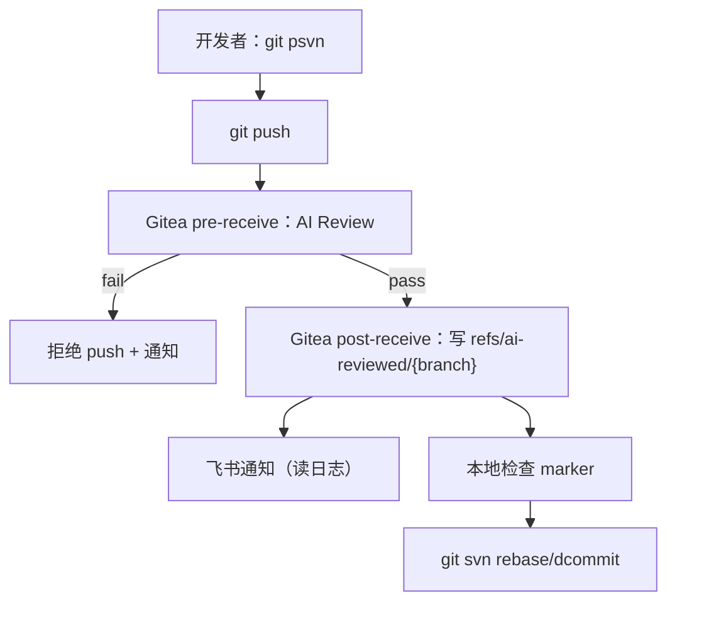

AI Review + Git/SVN 推行方案

用 Gitea hooks 做提交门禁；用 refs/ai-reviewed/* 记录“已评审”；再把 Git 提交同步到 SVN。

  

    
🛡️

    
pre-receive 门禁

  

  

    
🏷️

    
marker refs

  

  

    
🔔

    
飞书通知

  

  

    
🔁

    
git-svn 同步

  

  
cycleccc

  
•

  
2025

---
layout: center
---

# 关键结论

  

    
✅ 质量门禁：不合格直接拦截

    

      pre-receive 触发 AI Review；只有标为 CONFIRMED 的明确问题才会拦截。
    

  

  

    
🏷️ 通过标记：写到独立 ref

    

      post-receive 写 refs/ai-reviewed/&lt;branch&gt;，规避 quarantine 阶段不能写 refs 的限制。
    

  

  

    
🔁 push 通过后自动同步 SVN

    

      本地 wrapper：push 通过后自动 git svn rebase/dcommit，SVN 提交人仍是本人。
    

  

  

    
📊 评分归一化：避免 0/100 过于极端

    

      评分只用于展示/通知；是否拦截只看规则（minScore + CONFIRMED）。
    

  

---
layout: center
---

# 背景与目标

  

    
🗂️

    
SVN 为主

    

      管理层仍看 SVN 记录 
      研发日常更想用 Git
    

  

  

    
🧑‍💻

    
减少手动步骤

    

      让“质量检查/同步 SVN”自动化 
      失败直接给可执行的原因
    

  

  

    
🛡️

    
质量门禁

    

      不合格直接拦截 
      降低主分支风险
    

  

---
layout: center
---

# 关键约束：为什么要分两段

  

    
🚧 pre-receive quarantine

    

      quarantine 阶段 不能写 refs/tags，否则 push 会失败。 
      所以通过标记必须放到 post-receive。
    

  

  

    
🧷 Git 没有原生 post-push

    

      客户端要用 wrapper（或 CI）补 post-push；这里选本地脚本。
    

  

  

    
👤 SVN 提交人由账号决定

    

      如果服务器用统一账号写 SVN，作者会都变成同一个人； 
      所以 git svn dcommit 必须在开发者本地跑。
    

  

  

    
📌 大 diff / 不涉及目标语言

    

      只评审指定 paths；diff 太大默认放行，但会记录并提示拆分。
    

  

---
layout: two-cols-header
class: e2e-flow
---

# 端到端流程：一条命令跑通

::left::

::right::

<v-clicks>

- 统一入口：`git psvn`
- 拦截条件：只认 `CONFIRMED`
- “通过标记”：`refs/ai-reviewed/*`

</v-clicks>

---
layout: center
---

# 核心机制 1：只拦 CONFIRMED

  

    
规则

    <ul class="text-sm opacity-80 leading-relaxed space-y-2">
      <li>CONFIRMED: 有明确证据的问题（可拦截）</li>
      <li>RISK: 风险/信息不足（只提示，不拦截）</li>
      <li>没有 CONFIRMED：即使模型给了 pass=false，也不拦截，只提示</li>
    </ul>
  

  

    
为什么

    

      拦截只针对可复核的问题，减少误杀； 
      其它建议放到通知里，后续再迭代规则/提示词。
    

  

---
layout: two-cols
class: mechanism-2
---

# 核心机制 2：证据要求

  
为什么要“证据”

  

    让可拦截的问题能复核，减少误杀和争议。
  

  
证据格式（任一即可）

  

    

      
方式 A：精确定位

      
path/to/file.ts:123 或 path/to/file.ts#L123

    

    

      
方式 B：引用 diff 片段

      
直接贴 diff（用反引号包起来）

    

    

      
自动降级

      
缺少证据的 CONFIRMED 会被自动降级为 RISK

    

  

::right::

  
实现原则

  <ul class="text-sm opacity-80 leading-relaxed space-y-1">
    <li>缺少证据的 CONFIRMED 自动降级为 RISK</li>
    <li>拦截必须可复核：给文件/行号或贴 diff 片段</li>
    <li>结果落日志；通知/复盘直接读日志</li>
  </ul>
  
相关脚本在附录

---
layout: center
---

# 准入规则 + 跳过策略

<v-clicks>

- 门禁：`CONFIRMED` + `minScore`
- 评分：`AI_REVIEW_SCORE_MODE`（只用于展示/通知）

</v-clicks>

  

    
放行规则

    <ul class="text-sm opacity-80 leading-relaxed space-y-2">
      <li>不改 JS/TS：直接放行（可记录）</li>
      <li>diff 太大：默认放行，但提示拆分（可记录）</li>
      <li>紧急：提交信息带 [ai-review:force] 可强制放行（默认关闭，按需开启）</li>
    </ul>
  

  

    
设计思路

    

      拦截要严格，但日常流程尽量不打扰；更多细节放到通知和复盘里再优化。
    

  

---
layout: two-cols
---

# 核心机制 3：marker refs（可选）

<v-clicks>

- push 通过后，`post-receive` 写 marker：`refs/ai-reviewed/{branch} -> {newrev}`
- marker 只是标记：写失败不影响 push，只影响二次校验

</v-clicks>

::right::

  
写 marker 的关键命令

  <pre class="slidev-code text-sm"><code>git update-ref refs/ai-reviewed/&lt;branch&gt; &lt;newrev&gt;</code></pre>
  

    marker 写失败不影响 push，只会跳过二次校验。
  

  
完整脚本在附录

---
layout: two-cols
---

## 环境前置：为什么要推行 WSL

  

    
🪟

    
Windows 只负责 IDE

    

      编辑 / 调试 / GUI 工具 
      终端不强制统一
    

  

  

    
🐧

    
WSL 负责命令行层

    

      bash + Unix 工具链 
      git svn / wrapper 一次写好，团队通用
    

  

  

    
🏭

    
贴近 CI / 生产

    

      Linux 行为更一致 
      减少“只在 Win 出问题”
    

  

没有 WSL：git psvn 很难统一推广，最后还是回到手动同步 SVN

::right::

  
WSL 解决的是“能不能推广”

  

    

      
✅ 可复制

      
安装/脚本/排障路径统一

    

    

      
✅ 可自动化

      
一套命令走通（也更适合脚本/AI）

    

    

      
✅ 更少分裂

      
减少 PowerShell/Git Bash 分裂

    

    

      
✅ 更少重启

      
依赖/环境变量更好管

    

  

---
layout: center
---

# 对比：同一件事，两套路径

  
🪟 Windows 原生（常见问题）

  

    

      
SVN 提交 / 同步

      
慢且不稳（实际体验）

    

    

      
装 PostgreSQL / 语言依赖

      
GUI 多步 + 环境变量 + 重启

    

    

      
脚本/AI 跑命令

      
默认 Linux 语义 -> 先报错再修

    

    

      
工具链差异

      
PowerShell/Git Bash/MSYS2

    

    

      
编码/路径差异

      
更容易遇到编码/路径坑

    

  

  
🐧 WSL（团队可复制的最短命令行路径）

  

    

      

        
SVN 同步（统一入口）

        
git-svn

      

      <pre class="mt-2 text-xs opacity-80">git psvn</pre>
    

    

      

        
装 PostgreSQL（举例）

        
apt

      

      <pre class="mt-2 text-xs opacity-80">sudo apt-get update
sudo apt-get install -y postgresql</pre>
    

    

      

        
装 ffmpeg（举例）

        
apt

      

      <pre class="mt-2 text-xs opacity-80">sudo apt-get install -y ffmpeg</pre>
    

    

      关键点：把操作变成可重复执行的命令，自动化工具才能稳定执行
    

  

---
layout: two-cols
class: wsl-boundary
---

# WSL 的边界与绕法

  
实践中常见的两个问题

  

    

      
小程序 / 微信开发者工具热更新

      
很多工具只盯 Windows 路径；产物放在 WSL 文件系统可能监听不到

    

    

      
局域网访问（手机/同网段设备访问）

      
WSL2 默认是 NAT 网络，外部设备未必能直连 WSL 的端口

    

  

排查方式：先判断「文件系统监听」还是「网络转发」

  
其它坑（速记）

  <ul class="text-xs opacity-75 leading-relaxed space-y-1">
    <li>• 仓库尽量别放 /mnt/c（IO 慢、监听不稳）</li>
    <li>• 代理/VPN：配置和排障写文档，少“只在我电脑不行”</li>
    <li>• 权限/大小写：尽早暴露边界问题，贴近 CI/生产</li>
  </ul>

::right::

  
处理方式（举例）

  
① 让产物落到 Windows 目录（以 Taro 为例）

  <pre class="mt-2 slidev-code text-xs"><code># WSL (Linux)
export TARO_WEAPP_OUTPUT_ROOT=/mnt/c/Users/&lt;user&gt;/tmp/weapp-dist
pnpm dev:weapp</code></pre>

  
② 让局域网访问走 Windows 端口转发（管理员权限执行）

  <pre class="mt-2 slidev-code text-xs"><code># Windows (Admin PowerShell)
netsh interface portproxy add v4tov4 listenaddress=0.0.0.0 listenport=3000 `
  connectaddress=&lt;wsl-ip&gt; connectport=3000
netsh advfirewall firewall add rule name="Vite 3000" dir=in action=allow protocol=TCP localport=3000</code></pre>

  

  备注：服务端仍建议在 WSL 内监听 0.0.0.0（例如 Vite 的 --host 0.0.0.0）
  

---
layout: two-cols
class: alias-slide
---

# 开发者侧：一个 alias，一条命令

例如：

<pre class="mt-3 slidev-code text-xs"><code>git config --global alias.psvn '!./scripts/push-with-svn origin master:master'</code></pre>

  
带来的变化

  

    

      
统一入口

      
push 主分支只用 git psvn

    

    

      
减少手动步骤

      
push 成功后自动同步 SVN（失败时输出原因）

    

    

      
脚本可维护

      
团队只维护一套 wrapper

    

  

::right::

  
脚本做的事

  <ul class="text-sm opacity-80 leading-relaxed space-y-1">
    <li>先 git push</li>
    <li>（可选）校验远端 marker 指向当前 HEAD</li>
    <li>git svn rebase 后 git svn dcommit（作者仍是本人）</li>
  </ul>
  
脚本在附录

---
layout: center
---

# 可观测：日志 + 快速校验

  

    
日志结构

    

      每次 push 产出一份 JSON 日志（score/pass/reasons/forced/soft_pass）。 
      post-receive 通知直接读日志，不重复计算。
    

  

  

    
快速校验 marker

    <pre class="mt-3 slidev-code text-sm"><code>git ls-remote origin "refs/ai-reviewed/master"</code></pre>
  

---
layout: center
---

# Gitea Actions：自动部署测试环境

<v-clicks>

- 可选：把 push 后的部署/验证交给 CI（不阻塞主流程）
- 目标：主分支更新后自动部署到测试环境，减少手动操作
- 配置见附录

</v-clicks>

---
layout: center
---

# 配置项（示例）

<v-clicks>

- 核心：API Key / Model / Timeout / Diff 上限 / 日志目录
- 门禁：`CONFIRMED` / `RISK` 前缀与证据要求
- 分支：哪些分支参与门禁与 marker
- 示例配置见附录

</v-clicks>

---
layout: center
---

# 落地节奏

  

    
Phase 1

    
单仓库试点：误报、耗时、拦截率

  

  

    
Phase 2

    
git psvn 成为统一入口；Windows 统一走 WSL 跑 wrapper

  

  

    
Phase 3

    
模板化：env、hooks、文档

  

  

    
Phase 4

    
持续优化：规则、提示词、降噪

  

---
layout: center
---

# 补充说明

  

    

    
push 失败时不会触发 post-receive

    

      所以失败通知要在 pre-receive 里发，或者客户端直接提示。
    

    

    

    
marker 写失败不影响 push

    

      marker 只用于二次校验；排查分支正则和 post-receive 脚本即可。
    

    

    

    
评分两极化的处理

    

      先用 AI_REVIEW_SCORE_MODE=normalize；再把提示词的评分区间收敛。
    

    

    

    
SVN 未同步的排查

    

      先确认团队统一用 git psvn；必要时开启 REQUIRE_AI_REVIEW_MARKER=1。
    

    

  

---
layout: center
---

Q&A

推广到更多仓库：下一步做「模板化 + 数据观测 + 降噪」。

参考：<a href="https://sli.dev/" target="_blank">Slidev</a> · <a href="https://github.com/antfu/talks" target="_blank">antfu/talks</a>

---
layout: center
---

# 附录

实现细节放在附录：需要时再看，正文只讲方案和边界。

---
layout: center
---

## 附录 · pre-receive 关键逻辑（节选）

<<< @/snippets/10-ai-review.key-parts.sh bash {2-80}

---
layout: center
---

## 附录 · post-receive 写 marker（节选）

<<< @/snippets/20-ai-review-mark-reviewed.sh bash {2-80}

---
layout: center
---

## 附录 · 开发者侧 wrapper（节选）

<<< @/snippets/push-with-svn.sh bash {2-80}

---
layout: center
---

## 附录 · Gitea Actions（示例）

<<< @/snippets/deploy-test.yml yaml {all}

---
layout: center
---

## 附录 · 配置示例

<<< @/snippets/ai-review.env.example bash {all}
