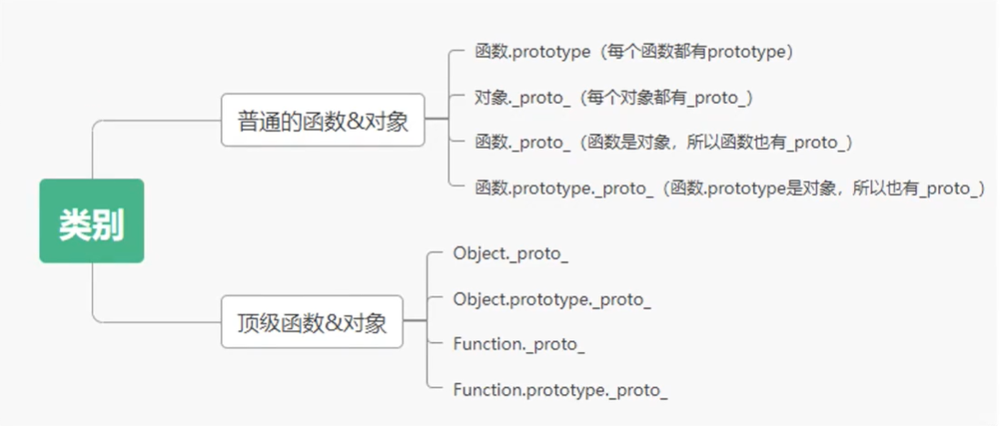

#### 1.原型和原型链的基础结论

1. 函数与对象的关系

   - 函数是对象，对象都是通过函数创建的
   - 函数雨对象并不是简单的包含与被包含的关系

2. 原型的类别

   - 显示原型：prototype，是每个函数function独有的属性
   - 隐式原型：`_proto_`，是每个对象都具有的属性

3. 原型和原型链

   - 原型：一个函数可以看成一个类，原型是所有类都有的一个属性，原型的作用就是给这个类的对象都添加一个统一的方法
   - 原型链：每个对象都有一个`_proto_`, 它指向它的prototype原型对象；它的prototype原型对象又有一个`_proto_`，指向它的prototype原型对象，就这样层层向上直到最终找到顶级对象Object的prototype，这个查询路径就是原型链

4. JavaScript里最顶层的两个概念

   - Function是最顶层的构造器

     Function是JavaScript里最顶层的构造器，它构造了系统中的所有对象，包括用户定义对象、系统内置对象、甚至包括它自己。

   - Object是最顶层的对象

     - 所有对象都继承Object的原型
     - Object也是被Function构造出来

5. instanceof

   obj instanceof F

   - 正确的描述：obj.`_obj_`.`_proto_`... = >F.prototype。沿着对象obj的原型链查找是否存在对象F.prototype，若存在则返回true，若查找到原型链的终点Object.prototype仍未找到，则返回false。

#### 2.经典的原型和原型链的分析

- 讲解的几个主要类别

