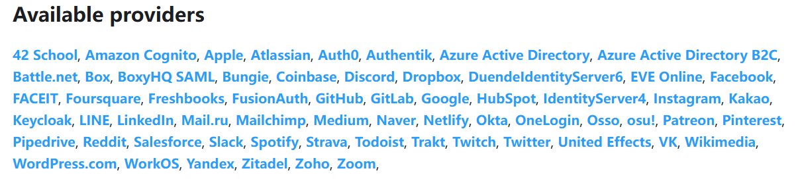

<!-- _class: cover_a 
<!-- _header: "" --> 
<!-- _footer: "" --> 
<!-- _paginate: "" --> 

# T3 Fullstack 技术分享

###### "全栈开发新范式：Next.js 引领的高效开发实践"

@cycleccc
全网账号：cycleccc
发布时间：2025年2月28日
<2991205548@qq.com>
PPT(md) 地址：[GitHub库](https://github.com/cycleccc/notes)

## 什么是 T3 Stack？

<!-- _class: cols2_ol_ci fglass toc_a  -->
<!-- _footer: "" -->
<!-- _header: "CONTENTS" -->
<!-- _paginate: "" -->

- [🧑‍💻为什么选择 T3 Stack](#1)
- [🌐Next.js](#2) 
- [🔥TRPC](#3)
- [✅Zod](#4)
- [📦Prisma](#5)
- [🛡️NextAuth](#6)
- [🎨Ant Design Pro](#7)
- [🎯Shadcn UI](#8)
<!-- - [需要知道的基础知识](#56) -->
<!-- - [最后一页](#59) -->

## 1. 为什么选择 T3 Stack？

<!-- _class: trans -->
<!-- _footer: "" -->
<!-- _paginate: "" -->

## 1. 为什么选择 T3 Stack？


为什么选择 T3 stack，或是说为什么选择 Next,不选择 PHP？

- **高效开发**：T3 Stack 提供了 TypeScript 和 tRPC，帮助开发者快速构建高效的应用程序，减少了常见的错误和调试时间。
- **强大的生态系统**：结合 Next.js 和 Prisma，开发者可以轻松实现服务端渲染和数据库操作，提升应用性能和用户体验。
- **灵活的样式**：使用 Tailwind CSS，开发者可以快速构建响应式设计，确保应用在各种设备上都能完美呈现。
- **安全性**：NextAuth 提供了强大的认证机制，确保用户数据的安全性，让开发者可以专注于业务逻辑，而不必担心安全问题。

因为我们搞前端的就喜欢这个样子啊！任何事情都喜欢一把梭，不能一把梭就给任何不能一把梭的东西写 polyfill，最后达成心满意足的一把梭。


## 2. Next.js 全栈开发基石

<!-- _class: trans -->
<!-- _footer: "" -->
<!-- _paginate: "" -->

## 2.1 文件路由

<!-- _class: cols-2 -->

<div class=ldiv>

~~~markdown
app/
  ├─ layout.tsx          → 全局结界
  ├─ page.tsx            → /
  ├─ (marketing)/
  │   ├─ about/
  │   │   └─ page.tsx    → /about
  │   └─ blog/
  │       └─ [slug]/
  │           └─ page.tsx → /blog/:slug
  └─ (dashboard)/
      └─ user/
          └─ [id]/
              └─ page.tsx → /user/:id
~~~

</div>


<div class=rdiv>

| 文件名 | 使用示例  | 独特技能 |
| --------- | ----------- | --------- |
| `layout` | 共享导航/样式/状态 | 嵌套继承布局 |
| `page` | 实际渲染的组件 | 必须存在否则404 |
| `loading` | 展示骨架屏/加载动画 | 自动绑定页面加载状态 |
| `error` | 展示错误边界 | 精准捕获子树错误 |
| `not-found` | 展示 404 页面 | 自动展示 |
| `(dashboard)` | 路由分组 | 按功能分类 |
| `[id]` | 路由参数 | 动态路由 |
| `@admin` | 平行路由 | 按权限分类 |

</div>

## 2.2 API 路由

<!-- _class: pin-3 -->

<div class="tdiv">

> 🔧 底层原理简述
Next.js 在构建时会：
 识别 app/api 或 pages/api 目录下的文件,不打包进客户端，只在服务端运行 自动根据路径注册为服务端函数
在运行时，Next.js 会：
根据请求路径 /api/user/123 映射到本地函数文件,将 req, res 注入函数（类 Express，但基于 Node 原生）
</div>

<div class=ldiv>

~~~markdown
app/api/
  ├─ hello.ts        → /api/hello
  └─ user/
      └─ [id].ts    → /api/user/:id
~~~

</div>

<div class=rdiv>

~~~typescript
// 传统方式：跨项目、跨域、跨团队沟通
fetch('https://api.example.com/user/123')

// Next.js方式：像调用本地函数一样简单,直接相对路径调用
fetch('/api/user/123')
~~~
</div>


## 2.3 渲染模式
Next.js 支持多种渲染模式  结合服务端和客户端的能力，实现灵活的页面渲染方案：

- ✅ SSG：静态生成（Static Site Generation）
- ✅ SSR：服务端渲染（Server Side Rendering）
- ✅ CSR：客户端渲染（Client Side Rendering）
- ✅ ISR：增量静态生成（Incremental Static Regeneration）

## 🧊 SSG - 静态生成

<!-- _class: cols-2 -->

<div class=ldiv>

适合：**内容不频繁变化**的页面

优点：

- HTML 在构建时生成，**加载快**
- 可部署在 CDN

缺点：

- 数据更新需**重新构建**


</div>

<div class=rdiv>

~~~ts
export async function getStaticProps() {
  return {
    props: { data: ... },
  }
}
~~~


```txt
浏览器
   ↓
CDN / 静态文件
   ↓
直接返回 HTML
```

</div>


## 🔁 SSR - 服务端渲染

<!-- _class: cols-2 -->

<div class=ldiv>

适合：**数据实时性要求高**的页面
优点：
- 每次请求都会重新渲染页面
- SEO 友好

缺点：

- **性能依赖服务器**
- 响应速度相对慢

</div>

<div class=rdiv>

~~~ts
export async function getServerSideProps(context) {
  const res = await fetch(...)
  return { props: { data: await res.json() } }
}
~~~

```txt
浏览器
   ↓
Next.js Server
   ↓
动态生成 HTML
```

</div>

## 🖼️ CSR - 客户端渲染

<!-- _class: cols-2 -->  

<div class=ldiv>

适合：**登录后页面 / 不关心 SEO**

页面只在浏览器中执行 JS 后渲染：

优点：

- 无需服务器参与，**部署简单**
- 体验流畅

缺点：

- SEO 不友好
- 首屏加载慢

</div>

<div class=rdiv>

```txt
浏览器
   ↓
获取空 HTML + JS
   ↓
JS 渲染出页面内容
```

~~~ts
// 没有 getStaticProps / getServerSideProps
// 在 useEffect 中加载数据
~~~

</div>

## 🔄 ISR - 增量静态生成

<!-- _class: cols-2 -->

<div class=ldiv>

SSG 的升级版：支持**定时更新**

优点：

- **静态性能 + 数据更新**
- 避免频繁构建

适合：**博客、商品页**等内容不实时但需定期更新的页面

</div>

<div class=rdiv>

~~~ts
export async function getStaticProps() {
  return {
    props: { ... },
    revalidate: 60, // 60 秒后重新生成
  }
}
~~~

```txt
请求页面时发现超时
   ↓
后台重新生成 HTML
   ↓
更新静态缓存
```

</div>

## 🤔 应该怎么选？


| 模式 | 适用场景 | 是否支持 SEO | 首屏加载速度 |
|------|----------|---------------|----------------|
| SSG  | 博客、文档、产品页 | ✅ | 🚀 非常快 |
| SSR  | 用户仪表盘、搜索页 | ✅ | 🐢 较慢 |
| CSR  | 后台管理、互动页面 | ❌ | 🐢 慢（需加载 JS）|
| ISR  | 新闻页、电商页面等 | ✅ | 🚀 快且可更新 |


## 3. TRPC: 类型安全通信

<!-- _class: trans -->
<!-- _footer: "" -->
<!-- _paginate: "" -->

## 3.1 TRPC 使用

<!-- _class: cols-2 -->  
<div class=ldiv>

灵魂暴击三连问
- 接口文档还要手动维护？
- Postman收藏夹比相亲对象还多？
- 字段名讨论会开成拼写纠察队？

~~~typescript
### 前端程序员の日常

const res = await fetch('/api/user/114514');
const data = await res.json(); // 可能是用户数据，也可能是 nul
console.log(data.avater); // 哦豁，拼错了avatar
~~~

~~~typescript
### 当你用tRPC时

const { data } = trpc.user.getById.query(114514);
// 只要后端敢返回没有avater字段，编译时就送你一首《凉凉》 ❄️
~~~

</div>
<div class=rdiv>

~~~typescript
// 定义一个精简的router
const appRouter = router({
  getCoffee: procedure
    .input(z.object({
      mode: z.enum(['深度工作', '协作会议']), // 工作状态智能识别
      focusMode: z.boolean()
    }))
    .query(({ input }) => input.focusMode
      ? '高效编码中...' 
      : db.coffee.findRandom()
    )
})

~~~

~~~typescript
// 像调用本地函数一样调接口
function ProductivityButton() {
  const { data } = trpc.getCoffee.useQuery({
    mode: '深度工作',
    focusMode: useStore(state => state.isFocusMode)
  })

  return <Button>{data || '正在获取咖啡灵感...'}</Button>
}
~~~
</div>

## 3.2 TRPC 使用预览


## 3.3 tRPC 原理介绍

<!-- _class: cols-2 -->

<div class=ldiv>

#### 核心概念
- **类型安全**：基于 TypeScript 的类型系统
- **零运行时开销**：编译时类型检查
- **端到端类型安全**：前后端共享类型定义
- **自动类型推导**：无需手动定义类型

#### 工作原理
1. 定义 Router 和 Procedure
2. 生成类型定义
3. 客户端自动生成调用代码
4. 运行时类型检查

</div>

<div class=rdiv>

#### 架构设计
```typescript
// 1. 定义 Router
const appRouter = router({
  user: router({
    getById: procedure
      .input(z.number())
      .query(({ input }) => {
        return db.user.findUnique({ where: { id: input } })
      })
  })
})

// 2. 生成类型
type AppRouter = typeof appRouter

// 3. 客户端使用
const { data } = trpc.user.getById.useQuery(1)
```

> 💡 提示：tRPC 通过 TypeScript 的泛型和类型推导，实现了端到端的类型安全

</div>


## 4. Zod：运行时类型验证利器

<!-- _class: trans -->
<!-- _footer: "" -->
<!-- _paginate: "" -->

## 4.1 为什么需要 Zod？

<!-- _class: cols-2 -->

<div class=ldiv>

#### 常见问题
- TypeScript 只在编译时检查类型
- API 请求数据无法保证类型安全
- 表单验证逻辑分散且重复
- 运行时类型错误难以捕获

~~~typescript
// 没有运行时验证的风险
type UserInput = {
  age: number;
  email: string;
}

function processUser(input: UserInput) {
  // 运行时可能崩溃！
  return input.age * 2;
}
~~~

</div>

<div class=rdiv>

#### Zod 解决方案
- 运行时类型验证
- 自动类型推导
- 丰富的验证规则
- 优雅的错误处理

~~~typescript
const UserSchema = z.object({
  age: z.number().min(0).max(120),
  email: z.string().email(),
});

function processUser(input: unknown) {
  // 安全！验证失败会抛出详细错误
  const user = UserSchema.parse(input);
  return user.age * 2;
}
~~~

</div>

## 4.2 Zod + tRPC 完美配合

<!-- _class: cols-2 -->

<div class=ldiv>

#### 定义 API 接口

~~~typescript
// server/api/router.ts
export const appRouter = router({
  createUser: procedure
    .input(z.object({
      name: z.string().min(2),
      age: z.number().min(0),
      email: z.string().email(),
      role: z.enum(['user', 'admin'])
    }))
    .mutation(async ({ input }) => {
      // 输入已经过验证，类型安全！
      const user = await prisma.user.create({
        data: input
      });
      return user;
    })
});
~~~

</div>

<div class=rdiv>

#### 客户端调用

~~~typescript
// pages/register.tsx
function RegisterForm() {
  const mutation = trpc.createUser.useMutation();

  const onSubmit = async (data: unknown) => {
    try {
      await mutation.mutateAsync({
        name: '张三',
        age: 25,
        email: 'zhangsan@example.com',
        role: 'user'
      });
      // 成功！
    } catch (error) {
      // 类型错误会在这里被捕获
      console.error(error.message);
    }
  };
}
~~~

</div>

## 4.3 Zod 常用验证规则

<!-- _class: cols-2 -->

<div class=ldiv>

~~~typescript
// 基础类型
const stringSchema = z.string()
const numberSchema = z.number()
const booleanSchema = z.boolean()

// 复杂验证
const UserSchema = z.object({
  username: z.string()
    .min(3, '用户名至少3个字符')
    .max(20, '用户名最多20个字符'),
  age: z.number()
    .int('年龄必须是整数')
    .min(0, '年龄不能为负')
    .max(120, '年龄不能超过120'),
  email: z.string()
    .email('邮箱格式不正确'),
});
~~~

</div>

<div class=rdiv>

~~~typescript
// 可选字段和数组
const ExtendedSchema = z.object({
  website: z.string()
    .url()
    .optional(),
  tags: z.array(z.string())
    .min(1, '至少需要一个标签')
});

// 联合类型
const ResponseSchema = z.union([
  z.object({ 
    status: z.literal('success'), 
    data: UserSchema 
  }),
  z.object({ 
    status: z.literal('error'), 
    message: z.string() 
  })
]);
~~~

</div>

## 4.4 最佳实践

<!-- _class: cols-2 -->

<div class=ldiv>

#### 错误处理和复用
~~~typescript
// 1. 定义清晰的错误消息
const schema = z.string({
  required_error: "此字段不能为空",
  invalid_type_error: "必须是字符串",
});

// 2. 复用验证逻辑
const baseUser = z.object({
  id: z.string().uuid(),
  email: z.string().email(),
});

const newUser = baseUser.extend({
  password: z.string().min(6),
});
~~~

</div>

<div class=rdiv>

#### 框架集成
~~~typescript
// 3. 结合 React Hook Form
const schema = z.object({
  username: z.string().min(3),
  email: z.string().email(),
  password: z.string().min(6)
});

const {
  register,
  handleSubmit,
} = useForm({
  resolver: zodResolver(schema)
});
~~~

> 💡 提示：Zod + tRPC + React Hook Form 是处理表单验证的最佳组合！

</div>

## 5. Prisma: 类型安全的 ORM

<!-- _class: trans -->
<!-- _footer: "" -->
<!-- _paginate: "" -->

## 5.1 Prisma 基础使用

<!-- _class: cols-2 -->

<div class=ldiv>

#### Schema 定义
~~~prisma
// schema.prisma
datasource db {
  provider = "postgresql"
  url      = env("DATABASE_URL")
}

model User {
  id    Int     @id @default(autoincrement())
  email String  @unique
  name  String?
  posts Post[]
}

model Post {
  id       Int     @id
  title    String
  author   User    @relation(fields: [authorId], references: [id])
  authorId Int
}
~~~

</div>

<div class=rdiv>

#### CRUD 操作示例
~~~typescript
// 创建用户和文章
const user = await prisma.user.create({
  data: {
    email: 'zhang@example.com',
    name: '张三',
    posts: {
      create: { title: '第一篇博客' }
  }}});

// 关联查询
const posts = await prisma.post.findMany({
  where: { author: { email: 'zhang@example.com' } },
  include: { author: true }
});

// 更新数据
const result = await prisma.user.update({
  where: { email: 'zhang@example.com' },
  data: { name: '张三丰' }
});
~~~

</div>

## 5.2 Prisma vs Drizzle

<!-- _class: cols-2 -->

<div class=ldiv>

#### Prisma

优点：
- 完整的 ORM 解决方案
- 强大的关系处理·
- Schema 定义直观
- 自动迁移工具

缺点：
- 启动时间较长
- 资源消耗较大
- 灵活性较低

</div>
<!--  -->
<div class=rdiv>

#### Drizzle
- 轻量级设计
- 启动速度快
- SQL 优先理念
- 更灵活的查询

~~~typescript
// Drizzle Schema
import { pgTable, serial, text } from 'drizzle-orm/pg-core'

export const users = pgTable('users', {
  id: serial('id').primaryKey(),
  name: text('name'),
  email: text('email').unique()
})

// 查询示例
const result = await db.select()
  .from(users)
  .where(eq(users.email, 'test@example.com'))
~~~

</div>

## 5.3 如何选择？

| 特性 | Prisma | Drizzle |
|------|---------|----------|
| 类型安全 | ✅ | ✅ |
| 启动性能 | 🐢 慢 | 🚀 快 |
| 学习曲线 | 较陡 | 平缓 |
| SQL 控制 | 较弱 | 强 |
| 生态完整度 | 完整 | 发展中 |
| 适用场景 | 大型项目 | 轻量应用 |

> 💡 建议：
> - 新手/标准项目：选择 Prisma
> - 性能敏感/经验丰富：考虑 Drizzle

# 6 NextAuth

## 6. NextAuth：身份认证的最佳实践

<!-- _class: trans -->
<!-- _footer: "" -->
<!-- _paginate: "" -->

## 6.1 为什么选择 NextAuth？

<!-- _class: cols-2 -->

<div class=ldiv>

#### 主要特点
- 开箱即用的社交登录
- 无需后端的认证方案
- 内置安全最佳实践
- 完整的 TypeScript 支持

~~~typescript
// 最简配置示例
import NextAuth from "next-auth"
import GithubProvider from "next-auth/providers/github"

export const authOptions = {
  providers: [
    GithubProvider({
      clientId: process.env.GITHUB_ID,
      clientSecret: process.env.GITHUB_SECRET,
    }),
  ],
}

export default NextAuth(authOptions)
~~~

</div>

<div class=rdiv>

#### 支持的认证方式
- OAuth 提供商
  - GitHub、Google、微信
  - 企业微信、飞书
- 邮箱验证码
- 用户名密码
- 自定义认证



</div>

## 6.2 与 Prisma 集成

<!-- _class: cols-2 -->

<div class=ldiv>

#### Schema 配置
~~~prisma
model Account {
  id        String   @id @default(cuid())
  userId    String
  type      String
  provider  String
  user      User     @relation(fields: [userId], references: [id])
  // ... 其他 OAuth 相关字段
}

model User {
  id       String    @id @default(cuid())
  email    String?   @unique
  name     String?
  accounts Account[]
}
~~~

</div>

<div class=rdiv>

#### 适配器配置
~~~typescript
// auth.ts
import { PrismaAdapter } from "@next-auth/prisma-adapter"
import { prisma } from "./db"

export const authOptions = {
  adapter: PrismaAdapter(prisma),
  providers: [
    GithubProvider({
      clientId: process.env.GITHUB_ID,
      clientSecret: process.env.GITHUB_SECRET,
    }),
  ],
}
~~~

</div>

## 6.3 在应用中使用

<!-- _class: cols-2 -->

<div class=ldiv>

#### 客户端使用
~~~typescript
'use client'
 
import { useSession } from "next-auth/react"
 
export default function ProfilePage() {
  const { data: session } = useSession()
 
  if (!session) {
    return <div>请先登录</div>
  }
 
  return (
    <div>
      欢迎回来, {session.user.name}
      
    </div>
  )
}
~~~

</div>

<div class=rdiv>

#### 服务端验证
~~~typescript
import { getServerSession } from "next-auth/next"
 
export default async function Page() {
  const session = await getServerSession()
 
  if (!session) {
    return {
      redirect: {
        destination: '/login',
        permanent: false,
      },
    }
  }
 
  return <AdminDashboard user={session.user} />
}
~~~

> 💡 提示：NextAuth + Prisma + tRPC 可以构建完整的用户认证系统

</div>

# 7 antd pro

## 7. Ant Design Pro：企业级中后台解决方案

<!-- _class: trans -->
<!-- _footer: "" -->
<!-- _paginate: "" -->

## 7.1 为什么选择 Ant Design Pro？

<!-- _class: cols-2 -->

<div class=ldiv>

#### 核心优势
- 企业级设计体系
- 开箱即用的模板
- 丰富的业务组件
- 完整的最佳实践

#### 内置功能
- 🔐 用户管理
- 📊 数据大屏
- 📝 表单设计器
- 🎨 主题定制
- 📱 响应式布局

</div>

<div class=rdiv>

#### antd ProComponents


#### antd Pro 
https://preview.pro.ant.design/

> 💡 开箱即用的中后台前端/设计解决方案

</div>

## 7.2 常用布局与组件

<!-- _class: cols-2 -->

<div class=ldiv>

#### 布局模板
- ProLayout：专业的布局
  - 可配置的菜单
  - 自适应缩放
  - 面包屑导航
  
#### 数据展示
- ProTable：高级表格
- ProList：高级列表
- ProCard：高级卡片
- ProDescriptions：详情描述

</div>

<div class=rdiv>

#### 表单系列
- ProForm：高级表单
  - 快速开发表单
  - 数据联动
  - 自动校验
  
#### 业务组件
- ProFlow：流程图
- Charts：图表库
- Dashboard：仪表盘
- Calendar：日历

</div>

## 7.3 与 T3 Stack 集成

<!-- _class: cols-2 -->

<div class=ldiv>

#### 安装配置
```bash
# 安装依赖
pnpm add @ant-design/pro-components
pnpm add antd @ant-design/icons

# 配置主题（tailwind.config.ts）
import { theme } from 'antd'
const { defaultAlgorithm, defaultSeed } = theme
```

#### 最佳实践
- 按需加载组件
- 统一主题配置
- 结合 tRPC 的类型
- 配合 NextAuth 权限

</div>

<div class=rdiv>

#### 示例：ProTable + tRPC
```typescript
<ProTable<API.UserInfo>
  columns={columns}
  request={async (params) => {
    const { data } = await trpc.user.list.query({
      current: params.current,
      pageSize: params.pageSize,
      ...params,
    });
    return {
      data: data.list,
      total: data.total,
    };
  }}
  rowKey="id"
  pagination={{
    showQuickJumper: true,
  }}
/>
```

> 💡 提示：ProComponents + tRPC + Tailwind 
> 可以快速构建企业级应用

</div>

# 8 shadcn UI

## 8. Shadcn UI：现代化的组件库解决方案

<!-- _class: trans -->
<!-- _footer: "" -->
<!-- _paginate: "" -->

## 8.1 为什么选择 Shadcn UI？

<!-- _class: cols-2 -->

<div class=ldiv>

#### 核心理念
- 不是组件库而是组件集合
- 复制即用的源码方案
- 完全可定制的设计
- Radix UI + Tailwind CSS

#### 独特优势
- 零运行时开销
- 完全可控的源码
- 随用随取的组件
- 极致的开发体验

</div>

<div class=rdiv>

#### 安装方式
```bash
# 初始化配置
npx shadcn-ui@latest init

# 安装需要的组件
npx shadcn-ui@latest add button
npx shadcn-ui@latest add dialog
npx shadcn-ui@latest add dropdown-menu
```

> 💡 不同于传统组件库，shadcn UI 是直接将组件代码复制到你的项目中

</div>

## 8.2 常用组件展示

<!-- _class: cols-2 -->

<div class=ldiv>

#### 基础组件
- Button：按钮
- Input：输入框
- Select：选择器
- Dialog：对话框
- Tabs：标签页

#### 数据展示
- Table：表格
- Card：卡片
- Calendar：日历
- Avatar：头像
- Badge：徽章

</div>

<div class=rdiv>

#### 布局组件
- Sheet：侧边栏
- Drawer：抽屉
- Popover：弹出框
- Toast：提示框

#### 特色功能
- 暗黑模式支持
- 动画过渡效果
- 无障碍访问
- 主题定制系统

</div>

## 8.3 实战应用

<!-- _class: cols-2 -->

<div class=ldiv>

#### 主题定制
```typescript
// globals.css
@layer base {
  :root {
    --background: 0 0% 100%;
    --foreground: 240 10% 3.9%;
    --primary: 240 5.9% 10%;
    --primary-foreground: 0 0% 98%;
    /* ... 其他变量 */
  }
}
```

#### 组件使用
```typescript
import { Button } from "@/components/ui/button"
import { Input } from "@/components/ui/input"

export function SearchBar() {
  return (
    <div className="flex gap-2">
      <Input placeholder="搜索..." />
      <Button>搜索</Button>
    </div>
  )
}
```

</div>

<div class=rdiv>

#### 与 T3 集成
```typescript
// 表单验证结合
import { Form } from "@/components/ui/form"
import { zodResolver } from "@hookform/resolvers/zod"

export function LoginForm() {
  const form = useForm({
    resolver: zodResolver(loginSchema),
  })

  return (
    <Form {...form}>
      <FormField
        control={form.control}
        name="email"
        render={({ field }) => (
          <FormItem>
            <FormLabel>邮箱</FormLabel>
            <FormControl>
              <Input {...field} />
            </FormControl>
          </FormItem>
        )}
      />
    </Form>
  )
}
```

> 💡 提示：Shadcn UI + Tailwind + React Hook Form 
> 是构建现代化表单的完美组合

</div>
