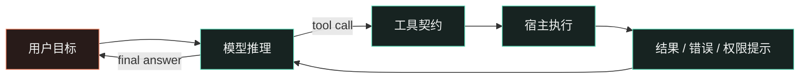

<style global>
:root { --slidev-theme-primary: #59d6b4; --ink: #f2f4f3; --muted: #aab7b4; --panel: #172321; --line: #35534c; --coral: #ff8f70; }
.slidev-layout { background: #0d1514; color: #f2f4f3; padding: 52px 72px; }
h1 { font-size: 52px; line-height: 1.08; letter-spacing: 0; }
h2 { font-size: 38px; line-height: 1.12; margin-bottom: 24px; letter-spacing: 0; }
h3 { font-size: 25px; }
p, li { font-size: 20px; line-height: 1.5; }
strong { color: #59d6b4; }
.eyebrow { color: #ff8f70; font-size: 16px; letter-spacing: .08em; text-transform: uppercase; }
.muted { color: #aab7b4; }
.accent { color: #ff8f70; }
.two-col { display: grid; grid-template-columns: 1.12fr .88fr; gap: 36px; align-items: start; }
.three-col { display: grid; grid-template-columns: repeat(3, 1fr); gap: 22px; }
.rule { height: 1px; background: #35534c; margin: 20px 0 26px; }
.quote { border-left: 4px solid #ff8f70; padding-left: 22px; color: #e7ecea; font-size: 29px; line-height: 1.3; }
.label { color: #aab7b4; font-size: 15px; text-transform: uppercase; letter-spacing: .08em; }
.step { border-top: 2px solid #59d6b4; padding-top: 12px; }
.step b { color: #59d6b4; font-size: 24px; }
.small { font-size: 16px; line-height: 1.4; }
.slidev-code { font-size: 17px !important; line-height: 1.45 !important; }
table { font-size: 18px; }
th { color: #59d6b4; }
td, th { padding: 9px 13px !important; border-color: #35534c !important; }
:global(.slidev-layout) { background: #0d1514; color: #f2f4f3; padding: 52px 72px; }
:global(.slidev-layout h1) { font-size: 52px; line-height: 1.08; letter-spacing: 0; }
:global(.slidev-layout h2) { font-size: 38px; line-height: 1.12; margin-bottom: 24px; letter-spacing: 0; }
:global(.slidev-layout h3) { font-size: 25px; }
:global(.slidev-layout p), :global(.slidev-layout li) { font-size: 20px; line-height: 1.5; }
:global(.slidev-layout strong) { color: #59d6b4; }
:global(.eyebrow) { color: #ff8f70; font-size: 16px; letter-spacing: .08em; text-transform: uppercase; }
:global(.muted) { color: #aab7b4; }
:global(.accent) { color: #ff8f70; }
:global(.two-col) { display: grid; grid-template-columns: 1.12fr .88fr; gap: 36px; align-items: start; }
:global(.three-col) { display: grid; grid-template-columns: repeat(3, 1fr); gap: 22px; }
:global(.rule) { height: 1px; background: #35534c; margin: 20px 0 26px; }
:global(.quote) { border-left: 4px solid #ff8f70; padding-left: 22px; color: #e7ecea; font-size: 29px; line-height: 1.3; }
:global(.label) { color: #aab7b4; font-size: 15px; text-transform: uppercase; letter-spacing: .08em; }
:global(.step) { border-top: 2px solid #59d6b4; padding-top: 12px; }
:global(.step b) { color: #59d6b4; font-size: 24px; }
:global(.small) { font-size: 16px; line-height: 1.4; }
:global(.slidev-code) { font-size: 17px !important; line-height: 1.45 !important; }
:global(table) { font-size: 18px; }
:global(th) { color: #59d6b4; }
:global(td), :global(th) { padding: 9px 13px !important; border-color: #35534c !important; }
:global(.stack) { display: flex; flex-direction: column; gap: 10px; margin-top: 18px; }
:global(.layer) { display: grid; grid-template-columns: 195px 1fr; gap: 16px; align-items: center; padding: 11px 16px; border-left: 4px solid #59d6b4; background: #172321; }
:global(.layer:nth-child(2)) { border-left-color: #7ee7ce; margin-left: 28px; }
:global(.layer:nth-child(3)) { border-left-color: #ffb08f; margin-left: 56px; }
:global(.layer:nth-child(4)) { border-left-color: #ff8f70; margin-left: 84px; }
:global(.layer-name) { font-size: 23px; font-weight: 700; color: #f2f4f3; }
:global(.layer-role) { color: #aab7b4; font-size: 15px; line-height: 1.35; }
:global(.timeline) { position: relative; margin-top: 24px; padding-left: 34px; }
:global(.timeline:before) { content: ''; position: absolute; left: 9px; top: 7px; bottom: 7px; width: 2px; background: #35534c; }
:global(.event) { position: relative; display: grid; grid-template-columns: 90px 1fr; gap: 22px; padding: 0 0 20px; }
:global(.event:before) { content: ''; position: absolute; left: -30px; top: 6px; width: 12px; height: 12px; background: #59d6b4; border: 3px solid #0d1514; outline: 2px solid #59d6b4; border-radius: 50%; }
:global(.event:nth-child(3):before) { background: #ff8f70; outline-color: #ff8f70; }
:global(.event-time) { color: #ff8f70; font-family: monospace; font-size: 16px; }
:global(.event-body) { color: #e7ecea; font-size: 19px; }
:global(.event-body span) { display: block; color: #aab7b4; font-size: 16px; margin-top: 4px; }
:global(.terminal) { background: #101b19; border: 1px solid #35534c; box-shadow: 8px 8px 0 #14211e; font-family: monospace; overflow: hidden; }
:global(.terminal-bar) { padding: 9px 14px; color: #aab7b4; border-bottom: 1px solid #35534c; font-size: 14px; }
:global(.terminal-body) { padding: 16px 18px 19px; font-size: 17px; line-height: 1.6; color: #d5e9e3; }
:global(.prompt) { color: #59d6b4; }
:global(.result) { color: #ffb08f; }
:global(.diff) { background: #151f1d; border-left: 3px solid #ff8f70; padding: 14px 18px; font-family: monospace; font-size: 16px; line-height: 1.6; }
:global(.minus) { color: #ff8f70; }
:global(.plus) { color: #59d6b4; }
:global(.boundary) { display: grid; grid-template-columns: 1fr 1.25fr 1fr; align-items: stretch; margin-top: 26px; min-height: 230px; }
:global(.zone) { padding: 20px; border: 1px solid #35534c; }
:global(.zone.model) { background: #1b2926; border-right: 0; }
:global(.zone.host) { background: #1b2422; border-right: 0; }
:global(.zone.world) { background: #2a1e1b; border-color: #7e4d40; }
:global(.zone h3) { margin: 0 0 12px; color: #59d6b4; }
 :global(.zone.world h3) { color: #ff8f70; }
:global(.zone p) { font-size: 17px; color: #aab7b4; }
:global(.boundary-arrow) { display: flex; align-items: center; justify-content: center; color: #ff8f70; font-size: 28px; }
:global(.demo-terminal) { float: left; width: 48%; margin-top: 20px; }
:global(.demo-copy) { margin-left: 52%; }
:global(.slidev-page-10 .slidev-code) { margin-left: 52%; width: 46%; }
:global(.slidev-page-10 .terminal) { border: 1px solid #35534c; background: #101b19; box-shadow: 8px 8px 0 #14211e; }
:global(.slidev-page-11 .slidev-monaco-container) { width: 100%; max-width: none; min-height: 300px; margin-top: 20px; }
:global(.slidev-page-11 .slidev-monaco-container-inner) { min-height: 300px; }
:global(.lab-copy) { margin-left: 0; }
:global(.lab-caption) { display: flex; align-items: baseline; justify-content: space-between; gap: 24px; }
:global(.lab-steps) { display: grid; grid-template-columns: repeat(3, 1fr); gap: 18px; margin-top: 14px; }
:global(.lab-steps li) { margin: 0; padding-top: 8px; border-top: 2px solid #35534c; }
:global(.lab-steps li::marker) { color: #ff8f70; }
:global(.choice-grid) { display: grid; grid-template-columns: repeat(3, 1fr); gap: 20px; margin-top: 28px; }
:global(.choice) { min-height: 170px; padding: 18px 20px; border-top: 3px solid #59d6b4; background: #172321; }
:global(.choice:nth-child(2)) { border-top-color: #ffb08f; }
:global(.choice:nth-child(3)) { border-top-color: #ff8f70; }
:global(.choice h3) { margin: 0 0 10px; color: #f2f4f3; }
:global(.choice p) { margin: 0; color: #aab7b4; font-size: 17px; line-height: 1.45; }
:global(.context-flow) { display: grid; grid-template-columns: 1fr 110px 1fr; align-items: center; gap: 16px; margin-top: 26px; }
:global(.context-list) { display: flex; flex-direction: column; gap: 9px; }
:global(.context-item) { padding: 10px 14px; border-left: 3px solid #59d6b4; background: #172321; color: #e7ecea; font-size: 18px; }
:global(.context-item:nth-child(2)) { border-left-color: #7ee7ce; }
:global(.context-item:nth-child(3)) { border-left-color: #ffb08f; }
:global(.context-item:nth-child(4)) { border-left-color: #ff8f70; }
:global(.context-arrow) { color: #ff8f70; font-size: 34px; text-align: center; }
:global(.context-result) { padding: 22px; border: 1px solid #35534c; background: #101b19; }
:global(.context-result strong) { display: block; font-size: 25px; margin-bottom: 10px; }
:global(.context-result span) { display: block; color: #aab7b4; font-size: 17px; line-height: 1.45; }
:global(.tree-box) { position: relative; min-height: 250px; padding: 22px 26px; background: #101b19; border: 1px solid #35534c; font-family: monospace; color: #d5e9e3; }
:global(.tree-box .branch) { display: block; margin: 10px 0; }
:global(.tree-box .branch:nth-child(2)) { margin-left: 40px; }
:global(.tree-box .branch:nth-child(3)) { margin-left: 80px; }
:global(.tree-box .branch:nth-child(4)) { margin-left: 120px; color: #ffb08f; }
:global(.tree-box .fork) { color: #ff8f70; }
.choice-grid { display: grid; grid-template-columns: repeat(3, 1fr); gap: 20px; margin-top: 28px; }
.choice { min-height: 170px; padding: 18px 20px; border-top: 3px solid #59d6b4; background: #172321; }
.choice:nth-child(2) { border-top-color: #ffb08f; }
.choice:nth-child(3) { border-top-color: #ff8f70; }
.choice h3 { margin: 0 0 10px; color: #f2f4f3; }
.choice p { margin: 0; color: #aab7b4; font-size: 17px; line-height: 1.45; }
.context-flow { display: grid; grid-template-columns: 1fr 110px 1fr; align-items: center; gap: 16px; margin-top: 26px; }
.context-list { display: flex; flex-direction: column; gap: 9px; }
.context-item { padding: 10px 14px; border-left: 3px solid #59d6b4; background: #172321; color: #e7ecea; font-size: 18px; }
.context-item:nth-child(2) { border-left-color: #7ee7ce; }
.context-item:nth-child(3) { border-left-color: #ffb08f; }
.context-item:nth-child(4) { border-left-color: #ff8f70; }
.context-arrow { color: #ff8f70; font-size: 34px; text-align: center; }
.context-result { padding: 22px; border: 1px solid #35534c; background: #101b19; }
.context-result strong { display: block; font-size: 25px; margin-bottom: 10px; }
.context-result span { display: block; color: #aab7b4; font-size: 17px; line-height: 1.45; }
.tree-box { position: relative; min-height: 250px; padding: 22px 26px; background: #101b19; border: 1px solid #35534c; font-family: monospace; color: #d5e9e3; }
.tree-box .branch { display: block; margin: 10px 0; }
.tree-box .branch:nth-child(2) { margin-left: 40px; }
.tree-box .branch:nth-child(3) { margin-left: 80px; }
.tree-box .branch:nth-child(4) { margin-left: 120px; color: #ffb08f; }
.tree-box .fork { color: #ff8f70; }
.misconceptions { display: grid; grid-template-columns: repeat(3, 1fr); gap: 26px; margin-top: 34px; }
.misconception { min-height: 210px; padding: 18px 20px 20px; border-top: 3px solid #35534c; background: #172321; }
.misconception:nth-child(2) { border-top-color: #ffb08f; }
.misconception:nth-child(3) { border-top-color: #ff8f70; }
.misconception .num { color: #ff8f70; font-family: monospace; font-size: 16px; }
.misconception .not { margin-top: 18px; color: #aab7b4; font-size: 17px; }
.misconception .not s { color: #ff8f70; text-decoration-thickness: 2px; }
.misconception .is { margin-top: 10px; color: #f2f4f3; font-size: 24px; line-height: 1.3; }
.misconception .is strong { color: #59d6b4; }
.stack { display: flex; flex-direction: column; gap: 10px; margin-top: 18px; }
.layer { display: grid; grid-template-columns: 195px 1fr; gap: 16px; align-items: center; padding: 11px 16px; border-left: 4px solid #59d6b4; background: #172321; }
.layer:nth-child(2) { border-left-color: #7ee7ce; margin-left: 28px; }
.layer:nth-child(3) { border-left-color: #ffb08f; margin-left: 56px; }
.layer:nth-child(4) { border-left-color: #ff8f70; margin-left: 84px; }
.layer-name { font-size: 23px; font-weight: 700; color: #f2f4f3; }
.layer-role { color: #aab7b4; font-size: 15px; line-height: 1.35; }
.timeline { position: relative; margin-top: 24px; padding-left: 34px; }
.timeline:before { content: ''; position: absolute; left: 9px; top: 7px; bottom: 7px; width: 2px; background: #35534c; }
.event { position: relative; display: grid; grid-template-columns: 90px 1fr; gap: 22px; padding: 0 0 20px; }
.event:before { content: ''; position: absolute; left: -30px; top: 6px; width: 12px; height: 12px; background: #59d6b4; border: 3px solid #0d1514; outline: 2px solid #59d6b4; border-radius: 50%; }
.event:nth-child(3):before { background: #ff8f70; outline-color: #ff8f70; }
.event-time { color: #ff8f70; font-family: monospace; font-size: 16px; }
.event-body { color: #e7ecea; font-size: 19px; }
.event-body span { display: block; color: #aab7b4; font-size: 16px; margin-top: 4px; }
.terminal { background: #101b19; border: 1px solid #35534c; box-shadow: 8px 8px 0 #14211e; font-family: monospace; overflow: hidden; }
.terminal-bar { padding: 9px 14px; color: #aab7b4; border-bottom: 1px solid #35534c; font-size: 14px; }
.terminal-body { padding: 16px 18px 19px; font-size: 17px; line-height: 1.6; color: #d5e9e3; }
.prompt { color: #59d6b4; }
.result { color: #ffb08f; }
.diff { background: #151f1d; border-left: 3px solid #ff8f70; padding: 14px 18px; font-family: monospace; font-size: 16px; line-height: 1.6; }
.minus { color: #ff8f70; }
.plus { color: #59d6b4; }
.boundary { display: grid; grid-template-columns: 1fr 1.25fr 1fr; align-items: stretch; margin-top: 26px; min-height: 230px; }
.zone { padding: 20px; border: 1px solid #35534c; }
.zone.model { background: #1b2926; border-right: 0; }
.zone.host { background: #1b2422; border-right: 0; }
.zone.world { background: #2a1e1b; border-color: #7e4d40; }
.zone h3 { margin: 0 0 12px; color: #59d6b4; }
.zone.world h3 { color: #ff8f70; }
.zone p { font-size: 17px; color: #aab7b4; }
.boundary-arrow { display: flex; align-items: center; justify-content: center; color: #ff8f70; font-size: 28px; }
</style>

<!--
[Sources]
- https://github.com/earendil-works/pi
- https://pi.dev/docs/latest
-->

# Pi Agent：模型如何开始工作

<div class="mt-8 text-xl muted">一次工具调用，如何变成一次真实的工程行动</div>
<div class="absolute bottom-14 left-18 right-18 flex justify-between text-sm muted"><span>内部学习分享</span><span>2026</span></div>

<!--
[Sources]
- https://github.com/earendil-works/pi/tree/main/packages/agent
-->

---
layout: center
---

<div class="eyebrow">先记住这一句话</div>
<div class="quote mt-8 max-w-4xl">模型只负责提出下一步；真正让 Agent 工作的是<strong>工具、宿主和状态循环</strong>。</div>
<div class="mt-10 muted">今天不背 API，先学会追踪一次任务到底发生了什么。</div>

<!--
[Sources]
- https://github.com/earendil-works/pi
-->

---

# 听完后，你应该能回答三个问题

<div class="three-col mt-10"><div class="step"><b>01</b><p>Pi 是什么？它和普通聊天有什么不同？</p></div><div class="step"><b>02</b><p>一次 read / edit / bash 调用经过哪些边界？</p></div><div class="step"><b>03</b><p>如何用一个小任务验证 Agent 是否真的工作？</p></div></div>

<!--
[Sources]
- https://github.com/earendil-works/pi/tree/main/packages/agent
-->

---

# 先放下三个误解，再看 Pi 的实现

<div class="misconceptions">
  <div class="misconception" v-click>
    <div class="num">01 / 身份</div>
    <div class="not"><s>Pi = 一个更聪明的模型</s></div>
    <div class="is">Pi 是把<strong>模型、工具与状态</strong>接起来的 harness。</div>
  </div>
  <div class="misconception" v-click>
    <div class="num">02 / 能力</div>
    <div class="not"><s>工具越多，Agent 越强</s></div>
    <div class="is">先用<strong>少量默认工具</strong>，让每次行动都可观察。</div>
  </div>
  <div class="misconception" v-click>
    <div class="num">03 / 安全</div>
    <div class="not"><s>信任项目，就等于安全</s></div>
    <div class="is">真正的<strong>权限与隔离</strong>，发生在宿主环境。</div>
  </div>
</div>
<div class="mt-8 quote" v-click="4">接下来每一页，都在回答其中一个问题。</div>

<!--
[Sources]
- https://github.com/earendil-works/pi
- https://juejin.cn/search?query=Pi%20Coding%20Agent
- https://www.zhihu.com/search?type=content&q=Pi%20Agent%20Core
-->

---

# Agent loop：行动来自循环，而不是一句 Prompt


<div class="mt-5 muted">模型没有直接拿到文件系统，它只能请求一个由宿主解释的工具。</div>

<!--
[Sources]
- https://github.com/earendil-works/pi/tree/main/packages/agent
-->

---

# Pi 的极简，是一种设计选择

<div class="choice-grid">
  <div class="choice" v-click><h3>默认很少</h3><p>read · write · edit · bash<br />先把 Agent loop 做成清晰的核心。</p></div>
  <div class="choice" v-click><h3>边界很直白</h3><p>不内置 plan、sub-agent、MCP 或权限弹窗。Pi 默认使用启动它的进程权限。</p></div>
  <div class="choice" v-click><h3>能力往外长</h3><p>extensions、skills、packages 可以注册工具、事件、命令和界面。</p></div>
</div>
<div class="mt-8 quote" v-click="4">Pi 的问题不是“功能够不够多”，而是<strong>你愿意把哪些能力放进自己的 harness</strong>。</div>

<!--
[Sources]
- https://github.com/earendil-works/pi
- https://deepakness.com/blog/pi-agent-setup/
-->

---

# 在模型推理前，Pi 先组装上下文

<div class="context-flow">
  <div class="context-list">
    <div class="context-item" v-click>系统提示与当前目录</div>
    <div class="context-item" v-click>AGENTS.md / 自定义规则</div>
    <div class="context-item" v-click>skills 与 tool descriptions</div>
    <div class="context-item" v-click>历史消息与当前目标</div>
  </div>
  <div class="context-arrow" v-click="5">→</div>
  <div class="context-result" v-click="5"><strong>一次 LLM 调用</strong><span>上下文过长时，先把历史压缩成 checkpoint，再继续循环。</span></div>
</div>
<div class="mt-7 muted">所以“它为什么这样做”不只取决于最后一句 Prompt，也取决于<strong>哪些信息被放进了这一轮上下文</strong>。</div>

<!--
[Sources]
- https://github.com/earendil-works/pi/tree/main/packages/agent
- https://www.youtube.com/watch?v=gTeujlv8qK0
-->

---
transition: slide-left
---

# Pi 不是一个“更聪明的模型”

<div class="two-col mt-5"><div class="stack">
  <div class="layer" v-click><div class="layer-name">pi-tui</div><div class="layer-role">终端交互：输入、输出和可见反馈</div></div>
  <div class="layer" v-click><div class="layer-name">pi-coding-agent</div><div class="layer-role">编码产品层：默认工具与 CLI 工作流</div></div>
  <div class="layer" v-click><div class="layer-name">pi-agent-core</div><div class="layer-role">运行时：tool calling、状态和事件循环</div></div>
  <div class="layer" v-click><div class="layer-name">pi-ai</div><div class="layer-role">模型适配：统一不同供应商的 API</div></div>
</div><div><div class="label">每一击展开一层</div><p class="text-2xl mt-3" v-click="5">Pi 是<strong>可扩展的 <span v-mark.circle="{ at: 5, color: '#ff8f70' }">harness</span></strong>：把模型、工具、状态、事件和交互接成一个可运行的系统。</p><div class="rule" v-click="5"></div><p class="muted small" v-click="5">读源码时，先定位“这一层拥有哪种责任”，再看具体实现。</p></div></div>

<!--
[Sources]
- https://github.com/earendil-works/pi
-->

---

# 把一次工具调用拆开看

<div class="timeline">
  <div class="event" v-click v-motion :initial="{ x: -24, opacity: 0 }" :enter="{ x: 0, opacity: 1 }" :click-1="{ x: 6, scale: 1.02 }"><div class="event-time">00.0s</div><div class="event-body">模型发出 <strong>tool call</strong><span>工具名 + 参数：read_file({ path })</span></div></div>
  <div class="event" v-click v-motion :initial="{ x: -24, opacity: 0 }" :enter="{ x: 0, opacity: 1 }" :click-2="{ x: 6, scale: 1.02 }"><div class="event-time">00.1s</div><div class="event-body">runtime 记录事件并检查状态<span>session、上下文、权限和取消信号</span></div></div>
  <div class="event" v-click v-motion :initial="{ x: -24, opacity: 0 }" :enter="{ x: 0, opacity: 1 }" :click-3="{ x: 6, scale: 1.02 }"><div class="event-time">00.2s</div><div class="event-body">宿主执行真实动作<span>文件系统、进程或网络都在这一边发生</span></div></div>
  <div class="event" v-click v-motion :initial="{ x: -24, opacity: 0 }" :enter="{ x: 0, opacity: 1 }" :click-4="{ x: 6, scale: 1.02 }"><div class="event-time">00.4s</div><div class="event-body">结果回注，循环再次进入模型<span>stdout、diff、error 或用户确认</span></div></div>
</div>
<div class="mt-1 quote" v-click="5">最重要的不是“模型说了什么”，而是<strong>哪一个边界真正产生了副作用</strong>。</div>

<!--
[Sources]
- https://github.com/earendil-works/pi/tree/main/packages/agent
-->

---

# 会话不是列表，而是一棵可分叉的树

<div class="two-col mt-6"><div>
  <div class="label">JSONL：一行一个事件</div>
  <div class="tree-box mt-4">
    <span class="branch">01 user_message</span>
    <span class="branch">02 assistant → tool</span>
    <span class="branch fork">├─ 03 tool → assistant</span>
    <span class="branch">│  └─ 04 assistant → next</span>
    <span class="branch fork">└─ 03' fork / alternate path</span>
  </div>
</div><div>
  <div class="label">这带来三个能力</div>
  <div class="mt-4 step" v-click><b>回到过去</b><p class="small">从某个节点继续，而不是抹掉之后的记录。</p></div>
  <div class="mt-4 step" v-click><b>分叉比较</b><p class="small">同一个父节点可以长出不同的尝试。</p></div>
  <div class="mt-4 step" v-click><b>压缩续跑</b><p class="small">上下文过长时，用 summary checkpoint 接着工作。</p></div>
</div></div>
<div class="mt-5 muted small" v-click="4">状态调试要同时看：事件顺序、父子关系，以及这一轮实际送进模型的上下文。</div>

<!--
[Sources]
- https://github.com/earendil-works/pi/tree/main/packages/agent
- https://www.youtube.com/watch?v=gTeujlv8qK0
-->

---
transition: slide-left
---

# 安全边界：项目 ≠ 执行环境

<div class="boundary">
  <div class="zone model" v-click><h3>模型</h3><p>提出下一步</p><p>看见上下文</p><p class="accent">看不见真实文件系统</p></div>
  <div class="zone host" v-click><h3><span v-mark.underline="{ at: 2, color: '#59d6b4' }">Agent + Host</span></h3><p>校验工具参数</p><p>决定是否执行</p><p>记录结果与权限</p></div>
  <div class="zone world" v-click><h3>真实世界</h3><p>文件</p><p>进程</p><p>网络 / 凭据</p></div>
</div>
<div class="mt-5 quote" v-click="4">Project trust 不是 sandbox。<strong>权限和隔离属于宿主产品的责任</strong>。</div>

<!--
[Sources]
- https://github.com/earendil-works/pi
-->

---
transition: slide-up
---

# Demo：用一个小任务看完整因果链

<div class="demo-terminal">
  <div class="label">终端里看到的行动</div>
  <div class="terminal mt-3"><div class="terminal-bar">pi · demo-project · session 01</div><div class="terminal-body"><div><span class="prompt">$</span> pi "修复空输入崩溃"</div><div class="mt-2 muted" v-click>→ read_file src/parser.ts</div><div class="muted" v-click>→ edit src/parser.ts</div><div v-click><span class="result">✓</span> 1 file changed</div><div v-click><span class="prompt">$</span> npm test -- parser</div><div v-click><span class="result">✓</span> 8 passed</div></div></div>
</div>
<div class="demo-copy">
  <div class="label">模型提出的修改，宿主留下的证据</div>
</div>

````md magic-move {lines: true}
```ts {*|1-4}
function parse(input?: string) {
  const token = input.trim()
  return token
}
```
```ts {*|1-4}
function parse(input?: string) {
  const token = (input ?? '').trim()
  return token
}
```
```ts {*|2-4}
function parse(input?: string) {
  const token = (input ?? '').trim()
  console.log(token)
  return token
}
```
````

<div class="demo-copy mt-4 muted small" v-click>讲解重点：先读，再改，再跑；每一步都能被观察和复盘。</div>

<!--
[Sources]
- https://github.com/earendil-works/pi/tree/main/packages/coding-agent
-->

---

# Live lab：让代码自己留下证据

```ts {monaco-run} {autorun:false,showOutputAt:'+1'}
function parse(input?: string) {
  const token = (input ?? '').trim()
  return token || '(empty)'
}

console.log(parse(undefined))
```
<div class="lab-caption mt-4">
  <p class="label lab-copy">可编辑、可运行的最小实验</p>
  <p class="muted small lab-copy">点击 Run，让宿主返回一条可重复的证据。</p>
</div>
<div class="label lab-copy mt-4">观察顺序</div>
<v-clicks every="2" class="lab-steps">

- 先看输入：`undefined` 会不会崩？
- 再点运行：宿主返回了什么？
- 最后改代码：结果如何变化？

</v-clicks>
<div class="lab-copy mt-5 quote">把“模型说它修好了”换成<strong>可重复的运行证据</strong>。</div>

<!--
[Sources]
- https://sli.dev/features/monaco-run
- https://sli.dev/guide/animations
-->

---

# 用一个练习把概念变成经验

<div class="three-col mt-10"><div class="step"><b>读</b><p>只允许读取一个文件，先解释计划，不修改。</p></div><div class="step"><b>改</b><p>允许修改明确范围，检查 diff 是否符合计划。</p></div><div class="step"><b>跑</b><p>只运行一个定向命令，观察错误和下一轮决策。</p></div></div>
<div class="mt-10 muted">每轮都问：模型决定了什么？宿主执行了什么？状态如何变化？</div>

<!--
[Sources]
- https://github.com/earendil-works/pi/tree/main/packages/agent
-->

---

# 为什么这次用 Slidev 做分享

<div class="two-col mt-8"><div><ul><li>Markdown + Git，适合边学习边迭代</li><li>代码、Mermaid、点击动画和 live coding</li><li>Web 版保留交互，PDF 版用于兜底</li></ul></div><div><div class="label">交付策略</div><p><strong>现场：</strong>本地 Web 版 + 终端 Demo</p><p><strong>备份：</strong>导出 PDF</p><p><strong>存档：</strong><code>slides.md</code> 与 README</p></div></div>
<div class="mt-8 muted small">导出的 PPTX 每页是图片，交互不会保留；本次把 Web 版作为主版本。</div>

<!--
[Sources]
- https://sli.dev/guide/why
- https://sli.dev/guide/exporting
- https://sli.dev/guide/work-with-ai
-->

---

# 带走一张心智模型

```text
目标
  ↓
模型：提出下一步
  ↓
Agent runtime：维护状态、选择工具、推进循环
  ↓
宿主：执行并施加权限
  ↓
观察：结果、错误、diff、用户确认
  ↺
```
<div class="mt-8 quote">学习 Pi 的入口不是“它有多少功能”，而是“这一轮行动由谁决定、在哪里执行、如何被观察”。</div>

<!--
[Sources]
- https://github.com/earendil-works/pi
-->

---
layout: center
---

<div class="eyebrow">讨论</div>
# 现在看 Pi，<br />你会先追哪一条边界？
<div class="mt-8 muted">模型 · runtime · tool · host · permission · session</div>

<!--
[Sources]
- https://github.com/earendil-works/pi
-->
