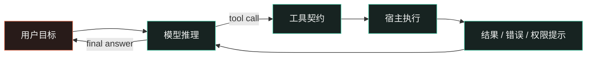

<style global>
:root { --slidev-theme-primary: #59d6b4; --ink: #f2f4f3; --muted: #aab7b4; --panel: #172321; --line: #35534c; --coral: #ff8f70; }
.slidev-layout { background: #0d1514; color: #f2f4f3; padding: 52px 72px; }
h1 { font-size: 52px; line-height: 1.08; letter-spacing: 0; }
h2 { font-size: 38px; line-height: 1.12; margin-bottom: 24px; letter-spacing: 0; }
h3 { font-size: 25px; }
p, li { font-size: 20px; line-height: 1.5; }
strong { color: #59d6b4; }
.eyebrow { color: #ff8f70; font-size: 16px; letter-spacing: .08em; text-transform: uppercase; }
.muted { color: #aab7b4; }
.accent { color: #ff8f70; }
.two-col { display: grid; grid-template-columns: 1.12fr .88fr; gap: 36px; align-items: start; }
.three-col { display: grid; grid-template-columns: repeat(3, 1fr); gap: 22px; }
.rule { height: 1px; background: #35534c; margin: 20px 0 26px; }
.quote { border-left: 4px solid #ff8f70; padding-left: 22px; color: #e7ecea; font-size: 29px; line-height: 1.3; }
.label { color: #aab7b4; font-size: 15px; text-transform: uppercase; letter-spacing: .08em; }
.step { border-top: 2px solid #59d6b4; padding-top: 12px; }
.step b { color: #59d6b4; font-size: 24px; }
.small { font-size: 16px; line-height: 1.4; }
.slidev-code { font-size: 17px !important; line-height: 1.45 !important; }
table { font-size: 18px; }
th { color: #59d6b4; }
td, th { padding: 9px 13px !important; border-color: #35534c !important; }
:global(.slidev-layout) { background: #0d1514; color: #f2f4f3; padding: 52px 72px; }
:global(.slidev-layout h1) { font-size: 52px; line-height: 1.08; letter-spacing: 0; }
:global(.slidev-layout h2) { font-size: 38px; line-height: 1.12; margin-bottom: 24px; letter-spacing: 0; }
:global(.slidev-layout h3) { font-size: 25px; }
:global(.slidev-layout p), :global(.slidev-layout li) { font-size: 20px; line-height: 1.5; }
:global(.slidev-layout strong) { color: #59d6b4; }
:global(.eyebrow) { color: #ff8f70; font-size: 16px; letter-spacing: .08em; text-transform: uppercase; }
:global(.muted) { color: #aab7b4; }
:global(.accent) { color: #ff8f70; }
:global(.two-col) { display: grid; grid-template-columns: 1.12fr .88fr; gap: 36px; align-items: start; }
:global(.three-col) { display: grid; grid-template-columns: repeat(3, 1fr); gap: 22px; }
:global(.rule) { height: 1px; background: #35534c; margin: 20px 0 26px; }
:global(.quote) { border-left: 4px solid #ff8f70; padding-left: 22px; color: #e7ecea; font-size: 29px; line-height: 1.3; }
:global(.label) { color: #aab7b4; font-size: 15px; text-transform: uppercase; letter-spacing: .08em; }
:global(.step) { border-top: 2px solid #59d6b4; padding-top: 12px; }
:global(.step b) { color: #59d6b4; font-size: 24px; }
:global(.small) { font-size: 16px; line-height: 1.4; }
:global(.slidev-code) { font-size: 17px !important; line-height: 1.45 !important; }
:global(table) { font-size: 18px; }
:global(th) { color: #59d6b4; }
:global(td), :global(th) { padding: 9px 13px !important; border-color: #35534c !important; }
:global(.stack) { display: flex; flex-direction: column; gap: 10px; margin-top: 18px; }
:global(.layer) { display: grid; grid-template-columns: 195px 1fr; gap: 16px; align-items: center; padding: 11px 16px; border-left: 4px solid #59d6b4; background: #172321; }
:global(.layer:nth-child(2)) { border-left-color: #7ee7ce; margin-left: 28px; }
:global(.layer:nth-child(3)) { border-left-color: #ffb08f; margin-left: 56px; }
:global(.layer:nth-child(4)) { border-left-color: #ff8f70; margin-left: 84px; }
:global(.layer-name) { font-size: 23px; font-weight: 700; color: #f2f4f3; }
:global(.layer-role) { color: #aab7b4; font-size: 15px; line-height: 1.35; }
:global(.timeline) { position: relative; margin-top: 24px; padding-left: 34px; }
:global(.timeline:before) { content: ''; position: absolute; left: 9px; top: 7px; bottom: 7px; width: 2px; background: #35534c; }
:global(.event) { position: relative; display: grid; grid-template-columns: 90px 1fr; gap: 22px; padding: 0 0 20px; }
:global(.event:before) { content: ''; position: absolute; left: -30px; top: 6px; width: 12px; height: 12px; background: #59d6b4; border: 3px solid #0d1514; outline: 2px solid #59d6b4; border-radius: 50%; }
:global(.event:nth-child(3):before) { background: #ff8f70; outline-color: #ff8f70; }
:global(.event-time) { color: #ff8f70; font-family: monospace; font-size: 16px; }
:global(.event-body) { color: #e7ecea; font-size: 19px; }
:global(.event-body span) { display: block; color: #aab7b4; font-size: 16px; margin-top: 4px; }
:global(.terminal) { background: #101b19; border: 1px solid #35534c; box-shadow: 8px 8px 0 #14211e; font-family: monospace; overflow: hidden; }
:global(.terminal-bar) { padding: 9px 14px; color: #aab7b4; border-bottom: 1px solid #35534c; font-size: 14px; }
:global(.terminal-body) { padding: 16px 18px 19px; font-size: 17px; line-height: 1.6; color: #d5e9e3; }
:global(.prompt) { color: #59d6b4; }
:global(.result) { color: #ffb08f; }
:global(.diff) { background: #151f1d; border-left: 3px solid #ff8f70; padding: 14px 18px; font-family: monospace; font-size: 16px; line-height: 1.6; }
:global(.minus) { color: #ff8f70; }
:global(.plus) { color: #59d6b4; }
:global(.boundary) { display: grid; grid-template-columns: 1fr 1.25fr 1fr; align-items: stretch; margin-top: 26px; min-height: 230px; }
:global(.zone) { padding: 20px; border: 1px solid #35534c; }
:global(.zone.model) { background: #1b2926; border-right: 0; }
:global(.zone.host) { background: #1b2422; border-right: 0; }
:global(.zone.world) { background: #2a1e1b; border-color: #7e4d40; }
:global(.zone h3) { margin: 0 0 12px; color: #59d6b4; }
 :global(.zone.world h3) { color: #ff8f70; }
:global(.zone p) { font-size: 17px; color: #aab7b4; }
:global(.boundary-arrow) { display: flex; align-items: center; justify-content: center; color: #ff8f70; font-size: 28px; }
.stack { display: flex; flex-direction: column; gap: 10px; margin-top: 18px; }
.layer { display: grid; grid-template-columns: 195px 1fr; gap: 16px; align-items: center; padding: 11px 16px; border-left: 4px solid #59d6b4; background: #172321; }
.layer:nth-child(2) { border-left-color: #7ee7ce; margin-left: 28px; }
.layer:nth-child(3) { border-left-color: #ffb08f; margin-left: 56px; }
.layer:nth-child(4) { border-left-color: #ff8f70; margin-left: 84px; }
.layer-name { font-size: 23px; font-weight: 700; color: #f2f4f3; }
.layer-role { color: #aab7b4; font-size: 15px; line-height: 1.35; }
.timeline { position: relative; margin-top: 24px; padding-left: 34px; }
.timeline:before { content: ''; position: absolute; left: 9px; top: 7px; bottom: 7px; width: 2px; background: #35534c; }
.event { position: relative; display: grid; grid-template-columns: 90px 1fr; gap: 22px; padding: 0 0 20px; }
.event:before { content: ''; position: absolute; left: -30px; top: 6px; width: 12px; height: 12px; background: #59d6b4; border: 3px solid #0d1514; outline: 2px solid #59d6b4; border-radius: 50%; }
.event:nth-child(3):before { background: #ff8f70; outline-color: #ff8f70; }
.event-time { color: #ff8f70; font-family: monospace; font-size: 16px; }
.event-body { color: #e7ecea; font-size: 19px; }
.event-body span { display: block; color: #aab7b4; font-size: 16px; margin-top: 4px; }
.terminal { background: #101b19; border: 1px solid #35534c; box-shadow: 8px 8px 0 #14211e; font-family: monospace; overflow: hidden; }
.terminal-bar { padding: 9px 14px; color: #aab7b4; border-bottom: 1px solid #35534c; font-size: 14px; }
.terminal-body { padding: 16px 18px 19px; font-size: 17px; line-height: 1.6; color: #d5e9e3; }
.prompt { color: #59d6b4; }
.result { color: #ffb08f; }
.diff { background: #151f1d; border-left: 3px solid #ff8f70; padding: 14px 18px; font-family: monospace; font-size: 16px; line-height: 1.6; }
.minus { color: #ff8f70; }
.plus { color: #59d6b4; }
.boundary { display: grid; grid-template-columns: 1fr 1.25fr 1fr; align-items: stretch; margin-top: 26px; min-height: 230px; }
.zone { padding: 20px; border: 1px solid #35534c; }
.zone.model { background: #1b2926; border-right: 0; }
.zone.host { background: #1b2422; border-right: 0; }
.zone.world { background: #2a1e1b; border-color: #7e4d40; }
.zone h3 { margin: 0 0 12px; color: #59d6b4; }
.zone.world h3 { color: #ff8f70; }
.zone p { font-size: 17px; color: #aab7b4; }
.boundary-arrow { display: flex; align-items: center; justify-content: center; color: #ff8f70; font-size: 28px; }
</style>

<!--
[Sources]
- https://github.com/earendil-works/pi
- https://pi.dev/docs/latest
-->

# Pi Agent：模型如何开始工作

<div class="mt-8 text-xl muted">一次工具调用，如何变成一次真实的工程行动</div>
<div class="absolute bottom-14 left-18 right-18 flex justify-between text-sm muted"><span>内部学习分享</span><span>2026</span></div>

<!--
[Sources]
- https://github.com/earendil-works/pi/tree/main/packages/agent
-->

---
layout: center
---

<div class="eyebrow">先记住这一句话</div>
<div class="quote mt-8 max-w-4xl">模型只负责提出下一步；真正让 Agent 工作的是<strong>工具、宿主和状态循环</strong>。</div>
<div class="mt-10 muted">今天不背 API，先学会追踪一次任务到底发生了什么。</div>

<!--
[Sources]
- https://github.com/earendil-works/pi
-->

---

# 听完后，你应该能回答三个问题

<div class="three-col mt-10"><div class="step"><b>01</b><p>Pi 是什么？它和普通聊天有什么不同？</p></div><div class="step"><b>02</b><p>一次 read / edit / bash 调用经过哪些边界？</p></div><div class="step"><b>03</b><p>如何用一个小任务验证 Agent 是否真的工作？</p></div></div>

<!--
[Sources]
- https://github.com/earendil-works/pi/tree/main/packages/agent
-->

---

# Agent loop：行动来自循环，而不是一句 Prompt


<div class="mt-5 muted">模型没有直接拿到文件系统，它只能请求一个由宿主解释的工具。</div>

<!--
[Sources]
- https://github.com/earendil-works/pi/tree/main/packages/agent
-->

---

# Pi 不是一个“更聪明的模型”

<div class="two-col mt-5"><div class="stack">
  <div class="layer"><div class="layer-name">pi-tui</div><div class="layer-role">终端交互：输入、输出和可见反馈</div></div>
  <div class="layer"><div class="layer-name">pi-coding-agent</div><div class="layer-role">编码产品层：默认工具与 CLI 工作流</div></div>
  <div class="layer"><div class="layer-name">pi-agent-core</div><div class="layer-role">运行时：tool calling、状态和事件循环</div></div>
  <div class="layer"><div class="layer-name">pi-ai</div><div class="layer-role">模型适配：统一不同供应商的 API</div></div>
</div><div><div class="label">从上到下是体验，从下到上是能力</div><p class="text-2xl mt-3">Pi 是<strong>可扩展的 harness</strong>：把模型、工具、状态、事件和交互接成一个可运行的系统。</p><div class="rule"></div><p class="muted small">读源码时，先定位“这一层拥有哪种责任”，再看具体实现。</p></div></div>

<!--
[Sources]
- https://github.com/earendil-works/pi
-->

---

# 把一次工具调用拆开看

<div class="timeline">
  <div class="event"><div class="event-time">00.0s</div><div class="event-body">模型发出 <strong>tool call</strong><span>工具名 + 参数：read_file({ path })</span></div></div>
  <div class="event"><div class="event-time">00.1s</div><div class="event-body">runtime 记录事件并检查状态<span>session、上下文、权限和取消信号</span></div></div>
  <div class="event"><div class="event-time">00.2s</div><div class="event-body">宿主执行真实动作<span>文件系统、进程或网络都在这一边发生</span></div></div>
  <div class="event"><div class="event-time">00.4s</div><div class="event-body">结果回注，循环再次进入模型<span>stdout、diff、error 或用户确认</span></div></div>
</div>
<div class="mt-1 quote">最重要的不是“模型说了什么”，而是<strong>哪一个边界真正产生了副作用</strong>。</div>

<!--
[Sources]
- https://github.com/earendil-works/pi/tree/main/packages/agent
-->

---

# 会话与状态：Agent 如何记住上下文

<div class="two-col mt-5"><div>
  <div class="label">一轮循环留下的记录</div>
  <div class="timeline">
    <div class="event"><div class="event-time">S1</div><div class="event-body">user_message<span>“修复空输入崩溃”</span></div></div>
    <div class="event"><div class="event-time">S2</div><div class="event-body">assistant → tool<span>read_file({ path })</span></div></div>
    <div class="event"><div class="event-time">S3</div><div class="event-body">tool → assistant<span>source text / error / diff</span></div></div>
    <div class="event"><div class="event-time">S4</div><div class="event-body">assistant → next<span>继续、修正，或结束</span></div></div>
  </div>
</div><div>
  <div class="label">调试时看哪三件事</div>
  <div class="mt-3 step"><b>顺序</b><p class="small">事件是否按预期进入上下文？</p></div>
  <div class="mt-3 step"><b>副作用</b><p class="small">工具参数和实际修改是否一致？</p></div>
  <div class="mt-3 step"><b>转移</b><p class="small">失败后状态去了重试、修正还是结束？</p></div>
</div></div>
<div class="mt-4 muted small">“它为什么这样做”通常要从事件流回答，而不是从最后一句自然语言回答。</div>

<!--
[Sources]
- https://github.com/earendil-works/pi/tree/main/packages/agent
-->

---

# 安全边界：项目 ≠ 执行环境

<div class="boundary">
  <div class="zone model"><h3>模型</h3><p>提出下一步</p><p>看见上下文</p><p class="accent">看不见真实文件系统</p></div>
  <div class="zone host"><h3>Agent + Host</h3><p>校验工具参数</p><p>决定是否执行</p><p>记录结果与权限</p></div>
  <div class="zone world"><h3>真实世界</h3><p>文件</p><p>进程</p><p>网络 / 凭据</p></div>
</div>
<div class="mt-5 quote">Project trust 不是 sandbox。<strong>权限和隔离属于宿主产品的责任</strong>。</div>

<!--
[Sources]
- https://github.com/earendil-works/pi
-->

---

# Demo：用一个小任务看完整因果链

<div class="two-col mt-5"><div>
  <div class="label">终端里看到的行动</div>
  <div class="terminal mt-3"><div class="terminal-bar">pi · demo-project · session 01</div><div class="terminal-body"><div><span class="prompt">$</span> pi "修复空输入崩溃"</div><div class="mt-2 muted">→ read_file src/parser.ts</div><div class="muted">→ edit src/parser.ts</div><div><span class="result">✓</span> 1 file changed</div><div><span class="prompt">$</span> npm test -- parser</div><div><span class="result">✓</span> 8 passed</div></div></div>
</div><div>
  <div class="label">模型提出的修改，宿主留下的证据</div>
  <div class="diff mt-3"><div class="muted">src/parser.ts</div><div class="minus">- const token = input.trim()</div><div class="plus">+ const token = (input ?? '').trim()</div><div class="muted">@@ test result</div><div class="plus">+ 8 passed</div></div>
  <div class="mt-5 muted small">讲解重点：先读，再改，再跑；每一步都能被观察和复盘。</div>
</div></div>

<!--
[Sources]
- https://github.com/earendil-works/pi/tree/main/packages/coding-agent
-->

---

# 用一个练习把概念变成经验

<div class="three-col mt-10"><div class="step"><b>读</b><p>只允许读取一个文件，先解释计划，不修改。</p></div><div class="step"><b>改</b><p>允许修改明确范围，检查 diff 是否符合计划。</p></div><div class="step"><b>跑</b><p>只运行一个定向命令，观察错误和下一轮决策。</p></div></div>
<div class="mt-10 muted">每轮都问：模型决定了什么？宿主执行了什么？状态如何变化？</div>

<!--
[Sources]
- https://github.com/earendil-works/pi/tree/main/packages/agent
-->

---

# 为什么这次用 Slidev 做分享

<div class="two-col mt-8"><div><ul><li>Markdown + Git，适合边学习边迭代</li><li>代码、Mermaid、点击动画和 live coding</li><li>Web 版保留交互，PDF 版用于兜底</li></ul></div><div><div class="label">交付策略</div><p><strong>现场：</strong>本地 Web 版 + 终端 Demo</p><p><strong>备份：</strong>导出 PDF</p><p><strong>存档：</strong><code>slides.md</code> 与 README</p></div></div>
<div class="mt-8 muted small">导出的 PPTX 每页是图片，交互不会保留；本次把 Web 版作为主版本。</div>

<!--
[Sources]
- https://sli.dev/guide/why
- https://sli.dev/guide/exporting
- https://sli.dev/guide/work-with-ai
-->

---

# 带走一张心智模型

```text
目标
  ↓
模型：提出下一步
  ↓
Agent runtime：维护状态、选择工具、推进循环
  ↓
宿主：执行并施加权限
  ↓
观察：结果、错误、diff、用户确认
  ↺
```
<div class="mt-8 quote">学习 Pi 的入口不是“它有多少功能”，而是“这一轮行动由谁决定、在哪里执行、如何被观察”。</div>

<!--
[Sources]
- https://github.com/earendil-works/pi
-->

---
layout: center
---

<div class="eyebrow">讨论</div>
# 现在看 Pi，<br />你会先追哪一条边界？
<div class="mt-8 muted">模型 · runtime · tool · host · permission · session</div>

<!--
[Sources]
- https://github.com/earendil-works/pi
-->
