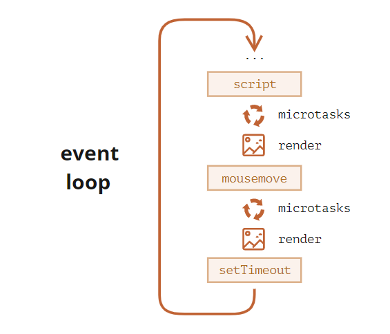
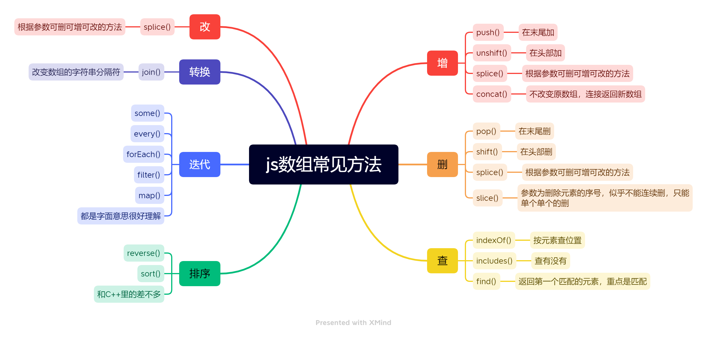
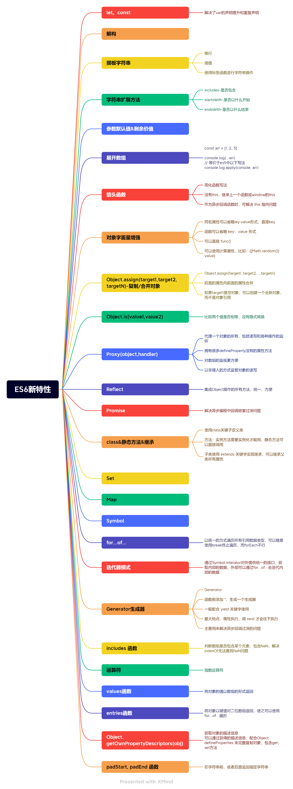

[toc]

# 2022年

## 4月

### 25日

​		前天把天梯赛打完，大半年没刷算法题理所当然的打了铁，想到还有一两个月时间，再不找实习就真寄了，昨天花了点时间总结了一下git的简单用法。

##### [git使用 | 思维导图](https://zhuanlan.zhihu.com/p/504587449)

​		真是太混了，虽然混起来是真的爽，但是还是得平衡好两者吧。

​		今天商城项目修了一下bug，有一些外部js文件出了问题，突然发现，**要学的架子真多，我也想搞一个自己的架子。**本来想把项目部署到云服务器，结果尚硅谷的给的接口出问题了，测试不了，没法确认还有没有bug，遂作罢。

### 26日

###### async

​		今天去了解了一下**async await**，发现需要重新才学一下**promise**，看过MDN以及其他大佬写的博客后对promise，async有了更深的了解，后面再看看面试题再加深一下，在看async时又看到了**微任务和宏任务**，发现不够了解，又去学习了一下。

**每个宏任务之后，引擎会立即执行微任务队列中的所有任务，然后再执行其他的宏任务，或渲染，或进行其他任何操作。**

​		这是在[现代 JavaScript 教程](https://zh.javascript.info/)中看到的对微任务的描述，很清晰，推荐大家看这个教程，写的很好。



​		学到了使用`queueMicrotask`安排微任务。

#### 面试题

##### [e.target 和 e.currentTarget 有什么区别？](https://fe.ecool.fun/topic-answer/4b1cefdc-57fd-443e-94ff-df06135cf5ac?orderBy=updateTime&order=desc&tagId=10)

​		开刷js面试题，第一题就不会，这表明什么，表明我差不多啥也不会，太美妙了:）

​		通过对[冒泡和捕获 (javascript.info)](https://zh.javascript.info/bubbling-and-capturing#eventtarget)的学习了解到对于冒泡：不要在没有需要的情况下停止冒泡，一般通过其它方式替换停止冒泡。

对于捕获则是开发时很少使用，也是通过addEventListener来学习捕获与冒泡的流程，可能面试的时候可以顺便多延申一下吧。

### 27日

#### 面试题

##### [Javscript数组的常用方法有哪些？](https://fe.ecool.fun/topic-answer/4b009a64-6d98-4469-89d4-9c254d682fa6?orderBy=updateTime&order=desc&tagId=10)

增删改查 | 排序 | 转换 | 迭代



##### [const声明了数组，还能push元素吗，为什么？](https://fe.ecool.fun/topic-answer/e79d1df5-690b-428c-846d-9f076e2afae3?orderBy=updateTime&order=desc&tagId=10)

​		这题就简单极了，const指向的对象不能变，而对象内部可以变。在js红宝书里讲过。

##### [如何区分数组和对象？](https://fe.ecool.fun/topic-answer/c8997d09-6634-4e27-9f3f-5376a6e97f17?orderBy=updateTime&order=desc&tagId=10)

​		这题在js红宝书里也讲过（说起来我红宝书才看了一些），红宝书里讲的更底层些，这里只在表层

```
let arr = [];
Array.isArray(arr);
arr instanceof Array;
arr.constructor;
Object.prototype.toString.call(arr)

```

##### [async、await 实现原理](https://fe.ecool.fun/topic-answer/29821d8e-dc41-4581-91fe-9fde7658a559?orderBy=updateTime&order=desc&tagId=10)

​		 刚好昨天看了一下async await的实现，虽然没怎么看懂，这里的讲解又引出了[Iterator对象](https://github.com/wangfupeng1988/js-async-tutorial/blob/master/part4-generator/02-iterator.md)的概念。

###### Iterator

​		先看了一下这个，看完感觉，这不就是给数组或函数对象啥的加个继承器嘛，感觉和C++里的差不多，又看到这篇文章其实是写的Generator，所以又了解了一下[Generator](https://github.com/wangfupeng1988/js-async-tutorial/tree/master/part4-generator).

###### Generator

​		了解到了yield， .next后会将yield后面的表达式执行,并返回执行的结果,又立即进入暂停状态.next向yield传值**传递给上一个已经执行完了的`yield`语句前面的变量**,差点没整明白.

​		`yield* `后面会接一个`Generator`，而且会把它其中的`yield`按照规则来一步一步执行。**如果有多个`Generator`串联使用的话（例如`Koa`源码中），用`yield\* `来操作非常方便**。

###### Thunk函数

​		在看Generator的过程中又看到了Thunk函数,不是很理解Thunk说是,得到一个只有一个参数为回调函数的函数.还介绍了thunkify和co库,最后又引出了koa框架和express框架.

​		介绍Generator在Koa框架中的使用时又说到了洋葱圈模型,顺着连接去看又看到了Egg.js,东西也太多了.😥

​		最后讲到了**“暂停”才是`Generator`的本质**

​		先暂时回到面试题asyncawait实现上,最后得到的结果是async、await 是 co 库的官方实现也可以看作是自带启动器的generator函数的语法糖。也算没白看刚刚大佬写的Generator介绍.

##### [岛屿数量](https://fe.ecool.fun/topic-answer/aa2840ae-f884-4fcb-a08b-e20310654dbd?orderBy=updateTime&order=desc&tagId=10)

​		还是一道算法题,我只能说太简单了,深搜广搜并查集简直右手就行(就是没用js写过),现在用js写一下,把这三个算法都实现一下.6

​		这里并查集使用了路径压缩,挺好.

##### [以下代码的输出是什么？](https://fe.ecool.fun/topic/8ee27192-8ae7-4e03-a32c-b00db276a83f?orderBy=updateTime&order=desc&tagId=10)

​		这道题考察this指向问题,我也不是很懂,但是按我的理解就是方法执行时的块或是说上下文?就是决定了this指向.

##### [给一个dom同时绑定两个点击事件，一个用捕获，一个用冒泡，说下会执行几次事件，然后会先执行冒泡还是捕获？](https://fe.ecool.fun/topic/2022f7f8-f3ec-4f8a-9971-9d5572d3e106?orderBy=updateTime&order=desc&tagId=10)

​		这道题在[e.target 和 e.currentTarget 有什么区别？](https://fe.ecool.fun/topic-answer/4b1cefdc-57fd-443e-94ff-df06135cf5ac?orderBy=updateTime&order=desc&tagId=10)这儿就已经考过了,本质上是三个阶段,捕获,到达目标,冒泡,这里只说冒泡和捕获,绑定几个就是几次,顺序就是先捕获然后再冒泡.

##### [promise.catch后面的.then还会执行吗？](https://fe.ecool.fun/topic/3925cf74-ee93-49fd-8896-8bc7221f32a4?orderBy=updateTime&order=desc&tagId=10)

​		这里就不又是知识盲区了,这里说promise之所以可以链式调用本质上是因为返回了一个新的Promise实例..`catch(onRejected)`与`then(undefined, onRejected)`在表现上一致

##### [如何确保你的构造函数只能被new调用，而不能被普通调用？](https://fe.ecool.fun/topic/2572a1d9-4018-49c3-9934-1fe1be0889b2?orderBy=updateTime&order=desc&tagId=10)

​		看到了这题,想起来以前看红宝书里对构造函数和普通函数的不同的描述,有点忘了都,去搜了一下,回忆起来了,通俗的讲,唯一的区别是是否用new,,而js自己是没有区分构造函数和普通函数的,要人为规定**构造函数名首字母要大写**作为区分,普通函数不建议使用this,构造函数不建议使用return。

### 28日

​		昨晚没学多少，晚上开会去了，开完会又去锻炼，锻炼完就十一点半了都，继续昨天这道题[如何确保你的构造函数只能被new调用，而不能被普通调用？](https://fe.ecool.fun/topic/2572a1d9-4018-49c3-9934-1fe1be0889b2?orderBy=updateTime&order=desc&tagId=10)

​		昨天说到构造函数里用this，而普通函数不用this，如果构造函数用Func()，返回的是undefined。这道题的实现就是靠函数内部加上instanceof来判断创建的实例是否是属于构造函数的。

​		但是这里说用instanceof并不完美，可以伪造一个实例来骗过去。于是引出了es6的new.target 属性，可以通过这个属性来判断是否是new的实例。

​		再进一步，引出了es6的class，我发现我es6的掌握基本为零，很好🙃。这里推荐面向对象编程时都使用class（确实用class才更像正统编程语言（指C++）），刚刚去廖雪峰的es6教程了解了一下es6的[Class 的基本语法](https://es6.ruanyifeng.com/?search=class&x=0&y=0#docs/class)，又通过这篇教程了解到了**v8引擎**，在了解class语法的过程中看到

```javascript
let getX;

export class C {
  #x = 1;
  static {
    getX = obj => obj.#x;
  }
}

console.log(getX(new C())); // 1
```


```
`#x`是类的私有属性，如果类外部的`getX()`方法希望获取这个属性，以前是要写在类的`constructor()`方法里面，这样的话，每次新建实例都会定义一次`getX()`方法。现在可以写在静态块里面，这样的话，只在类生成时定义一次。
```

​		这里太不懂，先放这儿了。

总结

- 借助 `instanceof` 和 `new` 绑定的原理，适用于低版本浏览器
- 借助 `new.target` 属性，可与 `class` 配合定义抽象类
- 面向对象编程使用 `ES6 class`——最佳方案

##### [如何获取到一个实例对象的原型对象？](https://fe.ecool.fun/topic/1a143475-08ab-49cc-abc9-62a4bb9249c0?orderBy=updateTime&order=desc&tagId=10)

​		这题就很简单了。分为三种，一种是构造函数自身用的，直接构造函数.prototype。二三种是对象实例用的，第二种是用 `_proto_`说是有兼容性问题，不建议使用。第三种就是Object.getPrototypeof(对象实例)

##### [下面代码会输出什么？](https://fe.ecool.fun/topic/7625104a-b9e7-4cab-915a-d1cccfa31d5c?orderBy=updateTime&order=desc&tagId=10)

​		这题考的是变量声明的提升，我一直认为js声明提升是非常垃圾的东西，所以如果我自己写项目是万万不会去用var的。这道题比较重要的点是**函数提升只会提升函数声明，而不会提升函数表达式。**

```javascript
console.log(foo1); // [Function: foo1]
foo1(); // foo1
console.log(foo2); // undefined
foo2(); // TypeError: foo2 is not a function
function foo1 () {
	console.log("foo1");
};
var foo2 = function () {
	console.log("foo2");
};
```

##### [restful 接口规范是什么？](https://fe.ecool.fun/topic/485b5052-3119-4ced-9473-940489629f99?orderBy=updateTime&order=desc&tagId=10)

​		又是一道完全不了解的题目，真好。但是这道题也太多了，暂时先看个大概，收藏起来以后看吧。

##### [ES5怎么实现继承](https://fe.ecool.fun/topic/9b19862a-b226-4a56-95d4-5ab4b05024bb?orderBy=updateTime&order=desc&tagId=10)

​		前面刚学了es6的class，es6实现了extend继承，在es5中主要依靠原型和原型链实现继承。

1. 原型链继承：学过原型链就很好理解，但是绑在原型对象上会导致只能创建一个实例，因为实例多了对继承父类修改的时候其它实例也会变。而且没有实现super()功能，super有点不了解有去看了一下。
2. 构造函数继承：这里遇到了apply不懂，其实call也不懂，顺便一起解决了吧。
   1. 这里说到apply和call的作用
      1. 改变this指向：那这就是实现继承的办法了
      2. 借用别的对象的方法：感觉和改变this指向是一样的
      3. 调用函数：使函数立即执行
   2. 又介绍了一下bind（我怎么这么多不知道！！！）
      1. 和call的区别是第二部分是个参数列表
      2. bind不立即触发，而是返回一个函数。
   3. 又看到了argument，这个我也不知道又去看了[Arguments 对象](https://developer.mozilla.org/zh-CN/docs/Web/JavaScript/Reference/Functions/arguments)，看arguments对象的时候又看到了[剩余参数](https://developer.mozilla.org/zh-CN/docs/Web/JavaScript/Reference/Functions/Rest_parameters#example)，发现剩余参数显然是比argument对象好用的，毕竟arguments想使用array方法必须先通过Array.prototype.slice.call(arguments)或是Array.from(arguments)转换为数组。还看到一个不知道的东西[Signature (functions)（函数签名）](https://developer.mozilla.org/zh-CN/docs/Glossary/Signature/Function)，看完了解到JavaScript中的 MyFunction和 java中的public一样。又了解到[解构赋值](https://developer.mozilla.org/zh-CN/docs/Web/JavaScript/Reference/Operators/Destructuring_assignment)
3. 组合式继承：结合了上面两种

### 29日

现在是05点46分，睡不着，起来接着看面试题吧

​		昨天看到了[ES5怎么实现继承](https://fe.ecool.fun/topic/9b19862a-b226-4a56-95d4-5ab4b05024bb?orderBy=updateTime&order=desc&tagId=10)第二种方法构造函数继承说是继承不到父类原型上的属性和方法，虽然有一点模糊，但能理解。第三种就是两种结合，原来没有父类原型上的属性和方法用原型链继承来弥补，但是会产生两份相同的属性和方法，不优雅。

​		这里讲到了第四种方法：寄生式组合继承，里面用到了object.create而不是new，值得查阅一下。Object.create()方法创建一个新对象，**使用现有的对象来提供新创建的对象的 `__proto__`**,到了这里就是ES5比较成熟的继承方式了


##### [什么是防抖和节流，以及如何编码实现？](https://fe.ecool.fun/topic/7fa82090-78a2-4445-a982-48ed95cb20c0?orderBy=updateTime&order=desc&tagId=10)

​        防抖和节流在写vue项目的时候就接触过了，这里加深一下印象学会如何实现。其实防抖和节流的概念再简单不过了，防抖节流就是走A，你的攻速多少就是多少，一定时间内只能触发一次这是节流，而防抖则是走A的前摇出手动作，你要是没把控好子弹没A出去那就白走A了。我甚至怀疑走A就是防抖节流做的，完全一致（不是）

​		这里的防抖节流实现没看懂，去找网上其它文章看一下。

节流的实现

~~~javascript
function thorttle(fn, delay) {
    //设定一个定时器
    let timer;
    // 开始时间
    let prevTime;
    return function (...args) {
      // 当前时间
      const currTime = Date.now();
      // 绑定上下文？
      const context = this;
      // 设定初始时间
      if (!prevTime) prevTime = currTime;
      // 先清楚一次定时器
      clearTimeout(timer);

      // 如果高于间隔delay
      if (currTime - prevTime > delay) {
        // 初始时间变为当前时间
        prevTime = currTime;
        // 触发传入的回调函数
        fn.apply(context, args);
        // 清楚定时器
        clearTimeout(tiemr);
        return;
      }

      // 设定定时器且触发一次fn
      timer = setTimeout(function () {
        prevTime = Date.now();
        timer = null;
        fn.apply(context, args);
      }, delay);
    };
  }
~~~

花了点时间理解了一下，差不多理解了， 不知道这个实际应用用的多不多（我记得lodash好像是有现成的可以用的），大致意思就是进入了return function这个函数里就一定得过一定间隔才能触发一次。

防抖的实现

~~~javascript
function debounce(func, wait, immediate) {

    let timeout;

    return function () {
        let context = this;
        let args = arguments;

        if (timeout) clearTimeout(timeout); // timeout 不为null
        if (immediate) {
            let callNow = !timeout; // 第一次会立即执行，以后只有事件执行后才会再次触发
            timeout = setTimeout(function () {
                timeout = null;
            }, wait)
            if (callNow) {
                func.apply(context, args)
            }
        }
        else {
            timeout = setTimeout(function () {
                func.apply(context, args)
            }, wait);
        }
    }
}
~~~

理解了节流的实现再看防抖就更好理解了。

##### [请简述 == 的机制](https://fe.ecool.fun/topic/be6f7f8b-d386-4f99-a0bc-f9b5a0512f99?orderBy=updateTime&order=desc&tagId=10)

​		感觉这题也太无聊了，在红宝书里看过了，就是觉得没什么意义，实际开发里也不会把不相关的两个参数拿来比较吧

##### [怎么实现图片懒加载？](https://fe.ecool.fun/topic/d3f21598-edfa-48f4-b2d3-d0c19d754b10?orderBy=updateTime&order=desc&tagId=10)

1. html实现：直接在img标签上加上loading:"lazy"
2. js监听页面的滚动实现
   1. 拿到所有的图片dom
   2. 遍历每个图片判断当前图片是否到了可视区范围
   3. 如果到了就设置图片的src属性
   4. 绑定window的scroll事件，对其进行事件监听
3. 这里需要手写一个节流函数，足可见节流函数的重要性，所以我等会儿就去手写练习一下
4. 这里指出现在有了一个新的名为IntersectionObserver交叉观察器的API

##### [说说sourcemap的原理？](https://fe.ecool.fun/topic/2f8aa80e-e3b0-4d10-843d-83e947dda744?orderBy=updateTime&order=desc&tagId=10)

> 调试原始源代码会比浏览器下载的转换后的代码更加容易。 [source map](https://www.html5rocks.com/en/tutorials/developertools/sourcemaps/) 是从已转换的代码映射到原始源的文件，使浏览器能够重构原始源并在调试器中显示重建的原始源。

​		不是很理解，先收藏着吧，感觉面试也不会太问

##### [使用js实现二分查找](https://fe.ecool.fun/topic/4a29429d-d77e-46be-a4fd-099ba208c52f?orderBy=updateTime&order=desc&tagId=10)

​		二分很简单，过！

##### [AST语法树是什么？](https://fe.ecool.fun/topic/4b1c17f5-a42b-4853-9ff5-792a23d45050?orderBy=updateTime&order=desc&tagId=10)

​		感觉实习面试用不到，先收藏了，过！

##### [flexible.js实现移动端适配的原理是什么？](https://fe.ecool.fun/topic/3c003aad-68a0-4abf-8fbc-62e37b4f3b10?orderBy=updateTime&order=desc&tagId=10)

​		感觉用不到，暂时过！

##### [JavaScript中的 sort 方法是怎么实现的？](https://fe.ecool.fun/topic/807ac3c6-6e75-4cbf-9a5d-3084f860ea11?orderBy=updateTime&order=desc&tagId=10)

快排实现

~~~javascript
  var a = [25, 76, 34, 232, 6, 456, 221];
  function quickSort(array) {
    var quick = function (arr) {
      if (arr.length <= 1) return arr;
      const index = Math.floor(arr.length >> 1);
      const pivot = arr.splice(index, 1)[0];
      const left = [];
      const right = [];
      for (let i = 0; i <= arr.length; i++) {
        if (arr[i] > pivot) {
          right.push(arr[i]);
        } else if (arr[i] <= pivot) {
          left.push(arr[i]);
        }
      }
      return quick(left).concat([pivot].quick(right));
    };
    const result = quick(array);
    return result;
  }

  quickSort(a);

var sortArray = function(nums) {
    // 快速排序
    function quickSort(start, end, arr) {
        if (start < end) {
            let mid = sort(start, end, arr);
            // 注意，一定要是 start mid , mid+1 end 这种组合
            // 否则当首位最大的时候(mid返回0)，将会无限循环
            quickSort(start, mid, arr);
            quickSort(mid+1, end, arr);
        }
        return arr;
    }

    function sort(start, end, arr) {
        // 取基准值
        let base = arr[start];

        let low = start;
        let high = end;

        while(low !== high) {
            // 从后往前，寻找比基准值小的值，赋给low位置(也就是取base值的位置)
            while(arr[high] >= base && high > low) {
                high--;
            }
            arr[low] = arr[high];
            // 从前往后，寻找比基准值大的值，赋给high位置
            while(arr[low] <= base && high > low) {
                low++;
            }
            arr[high] = arr[low];
        }
        arr[low] = base;
        return low;
    }
    return quickSort(0, nums.length - 1, nums);
};
~~~

对答案的阅读可知，sort的实现就是靠快排，而在长度为十以下就用插入排序（插入排序适合小数据，是sort小数据的补充），长度十到一千使用哨兵元素，而长度为一千以上就需要使用间隔为200到215的一个元素取出形成新数组对它排序找到中间位置的数，本质上数据量超过了10都是用的快排，只是需要找到合适的中间数以减小时间复杂度。

### 30日

[ES6有哪些新特性？](https://fe.ecool.fun/topic/5e131c75-d26e-4527-8f51-29d842f3c829?orderBy=updateTime&order=desc&tagId=10)

​		这题就要完全掌握了，好好学一下

> ES6是对于ES2015+的俗称，也可以说是通常叫法

新特性主要分为四大类

1. 解决原有语法上的一些不足：比如let和const的块级作用域
2. 对原有语法进行增强：比如解构、展开、参数默认值、摸板字符串
3. 全新的对象、全新的方法、全新的功能：比如promise、proxy、object和assign、is
4. 全新的数据类型和数据结构：symbol、set、map



##### [jquery的链式调用是怎么实现的？](https://fe.ecool.fun/topic/95cb0844-3e54-45c3-8809-1121bafc57ba?orderBy=updateTime&order=desc&tagId=10)

​		链式调用的核心就在于调用玩的方法将自身实例返回

##### [cookie、localStorage和sessionStorage 三者之间有什么区别](https://fe.ecool.fun/topic/718abe6b-08ab-4669-bc33-187fabad8fec?orderBy=updateTime&order=desc&tagId=10)

​		用户登录用登录，其它情况一般都用Storage

##### [前端怎么实现跨域请求？](https://fe.ecool.fun/topic/56e56a05-99c7-4701-ae72-e06d2c6a4d42?orderBy=updateTime&order=desc&tagId=10)

​		感觉好难记，要实践用起来才清晰

##### [自定义指令是什么？有哪些应用场景？](https://fe.ecool.fun/topic-answer/7f41c072-39f8-4785-ad16-992bf7cacfb7?orderBy=updateTime&order=desc&tagId=10)

什么是自定义指令？

​		指令系统是计算机硬件的语言系统，也叫机器语言，它是系统程序员看到的计算机的主要属性。因此指令系统表征了计算机的基本功能决定了机器所要求的能力

​		在vue中提供了一套为数据驱动视图更为方便的操作，这些操作被称为指令系统

​		我们看到的`v- `开头的行内属性，都是指令，不同的指令可以完成或实现不同的功能

​		除了核心功能默认内置的指令 (`v-model` 和 `v-show`)，`Vue` 也允许注册自定义指令。

注册一个自定义指令有全局注册与局部注册

- 全局注册注册主要是用过`Vue.directive`方法进行注册

  `Vue.directive`第一个参数是指令的名字（不需要写上`v-`前缀），第二个参数可以是对象数据，也可以是一个指令函数

- 局部注册通过在组件`options`选项中设置`directive`属性

---

感觉有点多，转移战场了

##### [面试官：说说你对盒子模型的理解? ](https://vue3js.cn/interview/css/box.html#一、是什么)

###### 一、是什么

- 当一个文档进行布局（layout）的时候，浏览器的渲染引擎会根据标准之一的CSS基础框盒模型，将所有元素表示为一个个矩形的盒子。

- 一个盒子由四部分组成，content、border、padding、margin

- 盒子模型又分：

  - W3C标准盒子模型

    - 盒子总宽度：width+padding+border+margin

    - 盒子总高度：height+padding+border+margin

    - > `width/height` 只是内容高度，不包含 `padding` 和 `border`值

  - IE怪异盒子模型

    - 盒子总宽度：width+margin

    - 盒子总高度：height+margin

    - > `width/height` 包含了 `padding`和 `border`值

  - Box-sizing属性

    - content-box 默认值，元素的 width/height 不包含padding，border，与**标准盒子模型**表现一致
    - border-box 元素的 width/height 包含 padding，border，与**怪异盒子模型**表现一致
    - inherit 指定 box-sizing 属性的值，应该从父元素**继承**

##### [面试官：css选择器有哪些？优先级？哪些属性可以继承？](https://vue3js.cn/interview/css/selector.html#一、选择器)

###### 一、选择器

- id选择器

- 类选择器

- 标签选择器

- 后代选择器：后代选择器是所有后代

- 子选择器：子选择器是直接后代（第一代后代）

- 相邻同胞选择器

- 群组选择器

- 伪类选择器

  ~~~css
  :link ：选择未被访问的链接
  :visited：选取已被访问的链接
  :active：选择活动链接
  :hover ：鼠标指针浮动在上面的元素
  :focus ：选择具有焦点的
  :first-child：父元素的首个子元素
  ~~~

- 伪元素选择器

  ```css
  :first-letter ：用于选取指定选择器的首字母
  :first-line ：选取指定选择器的首行
  :before : 选择器在被选元素的内容前面插入内容
  :after : 选择器在被选元素的内容后面插入内容
  ```

  

- 属性选择器

  ```css
  [attribute] 选择带有attribute属性的元素
  [attribute=value] 选择所有使用attribute=value的元素
  [attribute~=value] 选择attribute属性包含value的元素
  [attribute|=value]：选择attribute属性以value开头的元素
  ```

- CSS3中新增的选择器

  - 层次选择器（p~ul），选择前面有p元素的每个ul元素

  - 伪类选择器

    ```css
    :first-of-type 表示一组同级元素中其类型的第一个元素
    :last-of-type 表示一组同级元素中其类型的最后一个元素
    :only-of-type 表示没有同类型兄弟元素的元素
    :only-child 表示没有任何兄弟的元素
    :nth-child(n) 根据元素在一组同级中的位置匹配元素
    :nth-last-of-type(n) 匹配给定类型的元素，基于它们在一组兄弟元素中的位置，从末尾开始计数
    :last-child 表示一组兄弟元素中的最后一个元素
    :root 设置HTML文档
    :empty 指定空的元素
    :enabled 选择可用元素
    :disabled 选择被禁用元素
    :checked 选择选中的元素
    :not(selector) 选择与 <selector> 不匹配的所有元素
    ```

  - 属性选择器

    ```css
    [attribute*=value]：选择attribute属性值包含value的所有元素
    [attribute^=value]：选择attribute属性开头为value的所有元素
    [attribute$=value]：选择attribute属性结尾为value的所有元素
    ```

    

###### 优先级

> 内联 > ID选择器 > 类选择器 > 标签选择器

###### 三、继承属性

- 字体系列属性
- 文本系列属性
- 元素可见性
- 表格布局属性
- 列表属性
- 引用
- 光标属性

##### [面试官：说说em/px/rem/vh/vw区别? ](https://vue3js.cn/interview/css/em_px_rem_vh_vw.html#一、介绍)

- px

  px实际显示的大小是不确定的，之所以认为px是绝对单位在于px的大小和元素的其他属性无关

- em

  em是相对长度单位，相对于当前对象内文本的字体尺寸。浏览器默认字体尺寸为`1em=16px` ，为了简化font-size的换算一般在body选择器中声明62.5%，这样可以方便em与px的换算。

- rem

  rem相对的只是html根元素font-size的值，不像em一样使用级联的方式来计算尺寸

  对于只需要适配少部分手机设备且分辨率对页面影响不大用px，对于需要适配各种移动设备，使用rem

- vh、vw

  就是根据窗口的高度、宽度分成100份

睡了，明天至多花一天时间搞定css的面试题，后面就面到了再去补了

