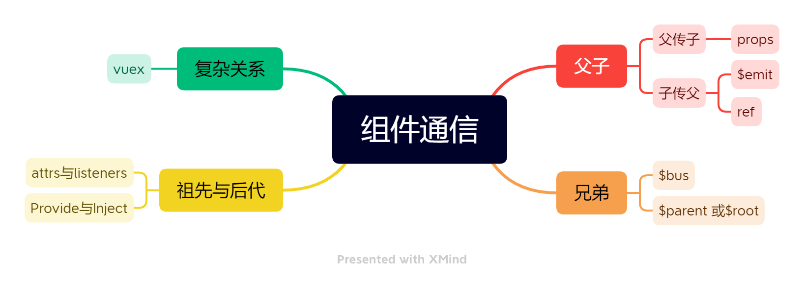
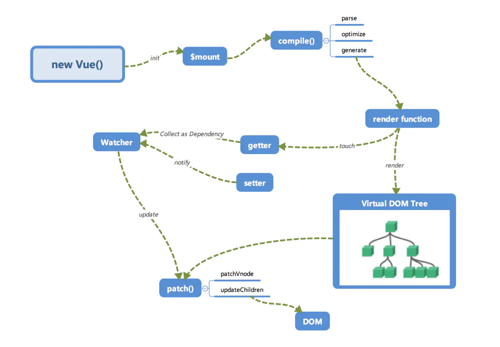

 [toc]


## 5月

### 1日

##### [面试官：说说设备像素、css像素、设备独立像素、dpr、ppi 之间的区别？](https://vue3js.cn/interview/css/dp_px_dpr_ppi.html#二、介绍)

无缩放情况下，1个CSS像素等于1个设备独立像素

设备像素由屏幕生产之后就不发生改变，而设备独立像素是一个虚拟单位会发生改变

PC端中，1个设备独立像素=1个设备像素（在100%，未缩放的情况下）

在移动端中，标准屏幕（160ppi）下1个设备独立像素 = 1个设备像素

设备像素比 （dpr）= 设备像素/设备独立像素

每英寸像素（ppi） = 值越大，图像越清晰

##### [面试官：css中，有哪些方式可以隐藏页面元素？区别? | web前端面试 - 面试官系列 (vue3js.cn)](https://vue3js.cn/interview/css/hide_attributes.html#一、前言)

这个问题我在别人的总结里见过，得认真看看。

- display:none
  - 直接消失
  - 特点：元素不可见，不占据空间，无法响应点击事件
- visiblity:hidden
  - 特点：元素不可见，占据页面空间，无法响应点击事件
- opacity:0
  - 特点：改变元素透明度，元素不可见，占据页面空间，可以响应点击事件
- 设置height、width模型属性为0
  - 将margin、border、padding、height和width等影响元素盒模型的属性设置为0，如果元素内有子元素或内容，还应该设置其overflow:hidden来隐藏子元素
  - 特点：元素不可见，不占据页面空间。无法响应点击事件
- position:absolute
  - 直接将元素移出可视区域
  - 元素不可见，不影响页面布局
- clip-path
  - 通过裁剪的形式，直接裁掉
  - 特点：元素不可见，占据页面空间，无法响应点击事件

最常用的是display:none和visibility:hidden，其他的方式并不适合

##### [面试官：谈谈你对BFC的理解？](https://vue3js.cn/interview/css/BFC.html#一、是什么)

BFC：块级格式上下文

一、是什么

实际就是一个独立的容器

二、触发条件

触发`BFC`的条件包含不限于：

- 根元素，即HTML元素
- 浮动元素：float值为left、right
- overflow值不为 visible，为 auto、scroll、hidden
- display的值为inline-block、inltable-cell、table-caption、table、inline-table、flex、inline-flex、grid、inline-grid
- position的值为absolute或fixed

三、应用场景

- 防止margin重叠
- 清除内部浮动
- 自适应多栏布局

##### [面试官：元素水平垂直居中的方法有哪些？如果元素不定宽高呢？](https://vue3js.cn/interview/css/center.html#面试官-元素水平垂直居中的方法有哪些-如果元素不定宽高呢)

实现方式

- 利用定位+margin:auto
  - 子绝父相，四定位属性设为0，设置宽高，使用margin，自动上下左右居中
- 利用定位+margin:负值
  - 子绝父相，子元素设置top、left：50%，然后移动自身宽高负50%。
  - 需要知道子元素自身的宽高
  - 除这一种外都不需要定宽高
- 利用定位+transform
  - 与上相同，唯一不同是不需要写移动多少px而是改为transform:translate(-50%,-50%)
- table布局
  - 设置父元素为display:table-cell，子元素设置display:inline-block。利用vetical和text-align让所有的行内块级元素水平垂直居中
- flex弹性布局
  - 设置父元素为display:flex，align-items:center水平居中，justify-content:center垂直居中
- grid网格布局
  - 网格布局与flex弹性布局相同，设置父元素为display:flex ，align-items:center ，justify-content:center

##### [面试官：如何实现两栏布局，右侧自适应？](https://vue3js.cn/interview/css/column_layout.html#一、背景)

这道题目我看面试考过，仔细看看

- 双栏布局

  双栏布局以一个定宽栏和一个自适应的栏并排展示存在

  思路

  - 使用float左浮左边栏
  - 右边模块使用margin-left撑出内容块做内容展示
  - 为父级元素添加BFC，防止下方元素飞到上方内容
  - 或者使用felx布局

- 三栏布局

  - 两边使用float，中间使用margin
  - 两边使用absolute，中间使用margin
  - 两边使用float和负margin
  - display：table实现
  - flex实现
  - grid网格布局

##### [面试官：说说flexbox（弹性盒布局模型）,以及适用场景？](https://vue3js.cn/interview/css/flexbox.html#二、属性)

flex，即弹性布局，可以简便、完整、响应式地实现各种页面布局

有两条主轴，默认沿主轴排列

应用场景

快速两栏三栏自适应布局，包括在移动端、小程序的开发，都建议使用flex进行布局

##### [面试官：介绍一下grid网格布局](https://vue3js.cn/interview/css/grid.html#一、是什么)

网格布局，是一种二维的布局方式，由纵横相交的两组网格线形成的框架性布局结构，能够同时处理行与列，擅长将一个页面划分为几个主要区域，以及定义这些区域的大小、位置、层次等关系

应用场景

可以实现两列三列布局

##### [面试官：CSS3新增了哪些新特性？](https://vue3js.cn/interview/css/css3_features.html#一、是什么)

- 新增了一些选择器
- 新增了样式
  - 边框
    - border-radius
    - box-shadow
    - border-image
    - 后续的css优化里说这些边框比较影响渲染速度
  - 背景
    - background-clip
    - background-origin
    - background-size
    - background-break
  - 文字
    - word-wrap
    - text-overflow
    - text-shadow
    - text-decoration
  - transition过渡
  - transform转换
  - animation动画
  - 渐变
- 新增了如flex弹性布局、Grid栅格布局、多列布局、媒体查询、混合模式等等

##### [面试官：css3动画有哪些？](https://vue3js.cn/interview/css/animation.html#一、是什么)

- transition 实现渐变动画
- transform 转变动画
- animation 实现自定义动画

##### [面试官：怎么理解回流跟重绘？什么场景下会触发？](https://vue3js.cn/interview/css/layout_painting.html#一、是什么)

回流：布局引擎会根据各种样式计算每个盒子在页面上的大小与位置（定位置和大小）

重绘：当计算好盒模型的位置、大小及其他属性后，浏览器根据每个盒子特性进行绘制（绘制）

渲染机制

- 解析HTML、生成DOM树，解析CSS，生成CSSOM树
- 将DOM树和CSSOM树结合，生成渲染树（Render Tree）
- Layout(回流)：根据生成的渲染树，进行回流（Layout），得到节点的几何信息（位置，大小）
- Painting(重绘)：根据渲染树以及回流得到的几何信息，得到节点的绝对像素
- Display：将像素发送给GPU，展示在页面上

如何触发

- 回流触发机制

  回流这一阶段主要是计算节点的位置和几何信息，当页面布局和几何信息发生变化的时候就需要回流

- 触发重绘机制

  触发回流一定会触发重绘

  - 颜色的修改
  - 文本方向的修改
  - 阴影的修改

浏览器优化机制

- 使用队列进行批量优化，知道过了一段时间或者操作到达了一个阈值才清空队列
- 获取布局信息会强制队列刷新

减少回流

- 如果想设定元素的样式，通过改变元素的 `class` 类名 (尽可能在 DOM 树的最里层)
- 避免设置多项内联样式
- 应用元素的动画，使用 `position` 属性的 `fixed` 值或 `absolute` 值(如前文示例所提)
- 避免使用 `table` 布局，`table` 中每个元素的大小以及内容的改动，都会导致整个 `table` 的重新计算
- 对于那些复杂的动画，对其设置 `position: fixed/absolute`，尽可能地使元素脱离文档流，从而减少对其他元素的影响
- 使用css3硬件加速，可以让`transform`、`opacity`、`filters`这些动画不会引起回流重绘
- 避免使用 CSS 的 `JavaScript` 表达式

##### [面试官：什么是响应式设计？响应式设计的基本原理是什么？如何做？](https://vue3js.cn/interview/css/responsive_layout.html#一、是什么)

响应式设计是一种网络页面设计布局，页面的设计与开发应当根据用户行为以及设备环境进行响应的响应和调整

实现

- 媒体查询
- 百分比
- vw/vh
- rem

##### [面试官：如果要做优化，CSS提高性能的方法有哪些？](https://vue3js.cn/interview/css/css_performance.html#一、前言)

实现方式

- 内联首屏关键CSS
- 异步加载CSS
- 资源压缩
- 合理使用选择器
- 减少使用昂贵的属性
- 不要使用@import
- 减少重排操作，以及减少不必要的重绘
- 了解哪些属性可以继承而来，避免对这些属性重复编写
- cssSprite，合成所有icon图片，用宽高加上backgroud-position的背景图方式显现出我们要的icon图，减少了http请求
- 把小的icon图片转成base64编码
- CSS3动画或者过渡尽量使用transform和opacity来实现动画，不要使用left和top属性

##### [面试官：如何实现单行／多行文本溢出的省略样式？](https://vue3js.cn/interview/css/single_multi_line.html#一、前言)

单行文本

- text-overflow：规定当文本溢出时，显示省略符号来代表被修剪的文本
- white-space：设置文字在一行显示，不能换行
- overflow：文字长度超出限定宽度，则隐藏超出的内容

多行文本

- 基于行数截断

- -webkit-line-clamp: 2：用来限制在一个块元素显示的文本的行数，为了实现该效果，它需要组合其他的WebKit属性）
- display: -webkit-box：和1结合使用，将对象作为弹性伸缩盒子模型显示
- -webkit-box-orient: vertical：和1结合使用 ，设置或检索伸缩盒对象的子元素的排列方式
- overflow: hidden：文本溢出限定的宽度就隐藏内容
- text-overflow: ellipsis：多行文本的情况下，用省略号“…”隐藏溢出范围的文本
- 基于高度截断
- position: relative：为伪元素绝对定位
- overflow: hidden：文本溢出限定的宽度就隐藏内容）
- position: absolute：给省略号绝对定位
- line-height: 20px：结合元素高度,高度固定的情况下,设定行高, 控制显示行数
- height: 40px：设定当前元素高度
- ::after {} ：设置省略号样式

##### [面试官：如何使用css完成视差滚动效果? ](https://vue3js.cn/interview/css/visual_scrolling.html#一、是什么)

- background-attachment
- transform:translate3D

##### [面试官：CSS如何画一个三角形？原理是什么？](https://vue3js.cn/interview/css/triangle.html#一、前言)

- 使用border各边的宽度和颜色以及是否透明
- 使用伪类实现空心三角形

##### [面试官：让Chrome支持小于12px 的文字方式有哪些？区别？](https://vue3js.cn/interview/css/less_12px.html#一、背景)

- zoom
- -webkit-transform:scale()
- -webkit-text-size-adjust:none

##### [面试官：说说对Css预编语言的理解？有哪些区别? | web前端面试 - 面试官系列 (vue3js.cn)](https://vue3js.cn/interview/css/sass_less_stylus.html#二、有哪些)

css是一门标记性语言，语法相对简单，但是逻辑性较差，css预处理器便是针对这一问题的解决方案

预处理语言扩充了css语言，增加了诸如变量、混合、函数等功能，让css更易维护、方便

sass预编译语言在前端里有三大优秀的预编处理器，sass、less、stylus

### 2日

先复习昨天的CSS面试题

#### HTTP系列

##### [面试官：什么是HTTP? HTTP 和 HTTPS 的区别? ](https://vue3js.cn/interview/http/HTTP_HTTPS.html)

一、HTTP

HTTP（HyperText Transfer Protocol）即超文本传输协议

### 3日

用了一上午复习了http相关的知识点，下午看es6特性。

没看完

### 4日

##### [面试官：你是怎么理解ES6中 Generator的？使用场景？](https://vue3js.cn/interview/es6/generator.html#三、异步解决方案)

Generator用来对象迭代、控制输出、部署Interator接口

[面试官：你是怎么理解ES6中Proxy的？使用场景?](https://vue3js.cn/interview/es6/proxy.html#一、介绍)

定义：用于定义基本操作的自定义行为，用于创建一个对象的代理，从而实现基本操作的拦截和自定义

本质：修改的是程序默认行为，形同于在编程语言层面上做修改，属于**元编程**（meta programming）又译超编程

若需要在Proxy内部调用对象的默认行为，建议使用**Reflect**

参数：

`target`表示所要拦截的目标对象（任何类型的对象，包括原生数组，函数，甚至另一个代理））

`handler`通常以函数作为属性的对象，各属性中的函数分别定义了在执行各种操作时代理 `p` 的行为

在handler中加入get、set等以代替原生get、set方法。

取消代理

```
Proxy.revocable(target, handler);
```

使用场景

- 拦截和监视外部对对象的访问
- 降低函数或类的复杂度
- 在复杂操作前对操作进行校验或对所需资源进行管理
- 实现观察者模式

##### [面试官：你是怎么理解ES6中Module的？使用场景？](https://vue3js.cn/interview/es6/module.html#一、介绍)

大多都是平时写项目遇见过的，唯独这个**复合写法**没见过不懂有什么意义。

如果在一个模块之中，先输入后输出同一个模块，`import`语句可以与`export`语句写在一起

```
export { foo, bar } from 'my_module';

// 可以简单理解为
import { foo, bar } from 'my_module';
export { foo, bar };
```

##### [面试官：你是怎么理解ES6中 Decorator 的？使用场景？](https://vue3js.cn/interview/es6/decorator.html#一、介绍)

Decorator，装饰器，与装饰者模式类似，一种在不改变原来和使用继承的情况下，动态的地扩展对象功能的设计理论，装饰器也是一样，用来扩展类属性和类方法

两大优点

- 代码可读性变强了，装饰器命名相当于一个注释
- 在不改变原有代码的情况下，对原来功能进行扩展

在装饰器外层再封装一层函数就可以实现传递参数（不是很理解，为什么需要封装两层不能一层传两个参数）

类属性的装饰，接受三个参数

- 类的原型对象
- 需要装饰的属性名
- 装饰属性名的描述对象

不能用来修饰函数，因为函数存在变量声明情况

使用场景

- react-redux
- mixins
- core-decorators.js
  - autobind
  - readonly
  - deprecate

##### [面试官：说说JavaScript中的数据类型？存储上的差别？](https://vue3js.cn/interview/JavaScript/data_type.html#前言)

基础类型中字符串是不可变的，一旦创建了就只能销毁再创建

null是一个空指针对象，null==underfined

symbol的用途是确保对象属性使用唯一标识符，不会发生属性冲突的危险

function实际上是对象

基本数据类型存储在栈中

引用数据类型的对象存储于堆中

##### [面试官：== 和 ===区别，分别在什么情况使用](https://vue3js.cn/interview/JavaScript/== _===.html#三、区别)

除了在比较对象属性为null或者undefined的情况下，我们可以使用相等操作符，其他情况建议一律使用全等操作符

##### [面试官：深拷贝浅拷贝的区别？如何实现一个深拷贝？](https://vue3js.cn/interview/JavaScript/copy.html#二、浅拷贝)

在`JavaScript`中，存在浅拷贝的现象有：

- `Object.assign`
- `Array.prototype.slice()`, `Array.prototype.concat()`
- 使用拓展运算符实现的复制

常见的深拷贝实现：

- _.cloneDeep()
- JQuery.extend()
- JSON.stringify()
- 循环递归

深拷贝的实现

第一种

~~~
let obj2 = JSON.parse(JSON.stringify(obj1))
~~~

存在问题

- 拷贝的对象中如果有函数，undefined，symbol，当使用过`JSON.stringify()`进行处理之后，都会消失。
- 无法拷贝不可枚举的属性；
- 无法拷贝对象的原型链；
- 拷贝 Date 引用类型会变成字符串；
- 拷贝 RegExp 引用类型会变成空对象；
- 对象中含有 NaN、Infinity 以及 -Infinity，JSON 序列化的结果会变成 null；
- 无法拷贝对象的循环应用，即对象成环 (`obj[key] = obj`)。

### 5日

##### [面试官：说说JavaScript中的事件模型](https://vue3js.cn/interview/JavaScript/event_Model.html#二、事件模型)

事件与事件流

js中的事件，就是在HTML文档或者浏览器中发生的一种交互操作，使得网页具备互动性，常见如加载事件、鼠标事件、自定义事件等

事件流

- 事件捕获阶段
- 处于目标阶段
- 事件冒泡阶段

原始事件模型

事件绑定监听函数有两种方式

- HTML代码种直接绑定
- 通过js代码绑定

特性

- 绑定速度快
  - DOM0级事件具有很好的跨浏览器优势，但由于绑定速度太快，可能页面还未完全加载出来，以至于事件可能无法正常运行
- 只支持冒泡，不支持捕获
- 同一个类型的事件只能绑定一次，使用btn.onclick = null删除DOM0级事件处理程序

 标准事件模型

事件模型中，一次事件共有三个过程

- 事件捕获阶段：事件从document一直向下传播到目标元素，依次检查经过的节点是否绑定了事件监听函数，有则执行
- 事件处理阶段：事件到达目标元素，触发目标元素的监听函数
- 事件冒泡阶段：事件从目标元素冒泡到document，一次检查经过的节点是否绑定了事件监听函数，如果有则执行

IE事件模型

- 事件处理阶段：事件到达目标元素，触发目标元素的监听函数

- 事件冒泡阶段：事件从目标元素冒泡到document，依次检查经过的节点是否绑定了事件监听函数，有则执行

- ```javascript
  btn.attachEvent(‘onclick’, showMessage);
  btn.detachEvent(‘onclick’, showMessage);
  ```

##### [面试官：typeof 与 instanceof 区别](https://vue3js.cn/interview/JavaScript/typeof_instanceof.html#一、typeof)

###### typeof

typeof操作符返回一个字符串，表示未经计算的操作数的类型

null显示object是一个悠久的bug，判断null时用===null。

判断变量是否存在可以用typeof

###### instanceof

instanceof运算符用于检测构造函数的prototype属性是否出现在某个实例对象的原型链上

构造函数通过new可以实例对象，instanceof能判断出这个对象是否是**之前那个构造函数生成的对象**

如果需要通用检测数据类型，可以采用Object 。prototype.toString，调用该方法，统一返回格式"[ object Xxx]"的字符串

##### [面试官：解释下什么是事件代理？应用场景？](https://vue3js.cn/interview/JavaScript/event_agent.html#一、是什么)

> 把一个元素响应事件（click、keydown...）的函数委托到另一个元素

事件委托发生再冒泡阶段

把一个或一组元素的事件委托到它的父层或者更外层上，真正绑定事件的是外层元素，而不是目标元素

###### 应用场景

- 如果我们有一个列表，列表之中有大量的列表项，我们需要在点击列表项的时候响应一个事件，可以用到事件委托
- 列表项经常增删，经常解绑事件影响性能

减少整个页面所需的内存，提升整体性能

动态绑定，减少重复工作

不适用focus、blur等没有冒泡机制的事件

##### [面试官：说说new操作符具体干了什么？](https://vue3js.cn/interview/JavaScript/new.html#一、是什么)

new操作符用于创建了一个给定构造函数的实例对象

new通过构造函数Person创建出来的实例可以访问到构造函数中的属性

new通过构造函数Person创建出来的实例可以访问到构造函数原型链中的属性

构造函数如果返回值是一个对象，那么这个返回值会被正常使用

##### [面试官：ajax原理是什么？如何实现？](https://vue3js.cn/interview/JavaScript/ajax.html#一、是什么)

###### ajax实现原理

通过XmlhttpRequest对象来向服务器发异步请求，从服务器获得数据，然后用JavaScript来操作DOM而更新页面

###### 实现过程

- 创建Ajax的核心对象XMLHttpRequest对象
- 通过XMLHttpRequest对象的open()方法与服务端建立连接
- 构建请求所需的数据内容，并通过XMLHttpRequest对象的send()方法发送给服务器端
- 通过XMLHttpRequest对象提供的onreadystatechange事件监听服务器端你的通信状态
- 接受并处理服务端向客户端响应的数据结果
- 将处理结果更新到HTML页面中

##### 6日

##### [面试官：bind、call、apply 区别？如何实现一个bind?](https://vue3js.cn/interview/JavaScript/bind_call_apply.html#一、作用)

call、apply、bind作用都是改变函数执行时的上下文，改变函数运行时的this指向

主栈执行时是在全局执行上下文的环境中执行的，这时候this指向window

apply和call的区别就在于apply只能传入一个参数可以是参数，call可以传入多个参数

bind方法和call相似，但是改变this指向后不会立即执行，而是返回一个永久改变this指向的函数

若第一个参数为undefined或null，则默认指向全局window

##### [面试官：说说你对正则表达式的理解？应用场景？](https://vue3js.cn/interview/JavaScript/regexp.html#一、是什么)

设计思想是用一种描述性的语言定义一个规则，凡是符合规则的字符串，我们就认为它“匹配”了

- 贪婪模式
- 懒惰模式
  - 惰性量词就是在贪婪量词后面加个问号，表示尽可能少的匹配
- 分组
  - 主要是通过 （）实现，在括号内使用 |  可以实现或，使用 $实现分组捕获
  - 分组捕获迭代

##### [面试官：说说你对事件循环的理解](https://vue3js.cn/interview/JavaScript/event_loop.html#一、是什么)

JavaScript是一门单线程的语言，意味着同一时间只能做一件事，事件循环可以用来实现单线程非阻塞

同步任务进入主线程（主执行栈），异步任务进入任务队列，主线程内的任务执行完毕为空，会去任务队列读取对应的任务，推入主线程执行，上述过程不断重复就是事件循环

###### 宏任务与微任务

异步任务中还细分了宏任务与微任务

###### 微任务

一个需要异步执行的函数，执行时机是在主函数执行结束之后、当前宏任务结束之前

常见的微任务

- Promise.then 
- MutaionObserver
- Object.observer(已废弃，Proxy对象替代)
- Process.nextTick(Node.js)

######  宏任务

宏任务的时间粒度比较大，执行的时间间隔是不能精确控制的，对一些高实时性的需求就不太符合

常见的宏任务

- script(可以理解为外层同步代码)
- SetTimeout/setInterval
- UI rendering/UI事件
- postMessage、MessageChannel
- setImmediate、I/O(Node.js)

总结下来就是先执行一轮宏任务，有异步的宏任务就塞到异步的任务队列中，等执行完一轮宏任务再看有没有微任务还没执行，有就执行了，然后再执行其它异步的宏任务

###### async与await

await会阻塞下面的代码（即加入微任务队列）

##### [面试官：DOM常见的操作有哪些？](https://vue3js.cn/interview/JavaScript/Dom.html#一、dom)

文档对象模型是HTML和XML文档的编程接口

元素节点、文本节点、属性节点

###### 操作

在以前，用Jquery，zepto等库来操作DOM，之后用vue、React等框架后，绝大多数时候通过操纵数据来控制DOM，很少直接去操作DOM

常见的DOM操作

- 创建节点
- 查询节点
- 更新节点
- 添加节点
- 删除节点

### 7日

##### [面试官：说说你对BOM的理解，常见的BOM对象你了解哪些？](https://vue3js.cn/interview/JavaScript/BOM.html#一、是什么)

浏览器对象模型，提供了独立于内容与浏览器窗口进行交互的对象

作用是跟浏览器做一些交互效果，比如如何进行页面的后退、前进、刷新、浏览器的窗口发生变化、滚动条的滚动、获取浏览器品牌版本、屏幕分辨率

###### window

Bom的核心对象是window，它表示浏览器的一个实例，在浏览器中，window即是浏览器窗口的一个接口，又是全局对象，因此所有在全局作用域中声明的变量、函数都会变成window对象的属性和方法

###### location

除了hash之外，只要修改location的一个属性，就会导致页面重新加载新URL

location.reload()此方法可以重新刷新当前页面.这个方法会根据最有效的方式刷新页面,如果要强制从服务器中重新加载,传递一个true即可

###### navigator

navigator对象主要用来获取浏览器的属性,区分浏览器类型.属性较多,且兼容性比较复杂

###### screen

保存的纯粹是客户端能力信息,也就是浏览器窗口外面的客户端显示器的信息,比如像素宽度和像素高度

###### history

history对象主要用来操作浏览器URL的历史记录,可以通过参数向前,向后,或者向指定URL跳转

常用的属性如下

- history.go()
- history.forward()
- history.back()
- history.length

##### [面试官：举例说明你对尾递归的理解，有哪些应用场景](https://vue3js.cn/interview/JavaScript/tail_recursion.html#一、递归)

尾递归,即在函数尾位置调用自身(或是一个尾调用本身的其他函数等等).尾递归也是递归的一种特殊情形

##### [面试官：说说 JavaScript 中内存泄漏的几种情况？](https://vue3js.cn/interview/JavaScript/memory_leak.html#一、是什么)

###### 垃圾回收机制

JavaScript具有自动垃圾回收机制,执行环境会负责管理代码执行过程中使用的内存

原理:垃圾收集器会定期找出那些不再继续使用的变量,然后释放其内存

两种实现方式:

- 标记清除
- 引用计数

###### 标记清除

JavaScript最常用的垃圾回收机制

当变量进入执行环境是，就标记这个变量为“进入环境“。进入环境的变量所占用的内存就不能释放，当变量离开环境时，则将其标记为“离开环境“

垃圾回收程序运行的时候，会标记内存中存储的所有变量。然后，它会将所有在上下文中的变量，以及被在上下文中的变量引用的变量的**标记去掉**

###### 引用计数

###### 常见的内存泄露情况

- 意外的全局变量
- 定时器没清除
- 闭包
- DOM:光removeChild还不够,要将dom元素设为null

##### [面试官：Javascript本地存储的方式有哪些？区别及应用场景？](https://vue3js.cn/interview/JavaScript/cache.html#一、方式)

主要以下四种

- cookie
- sessionStorage
- localStorage
- indexedDB

区别

- 存储大小：cookie数据大小不能超过4k,sessionStorage和localStorage可以达到5M或更大
- 有效时间：localStorage存储持久数据,浏览器关闭后数据不丢失除非主动删除数据
- 数据与服务器之间的交互方式，cookie的数据会自动传递到服务器，服务器端也可以写cookie到客户端，sessionStorage和localStorage不会自动把数据发给服务器仅在本地保存

###### 应用场景

- 标记用户与跟踪用户行为的情况，推荐使用cookie
- 适合长期保存在本地的数据（令牌），推荐使用localStorage
- 敏感帐号一次性登录，推荐使用sessionStorage
- 存储大量数据的情况，在线文档（富文本编辑器）保存编辑历史的情况，推荐使用indexedDB

### 8日

没学习

### 9日

##### [面试官：说说你对函数式编程的理解？优缺点？](https://vue3js.cn/interview/JavaScript/functional_programming.html#一、是什么)

函数式编程是一种编程范式，一种编写程序的方法论

主要的编程范式有三种

- 命令式编程
- 声明式编程
- 函数式编程

简单来讲，就是要把过程逻辑写成函数，定义好输入参数，只关心它的输出结果

###### 优点

- 更好的管理状态
- 更简单的复用
- 更优雅的组合

###### 缺点

- 性能
- 资源占用
- 递归陷阱

##### [面试官：Javascript中如何实现函数缓存？函数缓存有哪些应用场景？](https://vue3js.cn/interview/JavaScript/function_cache.html#一、是什么)

函数缓存，就是将函数运算过的结果进行缓存，本质上就是用空间（缓存存储）换时间（计算过程），常用于缓存数据结果和缓存对象

###### 应用场景

- 对于昂贵的函数调用，执行复杂计算的函数
- 对于具有有限且高度重复输入范围的函数
- 对于具有重复输入值的递归函数
- 对于纯函数，即每次使用特定输入调用时返回相同输出的函数

##### [面试官：说说 Javascript 数字精度丢失的问题，如何解决？](https://vue3js.cn/interview/JavaScript/loss_accuracy.html#一、场景复现)

计算机不能存储一个无限值只能存储一个近似值

在JavaScript中，现在主流的数值类型是number，而number采用的是IEEE754规范中的64位双精度浮点数编码，8个字节，64位比特。而64位比特又可分为三个部分

- 符号位S：第一位是正负数符号位，0代表正数，1代表负数
- 指数位E：中间的11位存储指数，可以为正负数，最大固定偏移量为1023
- 尾数位M：最后的52位是尾数，超出的部分自动进一舍零，即能精准表示的最大整数是2的53次方

关键就在于几个步骤

1. 用二进制小数点会动不好保存
2. 用科学计数法就不会动
3. 十进制小数转换为小树除不尽就会无限循环
4. 总共才留了52位给小数，所以要进行二进制的四舍五入了
5. “四舍五入”之后再进行加减乘除自然就不对了

如何解决？

- 使用toPrecision可以做精度处理，再使用parseFloat转成数字后再显示
- 如果是需要运算就不能使用toPrecision了，而是将两个数字都变为整数计算完成之后再变为小数
- 还可以使用第三方库如Math.js、BigDecimal.js

##### [面试官：什么是防抖和节流？有什么区别？如何实现？](https://vue3js.cn/interview/JavaScript/debounce_throttle.html#一、是什么)

本质是优化高频率执行代码的一种手段

如：浏览器的resize、scroll、keypress、mousemove等事件在触发时会不断地调用绑定在事件上的回调函数，极大地浪费资源，降低前端性能

###### 定义

节流：n秒内只运行一次，若在n秒内重复触发，只有一次生效

防抖：n秒后再执行该事件，若在n秒内被重复触发，则重新计时

##### [面试官：如何判断一个元素是否在可视区域中？](https://vue3js.cn/interview/JavaScript/visible.html#一、用途)

常用三种方法

- offsetTop、scrollTop
- getBoundingClientRect
- Intersection Observer

##### [面试官：大文件上传如何做断点续传？](https://vue3js.cn/interview/JavaScript/continue_to_upload.html#一、是什么)

- 分片上传
  - 就和计算机网络里通信是一样的
- 断点续传

这道题不是很理解，感觉实习面试应该不会问这个，先放着。

##### [面试官：如何实现上拉加载，下拉刷新？](https://vue3js.cn/interview/JavaScript/pull_up_loading_pull_down_refresh.html#一、前言)

实现方法

- iscroll、better-scroll、pulltorefresh.js库
- 原生js实现

没意思，先放着

##### [面试官：什么是单点登录？如何实现？](https://vue3js.cn/interview/JavaScript/single_sign.html#一、是什么)

单点登录（Single Sign On）简称SSO，是目前比较流行的企业业务整合的解决方案之一

###### 定义

在多个应用系统中，用户只需要登录一次就可以访问所有相互信任的应用系统

###### 实现

- 同域名下的单点登录

将cookie的domain属性设置为当前域的父域，并且父域的cookie会被子域所共享

path属性默认为web应用的上下文路径

- 不同域名下的单点登录

有点复杂，先放着

##### [面试官：web常见的攻击方式有哪些？如何防御？](https://vue3js.cn/interview/JavaScript/security.html#一、是什么)

常见的web攻击方式

- XSS(Cross Site Scripting)跨站脚本攻击
- CSRF(Cross-site request forgery)跨站请求伪造
- SQL注入攻击

##### [面试官：有使用过vue吗？说说你对vue的理解 ](https://vue3js.cn/interview/vue/vue.html#一、从历史说起)

###### vue是什么？

vue是一个用于创建用户界面的开源JavaScript框架，也是一个创建单页应用的web应用框架。

###### 核心特性

- 数据驱动
  - Model：模型层，负责处理业务逻辑以及和服务器端进行交互
  - View：视图层，负责将数据模型转化为UI展示出来，可以简单的理解为HTML页面
  - ViewModel：视图模型层，用来连接Model和View，是Model和View之间的通信桥梁
- 组件化
- 指令系统

###### vue跟传统开发的区别

- vue所有的界面事件都只操作数据，不操作DOM
- vue所有的界面的变动都是跟数据自动绑定起来的

###### vue和react对比

区别

- 数据流向不同。react从诞生开始就推崇单向数据流，而vue是双向数据流
- 数据变化的实现原理不同。react使用的是不可变数据，而vue使用的是可变的数据
- 组件化通信的不同。react中我们通过使用回调函数来进行通信，而vue中子组件向父组件传递消息有两种方式：事件和回调函数
- diff算法不同。react主要使用diff队列保存需要更新那些DOM，得到patch树，再统一操作批量跟新DOM。vue使用双向指针，边对比，边更新DOM

##### [面试官：你对SPA单页面的理解，它的优缺点分别是什么？如何实现SPA应用呢](https://vue3js.cn/interview/vue/spa.html#一、什么是spa)

SPA(single-page application)，是一种网络应用程序或网站的模型，它通过动态重写当前页面来与用户交互，这种方法避免了页面之间切换打断用户加载而检索，或者根据需要动态装载适当的资源并添加到页面

优点

- 具有桌面应用的即时性，网站的可以执行和可访问性
- 用户体验好、快、内容的改变不需要重新加载整个页面
- 良好的前后端分离，分工更明确

缺点

- 不利于搜索引擎的抓取
- 首次渲染速度相对较慢

###### 给SPA做SEO

1. SSR服务端渲染
2. 静态化
3. 使用Phantomjs针对爬虫处理

##### [面试官：v-show和v-if有什么区别？使用场景分别是什么？](https://vue3js.cn/interview/vue/show_if.html#一、v-show与v-if的共同点)

两种效果相同用法也相同

###### 不同点

- 控制手段不同
  - v-show是为该元素添加display:none，dom元素依旧在
  - v-if显示隐藏是将dom元素整个添加或删除
- 编译过程不同
  - v-if切换有一个局部编译/卸载的过程，切换过程中合适的销毁和重建内部的事件监听和子组件；
  - v-show只是简单的基于css切换
- 编译条件不同
  - v-if是真正的条件渲染，它会确保在切换过程中条件块内的事件监听器和子组件适当地被销毁和重建，只有渲染条件为假时，并不做操作，直到为真才渲染
- 性能消耗
  - v-if有更高的切换消耗，v-show有更高的初始渲染消耗

###### 原理分析

v-show不管初始条件是什么，元素总是会被渲染，有transition就执行transition，没有就直接设置display属性

v-if的看不懂

###### 使用场景

频繁切换用v-show反之用v-if

##### [面试官：Vue实例挂载的过程](https://vue3js.cn/interview/vue/new_vue.html#一、思考)

##### [面试官：请描述下你对vue生命周期的理解？在created和mounted这两个生命周期中请求数据有什么区别呢？](https://vue3js.cn/interview/vue/lifecycle.html#一、生命周期是什么)

声明周期指从创建、初始化数据、编译模板、挂载DOM→渲染、更新→渲染、卸载等一系列过程。

主要分为8个阶段

- 创建前后
- 载入前后
- 更新前后
- 销毁前后
- 以及一些特殊场景的生命周期

不能在声明周期中使用箭头函数

###### 声明周期有哪些

### 10日

##### [面试官：v-if和v-for的优先级是什么？](https://vue3js.cn/interview/vue/if_for.html#一、作用)

v-for的优先级比v-if高，这是写在源码里的了

v-for和v-if一起用会造成性能浪费

若有逻辑需要if和for配合可以分两种情况用

- 先判断的情况用template在外层嵌套（页面渲染不生成dom节点）
- 后判断的情况可以先用计算属性提前过滤掉不需要显示的项

##### [面试官：SPA首屏加载速度慢的怎么解决？](https://vue3js.cn/interview/vue/first_page_time.html#一、什么是首屏加载)

首屏时间指的是浏览器从响应用户输入网址地址，到首屏内容渲染完成的时间，此时整个网页不一定要全部渲染完成，但需要展示当前视窗需要的内容

###### 加载慢的原因

- 网络延时问题
- 资源文件体积是否过大
- 资源可能重复发送请求去加载
- 加载脚本的时候，渲染内容堵塞

###### 解决方案

- 减小入口文件体积
  - 路由懒加载，把不同路由对应的组件分割成不同的代码块，待路由被请求的时候会单独打包路由，使得入口文件变小，加载速度大大增加
- 静态资源本地缓存
  - 采用HTTP缓存，设置Cache-Control，Last-Modified，Etag等响应头
  - 采用Service Worker离线缓存
  - 前端合理利用localStorage
- UI框架按需加载
- 图片资源的压缩
  - 对页面上使用到的icon，可以使用在线字体图标，或者雪碧图，将众多小图标合并到同一张图上，用以减轻http请求压力
- 组件重复打包
  - 在webpack的config文件中，修改CommonsChunkPlugin的配置，修改minChunks为3表示会把使用3次以上的包抽离出来，放进公共依赖文件，避免重复加载组件
- 开启GZip压缩
  - 用gzip进行压缩，安装compression-webpack-plugin
  - 在vue.config.js中引入并修改webpack配置
  - 在服务器中也要做响应的配置，如果发送请求的浏览器支持gzip。就发送给它gzip格式的文件
- 使用SSR
  - 服务端渲染，组件或页面通过服务器生成html字符串，再发送到浏览器

##### [面试官：为什么data属性是一个函数而不是一个对象？](https://vue3js.cn/interview/vue/data.html#一、实例和组件定义data的区别)

vue实例定义data属性既可以是对象也可以是函数

组件中定义data属性只能是一个函数

vue组件可能会有很多个实例，采用函数返回一个全新data形式，使每个实例对象的数据不会受到其他实例对象数据的污染

- 根实例对象data可以是对象也可以是函数（跟实例是单例），不会产生数据污染情况
- 组件实例对象data必须为函数，*目的是为了防止多个组件实例对象之间共用一个data，产生数据污染*。采用函数的形式，initData时将其作为工厂函数都会返回全新data对象

##### [面试官：动态给vue的data添加一个新的属性时会发生什么？怎样解决？](https://vue3js.cn/interview/vue/data_object_add_attrs.html#一、直接添加属性的问题)

vue2用Object.defineProperty实现响应式，后面新增的属性并没有通过Object.defineProperty设置成响应式数据

###### 解决方法

vue不允许在已经创建的实例上动态添加新的响应式属性

若想实现数据与视图同步更新，可采取下面三种解决方案

- Vue.set()
  - 源码内部通过调用defineReactive方法，实现新增属性的响应式，defineReactive内部还是通过Object.defineProperty实现属性拦截，而defineProperty内部则实现了getset方法
- Object.assign()
  - 直接使用Object.assign()添加到对象的新属性不会触发更新，应创建一个新的对象，合并原对象和混入对象的属性
- $forcecUpdated()
  - 使用forceupdate强制更新重新渲染
  - 仅仅影响实例本身和插入插槽内容的子组件，而不是所有子组件
  - 不建议使用该方法

vue3用proxy实现数据响应式，直接动态添加你属性仍可以实现数据响应式

##### [面试官：Vue中组件和插件有什么区别？](https://vue3js.cn/interview/vue/components_plugin.html#一、组件是什么)

###### 组件定义

组件就是把图形、非图形的各种逻辑均抽象为一个统一的概念（组件）来实现开发的模式，在vue中每一个 .vue文件都可以视为一个组件

###### 插件定义

插件通常用来为vue添加全局功能。插件的功能范围没有严格的限制

###### 插件的一般用法

- 添加全局方法或者属性
- 添加全局资源
- 通过全局混入来添加一些组件选项
- 添加vue实例方法，通过把它们添加到vue.prototype上实现
- 一个库，提供自己的API，同时提供上面提到的一个或多个功能，如vue-router

###### 两者的区别

- 编写形式
- 注册形式
  - 组件有全局注册和局部注册
  - 插件通过Vue. use()的方式进行注册
- 使用场景
  - 组件是用来构成你的app的业务模块，它的目标是App.vue
  - 插件是用来增强你的技术栈的功能模块，它的目标是Vue本身，是对Vue的功能的增强或补充

##### [面试官：Vue组件之间的通信方式都有哪些？](https://vue3js.cn/interview/vue/communication.html#二、组件间通信解决了什么)

8种常规的通信方式

- 通过props传递
  - 适用场景：父组件传递数据给子组件
  - 子组件设置props属性，定义接受父组件传递过来的参数
  - 父组件在使用子组件标签中通过字面量来传递值
- 通过$emit触发自定义事件
  - 适用场景：子组件传递数据给父组件
  - 子组件通过`$emit`触发自定义事件，`$emit`第二个参数来传递的数值
  - 父组件绑定监听器获取到子组件传递过来的参数
- 使用ref
  - 父组件在使用子组件的时候设置ref
  - 父组件通过设置子组件ref来获取数据
- EventBus
  - 使用场景：兄弟组件传值
  - 创建一个中央事件总线EventBus
  - 兄弟组件通过`$emit`触发自定义事件，`$emit`第二个参数为传递的数值
  - 另一个兄弟组件通过$on监听自定义事件
- `$parent` 或 `$root`
  - 通过共同祖辈`$parent`或者`$root`搭建通信桥连
- attrs与listeners
  - 使用场景：祖先传递数据给子孙
  - 设置批量向下传属性`$attrs`和`$listeners`
  - 包含了父级作用域中不作为prop被识别（且获取）的特性绑定（class和style除外）
  - 可以通过`v-bind="$attrs"`传入内部组件
- Provide与Inject
  - 在祖先组件定义provide属性，返回传递的值
  - 在后代组件通过inject接收组件传递过来的值
- Vuex
  - 适用场景：复杂关系的组件数据传递
  - Vuex作用相当于一个用来存储共享变量的容器



##### [面试官：双向数据绑定是什么](https://vue3js.cn/interview/vue/bind.html#一、什么是双向绑定)

双向绑定由三个重要部分构成，Model、View、ViewModel，MVVM。

ViewModel的主要职责

- 数据变化后更新视图
- 视图变化后更新数据
- 有两个主要部分组成
  - 监听器（Observer）：对所有数据进行监听
  - 解析器（Compiler）：对每个元素节点的指令进行扫描和解析，根据指令摸板替换数据，以及绑定相应的更新函数

暂时看不进去，摆了，以后再回来看

##### [面试官：Vue中的$nextTick有什么作用？](https://vue3js.cn/interview/vue/nexttick.html#一、nexttick是什么)

官方定义：在下次DOM更新循环结束之后执行延迟回调。在修改数据之后立即使用这个方法，获取更新后的DOM

##### [面试官：说说你对vue的mixin的理解，有什么应用场景？ ](https://vue3js.cn/interview/vue/mixin.html#一、mixin是什么)

mixin（混入），提供了一种非常灵活的方式，来分发Vue组件中的可复用功能

本质其实就是一个js对象，它可以包含我们组件中任意功能选项，如data、components、methods、created、computed等等

我们只要将共用的功能以对象的方式传入mixins选项中，当组件使用mixins对象时所有mixins对象的选项都将被混入该组件本身的选项当中来

在Vue中我们可以局部混入和全局混入

使用全局混入需要注意，因为它会影响到每一个组件实例（包括第三方组件）

全局混入常用于插件的编写

如果mixins与组件有相同时会选用原组件而如果是生命周期钩子则会合并成一个数组，先执行mixin的钩子，再执行组件的钩子

###### 使用场景

封装一些可复用的功能

##### [面试官：说说你对slot的理解？slot使用场景有哪些？](https://vue3js.cn/interview/vue/slot.html#一、slot是什么)

##### [面试官：Vue.observable你有了解过吗？说说看 ](https://vue3js.cn/interview/vue/observable.html)

##### [面试官：你知道vue中key的原理吗？说说你对它的理解](https://vue3js.cn/interview/vue/key.html#一、key是什么)

寄了，昨晚忘报错，这几条都没了

### 11日

##### [面试官：说说你对keep-alive的理解是什么？](https://vue3js.cn/interview/vue/keepalive.html#一、keep-alive-是什么)

keep-alive是vue中的内置组件，能在组件切换过程中将状态保留在内存中，防止重复渲染DOM，keep-alive包裹动态组件时，会缓存不活动的组件实例，而不是销毁它们

匹配首先检查组件自身的name选项，如果name选项不可用，则匹配它的局部注册名称（父组件components选项的键值），匿名组件不能被匹配

设置了keep-alive缓存的组件，会多出两个生命周期钩子（activated与deactivated）

###### 使用场景

使用原则：当我们在某些场景下不需要让页面重新加载时我们可以使用keepalive

##### [面试官：Vue常用的修饰符有哪些有什么应用场景](https://vue3js.cn/interview/vue/modifier.html#一、修饰符是什么)

##### [面试官：你有写过自定义指令吗？自定义指令的应用场景有哪些？](https://vue3js.cn/interview/vue/directive.html#一、什么是指令)

###### 应用场景

- **防抖**：万一面试问道就手写一个自定义插件防抖
- 图片懒加载
- 一键Copy的功能

###### [面试官：Vue中的过滤器了解吗？过滤器的应用场景有哪些？ | web前端面试 - 面试官系列 (vue3js.cn)](https://vue3js.cn/interview/vue/filter.html#一、是什么)

第一反应就是vue3已废弃filter

###### 如何使用

- 双花括号插值
- v-bind表达式

局部过滤器优先于全局过滤器被调用

一个表达式可以使用多个过滤器，过滤器之间需要用管道符“|”隔开。其执行顺序从左往右

###### 应用场景

单位转换、数字打点、文本格式化、

### 12日

##### [面试官：什么是虚拟DOM？如何实现一个虚拟DOM？说说你的思路](https://vue3js.cn/interview/vue/vnode.html#一、什么是虚拟dom)

在JavaScript对象中，虚拟dom表现为一个object对象。并且最少包含标签名、属性和子元素对象三个属性，不同框架对这三个属性的命名可能会有差别

###### 为什么要用虚拟DOM

通过VNode，同样更新多个DOM节点，虚拟DOM不会立即操作DOM，而是将这10次更新的diff内容保存到本地的一个js对象中，最终将这个js对象一次性attach到DOM树上，避免大量的无谓计算

###### 如何实现

- 所有对象的context选项都指向了Vue实例
- elm属性则指向了其相对应的真实DOM节点

##### [面试官：你了解vue的diff算法吗？说说看](https://vue3js.cn/interview/vue/diff.html#一、是什么)

diff算法是一种通过同层的树节点进行比较的高效算法

###### 两个特点

- 比较只会在同层级进行，不会跨层级比较
- 在diff比较的过程中，循环从两边向中间比较

###### 应用场景

在vue中，作用于虚拟dom渲染成真实dom的新旧VNode节点比较

###### 比较方式

整体策略：深度优先，同层比较

1. 比较只会在**同层级**进行，不会跨层级比较
2. 比较的过程中，循环从两边向**中间收拢**

###### 总结

拿到新旧节点的数组,然后初始化四个指针,分别指向新旧节点的开始位置和结束位置,进行两两对比,若是新的开始节点和旧开始节点相同,则都向后面移动,如结尾节点相匹配,则都向前移动指针.若是新开始节点和旧结尾节点匹配上了,则会将旧的结束节点移动到旧的开始节点前.若是旧开始节点和新的结束节点相匹配,则会将旧开始节点移动到

##### [面试官：Vue项目中有封装过axios吗？主要是封装哪方面的？](https://vue3js.cn/interview/vue/axios.html#一、axios是什么)

axios是一个轻量的HTTP客户端

基于XMLHttpRequest服务来执行HTTP请求，支持丰富的配置，支持Promise，支持浏览器端和Node.js端。自Vue2.0起，axios已经成为大部分Vue开发者的首选

###### 特性

- 从浏览器中创建XMLHttpRequests
- 从node.js创建http请求
- 支持PromiseAPI
- 拦截请求和响应
- 转换请求数据和响应数据
- 取消请求
- 自动转换JSON数据
- 客户端支持防御XSRF

###### 基本使用

1. 安装
2. 导入
3. 发送请求
4. 并发请求 axios.all([])

###### 如何封装

设置接口请求前缀

设置请求头与超时时间

封住请求方法

请求拦截器

响应拦截器

*挺重要的，后面需要再看看*

##### [面试官：你了解axios的原理吗？有看过它的源码吗？](https://vue3js.cn/interview/vue/axiosCode.html#一、axios的使用)

回去看

##### [面试官：SSR解决了什么问题？有做过SSR吗？你是怎么做的？](https://vue3js.cn/interview/vue/ssr.html#一、是什么)

Server-Side Rendering 我们称其为SSR，意为服务端渲染

###### web发展史

1. 传统web开发：网页内容在服务端渲染完成，一次性传输到浏览器
2. 单页应用SPA：单页应用优秀的用户体验，使其逐渐成为主流，页面内容为JS渲染出来
3. 服务端渲染SSR：后端渲染出完整的首屏的dom结果返回，前端拿到的内容包括首屏及完整spa结构，应用激活后依然按照spa方式运行

- Vue SSR是一个在SPA上进行改良的服务端渲染
- 通过Vue SSR渲染的页面，需要在客户端激活才能实现交互
- Vue SSR将包含两部分：服务端渲染的首屏，包含交互的SPA

###### 解决了 什么问题

SSR主要解决了以下两种问题

- seo：搜索引擎优先爬取页面HTML结构，使用ssr时，服务端已经生成了和业务相关联的HTML，有利于seo
- 首屏呈现渲染：用户无需等待页面所有js加载完成就可以看到页面视图（压力给到了服务器，所以需要权衡那些服务端渲染，哪些交给客户端）

感觉不是现在该去考虑的事，先挂着了

##### [面试官：说下你的vue项目的目录结构，如果是大型项目你该怎么划分结构和划分组件呢？](https://vue3js.cn/interview/vue/structure.html#一、为什么要划分)

遵循原则

- 文件夹和文件夹内部文件的语义一致性
- 单一入口/出口
- 就近原则，紧耦合的文件应该放到一起，且应以相对路径引用
- 公共的文件应该以绝对路径的方式从根目录引用
- /src外的文件不应该被引入

##### [面试官：vue要做权限管理该怎么做？如果控制到按钮级别的权限怎么做？](https://vue3js.cn/interview/vue/permission.html#一、是什么)

请求的发起可能有两种形式触发

- 页面加载触发
- 页面上的按钮点击触发

请求都触发自前端路由或视图

###### 如何做

- 接口权限
  - 一般采用jwt的形式来验证，没有通过的话一般返回401，跳转到登录页面重新进行登录，登陆完拿到token，将token存起来，通过axios请求拦截器进行拦截，每次请求的时候头部携带token
- 按钮权限
- 菜单权限
- 路由权限

##### [面试官：Vue项目中你是如何解决跨域的呢？](https://vue3js.cn/interview/vue/cors.html#一、跨域是什么)

###### 同源策略

- 协议相同
- 主机相同
- 端口相同

跨域是浏览器的限制

###### 如何解决

- JSONP
- CORS
  - 增加http响应头
- Proxy
  - 通过webpack起一个本地服务器作为请求的代理对象，通过该服务器转发请求至目标服务器，得到结果再转发给前端，最终发布上线如果web应用和接口服务器不在一起仍会跨域
  - 通过服务端实现代理请求转发
  - 通过nginx实现代理

##### [面试官：你是怎么处理vue项目中的错误的？](https://vue3js.cn/interview/vue/error.html#一、错误类型)

错误类型

- 后端接口错误
  - 通过响应拦截器进行拦截报错
- 代码中本身逻辑错误
  - 全局设置错误处理函数：Vue.config.errorHandler
  - 生命周期钩子:errorCaptured

##### [面试官：vue3有了解过吗？能说说跟vue2的区别吗？](https://vue3js.cn/interview/vue/vue3_vue2.html#一、vue3介绍)

更新考虑的因素

- 利用新的语言特性(es6)
- 解决架构问题

新特性

- framents
  - vue3组件现在支持有多个根节点
- Teleport
- composition Api
  - 组合式API,通过这种形式我们能够更加容易维护我们的代码,将相同功能的变量进行一个集中式的管理
- createRenderer

### 13日

#### 看面经

##### 介绍一下vue内部机制

###### 初始化及挂载

调用vue原型上的`_init()`进行初始化，会初始化vue的生命周期，props，data，methods，computed，watch，最重要是利用definedPropty对data对象里的属性设置getter和setter，也就是实现响应式和依赖收集

###### 编译

- parse（解析）
- optimize（标记静态节点做优化）
- generate（转成字符串）

###### 响应式

###### Virtual DOM

有tag，children，isStatic，isComment等属性来做DOM描述

###### 更新视图

在更新时会执行patch，将新旧VNode传进去，通过diff算法算出差异，局部更新视图



##### 对虚拟DOM的理解

[虚拟DOM简单理解 - 掘金 (juejin.cn)](https://juejin.cn/post/7097183024441196557)

##### diff算法具体比较过程

[15张图，20分钟吃透Diff算法核心原理](https://juejin.cn/post/6994959998283907102)

这个确实讲得好，看其它文章很模糊，看这个就懂了


### 14日

##### Vue数据响应式的原理？

基于Object.defineProperty来实现数据响应

Vue数据响应式变化主要涉及Observer、Watcher、Dep这三个主要的类

数据响应式的中心思想是通过重写数据的get和set属性方法让数据在被渲染时把所有用到自己的订阅者放在自己的订阅者列表中，当数据发生变化时将该变化通知到所有订阅了自己的订阅者，达到重新渲染的目的

[Vue的数据响应式原理](https://www.infoq.cn/article/we3l33h5zgyyg6gc9hri)

##### vue生命周期

- beforeCreate：执行时组件实例还未创建，通常用于插件开发中执行一些**初始化任务**
- created：组件初始化完毕，各种数据可以使用，常用于**异步数据获取**
- beforeMount：未执行渲染、更新、dom未创建
- mounted：初始化结束，dom已创建，可用于**获取访问数据和dom元素**
- beforeUpdate：更新前，可用于获取更新前各种状态
- updated：更新后，所有状态已是最新
- beforeDestroy：销毁前，可用于一些**定时器或订阅的取消**
- destroyed：组件已销毁，作用同beforeDestroy

##### 对闭包的理解

闭包是指有权访问另一个函数作用域变量的函数

感觉挺简单的，不想再写了。。。

##### 对原型链的理解

JavaScript是基于原型的语言--每个实例对象都有一个私有属性指向它们的构造函数的原型对象

###### 三个题目

```
var A = function() {};
A.prototype.n = 1;
var b = new A();
A.prototype = {
  n: 2,
  m: 3
}
var c = new A();

console.log(b.n);
console.log(b.m);

console.log(c.n);
console.log(c.m);
```

```
var F = function() {};

Object.prototype.a = function() {
  console.log('a');
};

Function.prototype.b = function() {
  console.log('b');
}

var f = new F();

f.a();
f.b();

F.a();
F.b();
```

```
var foo = {},
    F = function(){};
Object.prototype.a = 'value a';
Function.prototype.b = 'value b';

console.log(foo.a);
console.log(foo.b);

console.log(F.a);
console.log(F.b);
```

讲到原型链就要说说new，new的时候把proto指向了原型的prototype上，所以就有了**实例的 `__proto__` 属性（原型）等于其构造函数的 `prototype` 属性。**而new中还进行了call改变了this的指向

所有构造函数都是Function的实例，所有原型对象都是Object的实例除了Object.prototype。

### 15日

##### 什么是盒模型？

在CSS中，所有的元素都被一个个盒子包围着

盒模型分为块级模型和内联模型

一个被定义成块级的（block）盒子会表现出以下行为:

- 盒子会在内联的方向上扩展并占据父容器在该方向上的所有可用空间，在绝大数情况下意味着盒子会和父容器一样宽
- 每个盒子都会换行
- [`width`](https://developer.mozilla.org/zh-CN/docs/Web/CSS/width) 和 [`height`](https://developer.mozilla.org/zh-CN/docs/Web/CSS/height) 属性可以发挥作用
- 内边距（padding）, 外边距（margin） 和 边框（border） 会将其他元素从当前盒子周围“推开”

除非特殊指定，诸如标题(`<h1>`等)和段落(`<p>`)默认情况下都是块级的盒子。

如果一个盒子对外显示为 `inline`，那么他的行为如下:

- 盒子不会产生换行。
-  [`width`](https://developer.mozilla.org/zh-CN/docs/Web/CSS/width) 和 [`height`](https://developer.mozilla.org/zh-CN/docs/Web/CSS/height) 属性将不起作用。
- 垂直方向的内边距、外边距以及边框会被应用但是不会把其他处于 `inline` 状态的盒子推开。
- 水平方向的内边距、外边距以及边框会被应用且会把其他处于 `inline` 状态的盒子推开。

用做链接的 `<a>` 元素、 `<span>`、 `<em>` 以及 `<strong>` 都是默认处于 `inline` 状态的。

##### 实现快排

找到一个基准

大于基准的放一边，小于基准的放另一边

长度为一是返回

##### 回流与重绘

- 浏览器使用的流式布局模型
- 浏览器会把HTML解析成DOM，把CSS解析成CSSOM，DOM和CSSOM合并就产生了Render Tree
- 有了RenderTree就知道所有节点的样式，然后计算他们在页面上的大小和位置，最后把节点绘制到页面上
- 由于浏览器使用流式布局，对Render Tree的计算通常只需要遍历一遍就行，但是**table及其内部元素除外**，通常要花3倍于同等元素的时间

**回流必将引起重绘，重绘不一定引起回流**

### 16日

##### vue生命周期限

创建挂载更新销毁

beforeCreate尚未初始化，可以用来执行初始化任务

create初始化完成此时dom尚未加载，可以用来对异步数据进行获取

beforeMount尚未执行渲染更新dom的创建

Mountdom已创建可以获取数据及dom元素

beforeUpdate更新前，可以用来获取更新前各种状态

updated更新完成

Beforedestory和destoryed可以用来销毁定时器和订阅

##### computed和watch的区别？

###### computed

computed中的属性依赖其它属性，由其它属性计算而来

computed带有缓存功能，只有依赖型数据发生改变，computed才会重新计算

computed有get和set方法，可以实现对属性的显示和监听

###### watch

当需要数据变化时执行异步或开销较大的操作时，watch很有用

区别是computed专注于数据的处理而watch更关注业务逻辑的处理

##### Vue2无法监听数组的哪些操作？如何解决？

###### 无法监听

利用索引直接设置一个数组项

修改数组的长度

> 出于性能问题作者没有将数组元素加入监听

###### 如何解决

使用set和splice

##### for…in和for…of的区别？

forin的值是key用来遍历对象，forof的值是value用来遍历数组

##### [将数组的length设置为0，取第一个元素会返回什么？- 题目详情 - 前端面试题宝典 (ecool.fun)](https://fe.ecool.fun/topic/cbdbe075-a81e-4c8b-a264-1ffb95a7ee49?orderBy=updateTime&order=desc&tagId=0)

设置length=0会清空数组，所以返回undefined

### 18日

总结了一下两场面试

### 19日

看了些js题目

##### css避免样式冲突

1. 细画选择符
2. 再写一次选择器名（类似覆盖）
3. 改变css样式表中的顺序
4. 另一方面
   1. css module
   2. vue scoped

##### vuex是什么，每个属性是干嘛的，如何使用

vuex是集中管理项目公共数据的，vuex有state、mutations、getters、actions、module这五个属性。state属性用来存储公共管理的数据。mutations属性定义改变state中数据的方法，getters可以认为是定义store的计算属性，就像计算属性一样，getter的返回值会根据它的依赖被缓存起来，且只有当它的依赖值发生了改变才会被重新计算。

### 20日

##### css js 阻塞

[一文读懂 css js 阻塞问题](https://liulingyang.github.io/2020/04/24/2020/一文读懂 css js 阻塞问题/)

这个讲的好