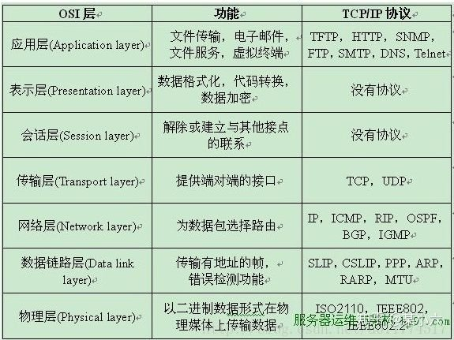

[toc]
# JS
## 说说js数据类型？存储差别？
基本类型主要六种：Number、String、Boolean、Undefind、null、symbol还有一种bigint

引用类型：三种：Object、Array、Function、除了以上三种还有Date、RegExp、Map、Set

区别：基本数据类型存储在栈中，引用类型的对象存储于堆中

## typeof与instanceof
如果我们想要判断一个变量是否存在，可以使用typeof

instanceof 运算符用于检测构造函数的 prototype 属性是否出现在某个实例对象的原型链上

typeof会返回一个变量的基本类型（字符串值），instanceof返回的是一个布尔值

instanceof 可以准确地判断复杂引用数据类型，但是不能正确判断基础数据类型

而typeof 也存在弊端，它虽然可以判断基础数据类型（null 除外），但是引用数据类型中，除了function 类型以外，其他的也无法判断

如果需要通用检测数据类型，可以采用Object.prototype.toString，调用该方法，统一返回格式“[object Xxx]”的字符串

[typeof 与 instanceof 区别](https://vue3js.cn/interview/JavaScript/typeof_instanceof.html#%E4%B8%80%E3%80%81typeof)

[说说JavaScript中的数据类型？存储上的差别？](https://vue3js.cn/interview/JavaScript/data_type.html)
## 数组常用方法
增：Push()、unshift()、splice()、concat()

删：pop()、shift()、splice()、slice()

改：splice()

查：indexOf()、includes()、find()

排序方法：reverse()、sort()

转换方法：join()

迭代方法：some()、every()、forEach()、filter()、map() 、reduce()
## reduce()
1. 介绍
	reduce为数组中的每一个元素依次执行回调函数，不包括数组中被删除或未被赋值的元素，接受四个参数：初始值（或者上一次回调函数的返回值），当前元素值，当前索引，调用reduce的数组。
2. 参数
```javascript
callback （执行数组中每个值的函数，包含四个参数）

    1、previousValue （上一次调用回调返回的值，或者是提供的初始值（initialValue））
    2、currentValue （数组中当前被处理的元素）
    3、index （当前元素在数组中的索引）
    4、array （调用 reduce 的数组）

initialValue （作为第一次调用 callback 的第一个参数。）
```
3. reduce的用法
	1. 计算数组中每个元素出现的次数
	2. 数组去重
	3. 将二维数组转化为一维
	4. 递归将多维数组转化为一维
	5. 对象里的属性求和

[数组的常用方法有哪些？](https://vue3js.cn/interview/JavaScript/array_api.html)

## 字符串常用方法
增：concat()

删：slice()、substr()、substring()

改：trim()、trimLeft()、trimRight()、repeat()、padStart()、padEnd()、toLowerCase()、 toUpperCase()

查：chatAt()、indexOf()、startWith()、includes()

转换方法：split()

模板匹配方法：match()、search()、replace()

[JavaScript字符串的常用方法有哪些？](https://vue3js.cn/interview/JavaScript/string_api.html)
## 类型转换机制
显式转换：Number()、parseInt()、String()、Boolean()

隐式转换：比较运算 \==、!=、>、<）、if、while需要布尔值地方、算术运算（+、-、\*、/、%）

[谈谈 JavaScript 中的类型转换机制](https://vue3js.cn/interview/JavaScript/type_conversion.html)
## == 和 === 区别
相等操作符（\==）会做类型转换，再进行值的比较，全等运算符不会做类型转换，对于Array、Object等高级类型== 与=== 没有区别都是进行指针地址比较，除了在比较对象属性为null或者undefined的情况下，我们可以使用相等操作符（\==），其他情况建议一律使用全等操作符（\=\==）

[== 和 \=\==区别，分别在什么情况使用](https://vue3js.cn/interview/JavaScript/== _===.html)
## 深拷贝和浅拷贝，手写深拷贝
浅拷贝：如果属性是基本类型，拷贝的就是基本类型的值。如果属性是引用类型，拷贝的就是内存地址
```JavaScript
function shallowClone(obj) {
  const newObj = {};
  for (let prop in obj) {
    if (obj.hasOwnProperty(prop)) {
      newObj[prop] = obj[prop];
    }
  }
  return newObj;
}
```

Js中存在浅拷贝的方法：Object.assign、Array.prototype.slice(), Array.prototype.concat()、扩展运算符

深拷贝：深拷贝开辟一个新的栈，两个对象属完成相同，但是对应两个不同的地址，修改一个对象的属性，不会改变另一个对象的属性

深拷贝实现：lodash库的cloneDeep、JQ库中的extend、stringify（会忽略undefined、symbol、函数）、**循环递归**（要能手写实现）
```JavaScript
function deepClone(obj, hash = new WeakMap()) {
if (obj === null) return obj; // 如果是null或者undefined我就不进行拷贝操作
if (obj instanceof Date) return new Date(obj);
if (obj instanceof RegExp) return new RegExp(obj);
// 可能是对象或者普通的值  如果是函数的话是不需要深拷贝
if (typeof obj !== "object") return obj;
// 是对象的话就要进行深拷贝
if (hash.get(obj)) return hash.get(obj);
let cloneObj = new obj.constructor();
// 找到的是所属类原型上的constructor,而原型上的 constructor指向的是当前类本身
hash.set(obj, cloneObj);
for (let key in obj) {
if (obj.hasOwnProperty(key)) {
// 实现一个递归拷贝
cloneObj[key] = deepClone(obj[key], hash);
}
}
return cloneObj;
}
```

[深拷贝浅拷贝的区别？如何实现一个深拷贝？](https://vue3js.cn/interview/JavaScript/copy.html#%E4%B8%80%E3%80%81%E6%95%B0%E6%8D%AE%E7%B1%BB%E5%9E%8B%E5%AD%98%E5%82%A8)
## 闭包
定义：它涉及到`函数`和`作用域`的特性。**闭包**（closure）是一个函数以及其捆绑的周边环境状态（**lexical environment**，**词法环境**）的引用的组合。换而言之，闭包让开发者可以从内部函数访问外部函数的作用域。

词法作用域：词法作用域根据源代码中声明变量的位置来确定该变量在何处可用

形成原理：作用域链，当前作用域可以访问上级作用域中的变量

使用场景：创建私有变量、延长变量的生命周期

例：柯里化函数、闭包模拟私有方法

注意事项：在很多底层代码里可以看到闭包，但是平时开发要正确使用闭包，防止对性能造成影响

具体来说，闭包可以在函数内部创建一个独立的作用域，并且该作用域可以访问函数定义时所在的词法作用域中的变量。这意味着即使外部函数执行完毕，闭包仍然可以访问并保留对这些变量的引用。

闭包的最常见用途之一是创建私有变量。通过使用闭包，可以创建一个函数和其内部变量的封闭空间，外部无法直接访问这些变量，从而实现数据的隐藏和封装。这种特性对于模块化开发和防止变量污染非常有用。

另外，闭包还可以用于创建函数工厂，即返回函数的函数。通过在一个函数内部定义并返回另一个函数，可以捕获并保留该函数所在作用域中的变量，从而实现函数的定制和复用。

需要注意的是，闭包在使用过程中需要注意内存管理，因为闭包会持有对外部变量的引用，可能导致内存泄漏。在不再需要使用闭包时，需要手动释放对外部变量的引用，以便垃圾回收机制可以回收相关的内存。

[说说你对闭包的理解？闭包使用场景](https://vue3js.cn/interview/JavaScript/closure.html#%E4%B8%80%E3%80%81%E6%98%AF%E4%BB%80%E4%B9%88)
## Promise
Promise的作用：Promise是异步微任务，解决了异步多层嵌套回调的问题，让代码的可读性更高，更容易维护。

Promise使用：Promise是ES6提供的一个构造函数，可以使用Promise构造函数new一个实例，Promise构造函数接收一个函数作为参数，这个函数有两个参数，分别是两个函数 `resolve`和`reject`，`resolve`将Promise的状态由等待变为成功，将异步操作的结果作为参数传递过去；`reject`则将状态由等待转变为失败，在异步操作失败时调用，将异步操作报出的错误作为参数传递过去。实例创建完成后，可以使用`then`方法分别指定成功或失败的回调函数，也可以使用catch捕获失败，then和catch最终返回的也是一个Promise，所以可以链式调用。 

Promise的特点： 1. 对象的状态不受外界影响（Promise对象代表一个异步操作，有三种状态）。 - pending（执行中） - Resolved（成功，又称Fulfilled） - rejected（拒绝） 其中pending为初始状态，fulfilled和rejected为结束状态（结束状态表示promise的生命周期已结束）。 2. 一旦状态改变，就不会再变，任何时候都可以得到这个结果。 Promise对象的状态改变，只有两种可能（状态凝固了，就不会再变了，会一直保持这个结果）： - 从Pending变为Resolved - 从Pending变为Rejected 3. resolve 方法的参数是then中回调函数的参数，reject 方法中的参数是catch中的参数 4. then 方法和 catch方法 只要不报错，返回的都是一个fullfilled状态的promise 加分回答 Promise的其他方法： Promise.resolve() :返回的Promise对象状态为fulfilled，并且将该value传递给对应的then方法。 Promise.reject()：返回一个状态为失败的Promise对象，并将给定的失败信息传递给对应的处理方法。 Promise.all()：返回一个新的promise对象，该promise对象在参数对象里所有的promise对象都成功的时候才会触发成功，一旦有任何一个iterable里面的promise对象失败则立即触发该promise对象的失败。 Promise.any()：接收一个Promise对象的集合，当其中的一个 promise 成功，就返回那个成功的promise的值。 Promise.race()：当参数里的任意一个子promise被成功或失败后，父promise马上也会用子promise的成功返回值或失败详情作为参数调用父promise绑定的相应句柄，并返回该promise对象。

## 事件循环EventLoop
JavaScript中的事件循环是一种处理异步代码执行的机制，它确保代码按照正确的顺序执行，并且能够响应用户输入和其他异步事件。事件循环基于单线程的特性，通过`轮询`任务队列来处理事件。
宏任务和微任务的区分是基于它们的执行时机和优先级进行的。
宏任务：
- script(整体代码)
- setTimeout
- setInterval
- setImmediate
- I/O
- UI render
微任务：
- process.nextTick
- Promise
- Async/Await(实际就是promise)
- MutationObserver(html5新特性)
**宏任务的时间粒度比较大，执行的时间间隔是不能精确控制的，对一些高实时性的需求就不太符合**
[说说你对事件循环的理解](https://vue3js.cn/interview/JavaScript/event_loop.html#%E4%B8%80%E3%80%81%E6%98%AF%E4%BB%80%E4%B9%88)

## 作用域
作用域：变量（变量作用域又称上下文）和函数生效（能被访问）的区域或集合

全局作用域：任何不在函数中或是大括号中声明的变量，都是在全局作用域下，全局作用域下声明的变量可以在程序的任意位置访问

函数作用域：函数作用域也叫局部作用域，如果一个变量是在函数内部声明的它就在一个函数作用域下面。这些变量只能在函数内部访问，不能在函数以外去访问

块级作用域：ES6引入了let和const关键字,和var关键字不同，在大括号中使用let和const声明的变量存在于块级作用域中。在大括号之外不能访问这些变量

词法作用域：词法作用域，又叫静态作用域，变量被创建时就确定好了，而非执行阶段确定的。也就是说我们写好代码时它的作用域就确定了，JavaScript 遵循的就是词法作用域

作用域链：当在Javascript中使用一个变量的时候，首先Javascript引擎会尝试在当前作用域下去寻找该变量，如果没找到，再到它的上层作用域寻找，以此类推直到找到该变量或是已经到了全局作用域，如果在全局作用域里仍然找不到该变量，它就会在全局范围内隐式声明该变量(非严格模式下)或是直接报错

[说说你对作用域链的理解](https://vue3js.cn/interview/JavaScript/scope.html#%E4%BA%8C%E3%80%81%E8%AF%8D%E6%B3%95%E4%BD%9C%E7%94%A8%E5%9F%9F)
## 原型、原型链
原型：js常被描述为是一种基于原型的语言，每个对象拥有一个原型对象，当试图访问一个对象的属性时，它不仅仅在该对象上搜寻，还会搜寻该对象的原型，以及该对象的原型的原型，依次层层向上搜索，直到找到一个名字匹配的属性或到达原型链的末尾准确地说，这些属性和方法定义在Object的构造器函数（constructor functions）之上的prototype属性上，而非实例对象本身

Constructor：这个属性指向该函数

Prototype：指向原型

\_\_proto\_\_：实例对象的proto指向构造函数的prototype

[JavaScript原型，原型链 ? 有什么特点？](https://vue3js.cn/interview/JavaScript/prototype.html#%E4%B8%80%E3%80%81%E5%8E%9F%E5%9E%8B)

## 地址栏输入 URL 敲下回车后发生了什么
1. URL解析：浏览器会解析输入的URL，提取出协议、域名、端口号和查询参数等信息
2. DNS解析：浏览器将域名转换为对应的IP地址，以便建立与服务器的连接。浏览器首先会检查缓存中是否有对应的DNS记录，如果没有则进行DNS查询，找到对应的IP地址。
3. 建立TCP连接：使用解析得到的IP地址和端口号，浏览器与服务器建立TCP连接。这个过程通常经过三次握手。
4. 发送HTTP请求：浏览器向服务器发送HTTP请求，请求的内容包括请求方式（GET、POST等）、请求头部（包含浏览器的信息、请求的MIME类型等）以及请求体（对于POST请求）。
5. 服务器处理请求：服务器接收到请求后，会根据请求的路径和参数等信息处理请求。这可能涉及到后端逻辑处理、数据库查询等操作。
6. 接受响应：服务器处理完请求后，会生成响应，包括响应状态码、响应头部和响应体。响应被分为多个数据包发送给浏览器。
7. 渲染页面：浏览器接收到响应数据后，开始解析HTML、并构建DOM树。同时，还会解析CSS样式文件，构建CSSOM树。然后将DOM树和CSSOM树合并成渲染树（Render Tree）。
8. 布局和绘制：浏览器根据渲染树进行布局（计算元素的位置和大小）和绘制（将元素绘制在屏幕上）。
9. 加载其他资源：在渲染过程中，如果遇到外部的CSS文件、JavaScript文件、图像或其他资源，浏览器会发送额外的请求来获取这些资源。
10. 执行Javascript：如果遇到Javascript代码，浏览器会执行相应的Javascript代码。Javascript可以修改DOM树、处理用户交互等。
11. 页面展示：最后，浏览器根据渲染树和布局信息将页面内容显示在用户解面上，完成页面的展示。

[说说地址栏输入 URL 敲下回车后发生了什么?](https://vue3js.cn/interview/http/after_url.html#%E4%B8%80%E3%80%81%E7%AE%80%E5%8D%95%E5%88%86%E6%9E%90)

## 实现继承
es6之前没有extend，使用组合寄生式继承来实现继承，而es6的extend通过babel转换可以看到采用的也是寄生组合继承
```JavaScript
function clone(parent, child) {
  // 这里改用 Object.create 就可以减少组合继承中多进行一次构造的过程
  child.prototype = Object.create(parent.prototype);
  child.prototype.constructor = child;
}

function Parent6() {
  this.name = "parent6";
  this.play = [1, 2, 3];
}

Parent6.prototype.getName = function () {
  return this.name;
};

function Child6() {
  Parent6.call(this);
  this.friends = "child5";
}

clone(Parent6, Child6);

Child6.prototype.getFriends = function () {
  return this.friends;
};

let person6 = new Child6();
console.log(person6); //{friends:"child5",name:"child5",play:[1,2,3],\_\_proto\_\_:Parent6}
console.log(person6.getName()); // parent6
console.log(person6.getFriends()); // child5
```

[Javascript如何实现继承？](https://vue3js.cn/interview/JavaScript/inherit.html#%E4%B8%80%E3%80%81%E6%98%AF%E4%BB%80%E4%B9%88)

## New操作符
new操作符用于创建一个给定构造函数的实例对象

New干了什么

1. <a name="_toc11519"></a><a name="_toc32317"></a>创建一个新的对象obj
1. 将对象与构建函数通过原型链连接起来
1. 将构建函数中的this绑定到新建的对象obj上
1. 根据构建函数返回类型作判断，如果是原始值则被忽略，如果是返回对象，需要正常处理

[说说new操作符具体干了什么？](https://vue3js.cn/interview/JavaScript/new.html#%E4%B8%80%E3%80%81%E6%98%AF%E4%BB%80%E4%B9%88)

## This对象理解
默认绑定：严格模式下，不能将全局对象用于默认绑定，this会绑定到undefined，只有函数运行在非严格模式下，默认绑定才能绑定到全局对象

隐式绑定：this永远指向的是最后调用它的对象，虽然fn是对象b的方法，但是fn赋值给j时候并没有执行，所以最终指向window

显示修改：apply()、call()、bind()是函数的一个方法，作用是改变函数的调用对象。它的第一个参数就表示改变后的调用这个函数的对象。因此，这时this指的就是这第一个参数

New绑定：通过构建函数new关键字生成一个实例对象，此时this指向这个实例对象

箭头函数：在 ES6 的语法中还提供了箭头函语法，让我们在代码书写时就能确定 this 的指向（编译时绑定）

[谈谈this对象的理解](https://vue3js.cn/interview/JavaScript/this.html#%E4%B8%80%E3%80%81%E5%AE%9A%E4%B9%89)

## 执行上下文和执行栈
[JavaScript中执行上下文和执行栈是什么？](https://vue3js.cn/interview/JavaScript/context_stack.html#%E4%B8%80%E3%80%81%E6%89%A7%E8%A1%8C%E4%B8%8A%E4%B8%8B%E6%96%87)

## 防抖和节流
### 防抖
	n 秒后在执行该事件，若在 n 秒内被重复触发，则重新计时
使用场景：
1. **输入框搜索联想：** 当用户在搜索框中输入内容时，防抖可以确保在用户停止输入一段时间后才进行搜索请求。这样可以减少频繁的请求，只在用户完成输入后进行一次请求，减轻服务器负担。
    
2. **窗口大小调整：** 在处理窗口大小调整事件时，防抖可以确保只有用户完成调整窗口大小操作后，才会执行调整相关的操作，避免频繁的重绘和计算。
    
3. **按钮点击避免重复提交：** 当用户频繁点击某个按钮，比如提交订单，防抖可以确保只有用户点击操作完成后，才会执行相应的提交操作，避免重复提交。
    
4. **滚动事件：** 在处理滚动事件时，特别是在实现无限滚动加载更多内容时，防抖可以确保只有用户停止滚动一段时间后，才会触发加载更多的操作，避免不必要的加载请求。

**实现**
~~~JavaScript
function debounce(fn, delay) {
    // 创建timer变量作为闭包中定时器的私有变量
    let timer;
    // 返回执行函数
    return function (...args) {
        // 如果已存在定时器则取消定时器
        if (timer) {
            clearTimeout(timer);
        }
        // 创建定时器
        timer = setTimeout(() => {
            fn.apply(this, args);
        }, delay)
    }
}
~~~
### 节流
	n 秒内只运行一次，若在 n 秒内重复触发，只有一次生效
使用场景：
1. **滚动事件：** 节流可以用于限制滚动事件的触发频率，确保在一定时间间隔内只执行一次滚动事件的处理逻辑，避免过于频繁的操作。
    
2. **鼠标移动：** 当处理鼠标移动事件时，节流可以限制处理函数的执行频率，以免因为鼠标移动过快而导致过多的计算。
    
3. **实时定位：** 在获取用户的实时地理位置信息时，节流可以限制定位请求的频率，避免过多的定位请求对电池寿命和设备性能造成负担。
    
4. **窗口大小调整：** 节流可以用于处理窗口大小调整事件，确保在一定时间内只执行一次相关操作，避免过于频繁的操作。

**实现**
~~~JavaScript
function throttle(fn, delay) {
    // 创建last变量作为闭包的私有变量
    let last = 0;
    // 返回执行函数
    return function (...args) {
        // 获得当前时间
        const now = new Date();
        // 比较当前时间与上一次触发事件事件间隔是否大于delay
        if (now - last > delay) {
            // 更新上一次触发事件的时间
            last = now;
            // 触发事件
            fn.apply(this, args);
        }
    }
}
~~~
- 相同点：
都可以通过使用 setTimeout 实现
目的都是，降低回调执行频率。节省计算资源
- 不同点：
函数防抖，在一段连续操作结束后，处理回调，利用clearTimeout和 setTimeout实现。函数节流，在一段连续操作中，每一段时间只执行一次，频率较高的事件中使用来提高性能。
函数防抖关注一定时间连续触发的事件，只在最后执行一次，而函数节流一段时间内只执行一次。

[什么是防抖和节流？有什么区别？如何实现？](https://vue3js.cn/interview/JavaScript/debounce_throttle.html#%E4%B8%80%E3%80%81%E6%98%AF%E4%BB%80%E4%B9%88)

## 事件模型（冒泡）
事件流：事件捕获阶段(capture phase)、处于目标阶段(target phase)、事件冒泡阶段(bubbling phase)

`focus` 事件不会冒泡

事件模型：
1. 原始事件模型btn.onclick
   1. 只支持冒泡，不支持捕获
   1. 同一个类型的事件只能绑定一次
1. 标准事件模型 btn.adEventListerner
   1. 有捕获、处理、冒泡三个过程
   2. 有一个可选参数capture默认为false，在冒泡阶段
2. IE事件模型attachEvent（很少用）

[说说JavaScript中的事件模型](https://vue3js.cn/interview/JavaScript/event_Model.html#%E4%BA%8C%E3%80%81%E4%BA%8B%E4%BB%B6%E6%A8%A1%E5%9E%8B)

## 事件代理
事件代理：就是把一个元素响应事件（click、keydown......）的函数委托到另一个元素

两个好处：1.减少整个页面所需的内存，提升整体性能2.动态绑定，减少重复工作

局限：1.focus、blur这些事件没有事件冒泡机制，所以无法进行委托绑定事件

2\.mousemove、mouseout这样的事件，虽然有事件冒泡，但是只能不断通过位置去计算定位，对性能消耗高，因此也是不适合于事件委托的

[解释下什么是事件代理？应用场景？](https://vue3js.cn/interview/JavaScript/event_agent.html#%E4%B8%80%E3%80%81%E6%98%AF%E4%BB%80%E4%B9%88)

## 跨域
跨域：当前页面中的某个接口请求的地址和当前页面的地址如果协议、域名、端口其中有一项不同，就说该端口跨域了

跨域的原因：浏览器为了保证网页的安全，出的同源协议策略

解决方案：

1. Cors：目前常用的解决方案，通过设置后端允许跨域实现
```JavaScript
  ctx.set('Access-Control-Allow-Origin', '*');
  ctx.set('Access-Control-Allow-Headers', 'Content-Type, Content-Length, Authorization, Accept, X-Requested-With , yourHeaderFeild');
  ctx.set('Access-Control-Allow-Methods', 'PUT, POST, GET, DELETE, OPTIONS');
```

2. Node中间件、nginx反向代理：跨域限制的时候浏览器不能跨域访问服务器，node中间件和nginx反向代理都是让请求发给代理服务器，静态页面和代理服务器是同源的，然后代理服务器再向后端服务器发请求，服务器和服务器之间不存在同源限制

3. JSONP：利用的原理是是script标签可以跨域请求资源，将回调函数作为参数拼接在url中。后端收到请求，调用该回调函数，并将数据作为参数返回去，注意设置响应头返回文档类型，应该设置成JavaScrit。

4. Postmessage：H5新增API，通过发送和接收API实现跨域通信。

[跨域](https://www.nowcoder.com/exam/interview/detail?questionClassifyId=0&questionId=2412570&questionJobId=156&type=1)

## Cookie、sessionstorage、localStorage区别
存储大小：cookie数据大小不能超过4K，sessionStorage和localStorage可以达到5M或更大

有效时间：localStorage存储持久数据，浏览器关闭后数据不丢失除非主动删除数据

数据与服务器之间的交互方式，cookie的数据会自动传递到服务器，服务器端也可以写cookie到客户端，sessionStorage和localStorage不会自动把数据发给服务器仅在本地保存

应用场景

标记用户与跟踪用户行为的情况，推荐使用cookie

适合长期保存在本地的数据（令牌），推荐使用localStorage

敏感帐号一次性登录，推荐使用sessionStorage

存储大量数据的情况，在线文档（富文本编辑器）保存编辑历史的情况，推荐使用indexedDB

## Apply、bind、call的区别
相同点：

1. 三者都可以改变函数的this对象指向
2. 三者第一个参数都是this要指向的对象，如果如果没有这个参数或参数为undefined或null，则默认指向全局window

不同点：

1. 三者都可以传参，但是apply是数组，而call是参数列表，且apply和call是一次性传入参数，而bind可以分为多次传入
2. bind是返回绑定this之后的函数，apply、call 则是立即执行

[bind、call、apply 区别？如何实现一个bind?](https://vue3js.cn/interview/JavaScript/bind_call_apply.html#%E4%B8%80%E3%80%81%E4%BD%9C%E7%94%A8)

## Web攻击
### XSS
	跨站脚本攻击，允许攻击者将恶意代码植入到提供给其它用户使用的页面中。
**措施**
输入过滤并非完全可靠，我们就要通过“防止浏览器执行恶意代码”来防范 XSS。这部分分为两类：

- 防止 HTML 中出现注入。
- 防止 JavaScript 执行时，执行恶意代码。

- **利用模板引擎** 开启模板引擎自带的 HTML 转义功能。例如： 在 ejs 中，尽量使用 `<%= data %>` 而不是 `<%- data %>`； 在 doT.js 中，尽量使用 `{{! data }` 而不是 `{{= data }`； 在 FreeMarker 中，确保引擎版本高于 2.3.24，并且选择正确的 `freemarker.core.OutputFormat`。
- **避免内联事件** 尽量不要使用 `onLoad="onload('{{data}}')"`、`onClick="go('{{action}}')"` 这种拼接内联事件的写法。在 JavaScript 中通过 `.addEventlistener()` 事件绑定会更安全。
- **避免拼接 HTML** 前端采用拼接 HTML 的方法比较危险，如果框架允许，使用 `createElement`、`setAttribute` 之类的方法实现。或者采用比较成熟的渲染框架，如 Vue/React 等。
- **时刻保持警惕** 在插入位置为 DOM 属性、链接等位置时，要打起精神，严加防范。
- **增加攻击难度，降低攻击后果** 通过 CSP、输入长度配置、接口安全措施等方法，增加攻击的难度，降低攻击的后果。
- **主动检测和发现** 可使用 XSS 攻击字符串和自动扫描工具寻找潜在的 XSS 漏洞。
### CSRF
	跨站请求伪造：攻击者诱导受害者进入第三方网站，在第三方网站中，向被攻击网站发送跨站请求。
**措施**
1. 设置cookie的请求头：设置SameSites属性，它三个值（Strict:跨站时，只有当前网页的URL和请求目标一致才携带cookie；Lax：像a，link，form标签有目标网站的GET请求；None，关闭该属性）
2. 设置Token：服务器端生成token，让前端存储在localstorage或sessionstorage中，之后每次请求都带上，第三方没有token，依此判别。
3. 使用同源限制，禁止第三方网站请求，服务端通过请求头中的Referer和Origin字段，判断请求源。
4. 验证referer头部：Referer 请求头包含了当前请求页面的来源页面的地址，所以我们可以在服务端验证referer字段是否是指定的url。
5. 使用httpOnly禁止document.cookie获取cookie。

### SQL注入
	通过将恶意的 Sql查询或添加语句插入到应用的输入参数中，再在后台 Sql服务器上解析执行进行的攻击。

[web常见的攻击方式有哪些？如何防御？](https://vue3js.cn/interview/JavaScript/security.html#%E4%B8%80%E3%80%81%E6%98%AF%E4%BB%80%E4%B9%88)

## 本地存储
Cookie、SessionStorage、 LocalStorage都是浏览器的本地存储。 

共同点：都是存储在浏览器本地的

它们的区别：
1. 写入方式
cookie是由服务器端写入的，而SessionStorage、 LocalStorage都是由前端写入的。

2. 生命周期
cookie的生命周期是由服务器端在写入的时候就设置好的，LocalStorage是写入就一直存在，除非手动清除，SessionStorage是页面关闭的时候就会自动清除。

3. 存储大小
cookie的存储空间比较小大概4KB，SessionStorage、 LocalStorage存储空间比较大，大概5M。

4. 数据共享
Cookie、SessionStorage、 LocalStorage数据共享都遵循同源原则，SessionStorage还限制必须是同一个页面。

5. 是否携带
在前端给后端发送请求的时候会自动携带Cookie中的数据，但是SessionStorage、 LocalStorage不会

加分回答 由于它们的以上区别，所以它们的应用场景也不同，Cookie一般用于存储登录验证信息SessionID或者token，LocalStorage常用于存储不易变动的数据，减轻服务器的压力，SessionStorage可以用来检测用户是否是刷新进入页面，如音乐播放器恢复播放进度条的功能。

[Javascript本地存储的方式有哪些？区别及应用场景？](https://vue3js.cn/interview/JavaScript/cache.html#%E4%B8%80%E3%80%81%E6%96%B9%E5%BC%8F)

## DOM常见操作
[DOM常见的操作有哪些？](https://vue3js.cn/interview/JavaScript/Dom.html#%E4%BA%8C%E3%80%81%E6%93%8D%E4%BD%9C)
## 常见的BOM对象
window：在浏览器中，window对象有双重角色，即是浏览器窗口的一个接口，又是全局对象，因此所有在全局作用域中声明的变量、函数都会变成window对象的属性和方法.

Location：

Navigator：navigator 对象主要用来获取浏览器的属性，区分浏览器类型。属性较多，且兼容性比较复杂

Screen：保存的纯粹是客户端能力信息，也就是浏览器窗口外面的客户端显示器的信息，比如像素宽度和像素高度

History：history对象主要用来操作浏览器URL的历史记录，可以通过参数向前，向后，或者向指定URL跳转

[说说你对BOM的理解，常见的BOM对象你了解哪些？](https://vue3js.cn/interview/JavaScript/BOM.html#%E4%BA%94%E3%80%81screen)
## 尾递归
尾递归：即在函数尾位置调用自身（或是一个尾调用本身的其他函数等等）。尾递归也是递归的一种特殊情形。尾递归是一种特殊的尾调用，即在尾部直接调用自身的递归函数

[举例说明你对尾递归的理解，有哪些应用场景](https://vue3js.cn/interview/JavaScript/tail_recursion.html#%E4%B8%80%E3%80%81%E9%80%92%E5%BD%92)
## 内存泄漏
垃圾回收：1. 引用计数 2. 标记清除

常见的内存泄露：

1. 意外的全局变量
1. 定时器造成内存泄露
1. 闭包
1. 没有清理DOM元素的引用

[说说 JavaScript 中内存泄漏的几种情况？](https://vue3js.cn/interview/JavaScript/memory_leak.html#%E4%B8%80%E3%80%81%E6%98%AF%E4%BB%80%E4%B9%88)

## Ajax原理及实现
Ajax：异步的JavaScript 和XML，是一种创建交互式网页应用的网页开发技术，可以在不重新加载整个网页的情况下，与服务器交换数据，并且更新部分网页

原理：Ajax的原理简单来说通过XmlHttpRequest对象来向服务器发异步请求，从服务器获得数据，然后用JavaScript来操作DOM而更新页面

步骤

1. 创建 Ajax的核心对象 XMLHttpRequest对象
1. 通过 XMLHttpRequest 对象的 open() 方法与服务端建立连接
1. 构建请求所需的数据内容，并通过XMLHttpRequest 对象的 send() 方法发送给服务器端
1. 通过 XMLHttpRequest 对象提供的 onreadystatechange 事件监听服务器端你的通信状态
1. 接受并处理服务端向客户端响应的数据结果
1. 将处理结果更新到 HTML页面中

[ajax原理是什么？如何实现？](https://vue3js.cn/interview/JavaScript/ajax.html#%E4%B8%80%E3%80%81%E6%98%AF%E4%BB%80%E4%B9%88)

## 精度丢失 | 0.1+0.2 === 0.3
Js使用64位双精度浮点数编码，优点是可以归一化处理整数和小数，节省存储空间，缺点就是小数需要用二进制科学计数法表示小数二进制表示法就会丢失精度，因为会有无限值就像十进制没法表示三分之一样，会造成无限循环，需要舍入操作，再转换为十进制就造成了误差

解决：使用toPrecision凑成并用parseFloat转成数字再显示

[说说 Javascript 数字精度丢失的问题，如何解决？](https://vue3js.cn/interview/JavaScript/loss_accuracy.html)
## 可视区域
[如何判断一个元素是否在可视区域中？](https://vue3js.cn/interview/JavaScript/visible.html#%E4%BA%8C%E3%80%81%E5%AE%9E%E7%8E%B0%E6%96%B9%E5%BC%8F)
## 断点续传
[大文件上传如何做断点续传？](https://vue3js.cn/interview/JavaScript/continue_to_upload.html#%E4%B8%80%E3%80%81%E6%98%AF%E4%BB%80%E4%B9%88)
## 上拉加载
[如何实现上拉加载，下拉刷新？](https://vue3js.cn/interview/JavaScript/pull_up_loading_pull_down_refresh.html)

## 正则表达式
作用：匹配字符串

应用场景：验证帐号密码合法性、对url等进行解析

[说说你对正则表达式的理解？应用场景？](https://vue3js.cn/interview/JavaScript/regexp.html#%E4%B8%80%E3%80%81%E6%98%AF%E4%BB%80%E4%B9%88)

## 单点登录
[什么是单点登录？如何实现？](https://vue3js.cn/interview/JavaScript/single_sign.html#%E4%BA%8C%E3%80%81%E5%A6%82%E4%BD%95%E5%AE%9E%E7%8E%B0)
# Vue
## Vuex
Vuex是集中管理项目公共数据的。

Vuex 有state、mutations 、getters、actions、module属性。 

state 属性用来存储公共管理的数据。 

mutations 属性定义改变state中数据的方法， 注意：不要在mutation中的方法中写异步方法ajax，那样数据就不可跟踪了 。 

getters 属性可以认为是定义 store 的计算属性。就像计算属性一样，getter 的返回值会根据它的依赖被缓存起来，且只有当它的依赖值发生了改变才会被重新计算。 

action属性类似于 mutation，不同在于：Action 提交的是 mutation，而不是直接变更状态。Action 可以包含任意异步操作。 

moudle属性是将store分割成模块。每个模块拥有自己的 state、mutation、action、getter、甚至是嵌套子模块，从上至下进行同样方式的分割

使用方法： state ：直接以对象方式添加属性 mutations ：通过`store.commit`调用 action：通过 `store.dispatch` 方法触发 getters：直接通过store.getters.调用 

加分回答 可以使用mapState、mapMutations、mapAction、mapGetters一次性获取每个属性下对应的多个方法。 VueX在大型项目中比较常用，非关系组件传递数据比较方便。

[vuex](https://www.nowcoder.com/exam/interview/detail?questionClassifyId=0&questionId=2412650&questionJobId=156&type=1)
## 生命周期
- beforeCreate：执行时组件实例还未创建，通常用于插件开发中执行一些**初始化任务**

- created：组件初始化完毕，各种数据可以使用，常用于**异步数据获取**

- beforeMount：未执行渲染、更新、dom未创建

- mounted：初始化结束，dom已创建，可用于**获取访问数据和dom元素**

- beforeUpdate：更新前，可用于获取更新前各种状态

- updated：更新后，所有状态已是最新

- beforeDestroy（vue3：beforeUnmount）：销毁前，可用于一些**定时器或订阅的取消**

- destroyed（vue3：unmounted）：组件已销毁，作用同beforeDestroy

- actived：keep-alive缓存的组件激活时

- deactivated：keep-alive缓存的组件停用时调用

- errorCaptured：捕获一个来自子孙组件的错误时被调用

[请描述下你对vue生命周期的理解？在created和mounted这两个生命周期中请求数据有什么区别呢？](https://vue3js.cn/interview/vue/lifecycle.html#%E4%B8%80%E3%80%81%E7%94%9F%E5%91%BD%E5%91%A8%E6%9C%9F%E6%98%AF%E4%BB%80%E4%B9%88)
## Computed与watch
computed值有缓存、触发条件是依赖值发生更改、 watch无缓存支持异步、监听数据变化

[computed与watch](https://www.nowcoder.com/exam/interview/detail?questionClassifyId=0&questionId=2412594&questionJobId=156&type=1)
## 组件通信


1. 通过 props 传递
2. 通过 $emit 触发自定义事件
3. 使用 ref
4. EventBus
5. $parent 或$root
6. attrs 与 listeners
7. Provide 与 Inject
8. Vuex

[Vue组件之间的通信方式都有哪些？](https://vue3js.cn/interview/vue/communication.html#%E4%B8%80%E3%80%81%E7%BB%84%E4%BB%B6%E9%97%B4%E9%80%9A%E4%BF%A1%E7%9A%84%E6%A6%82%E5%BF%B5)
## 响应式原理
**vue2**
1. Vue 使用 Object.defineProperty() 方法来实现数据劫持。在初始化时，Vue 会递归地遍历数据对象，将每个属性转换为 getter 和 setter，并将其添加到对象中。这样，当访问或修改这些属性时，Vue 就能捕获到，并触发相应的更新。
    
2. 当访问被劫持的属性时，Vue 会收集依赖，并建立一个依赖关系图。每个属性都有一个依赖追踪器（Dep），用于存储依赖于该属性的所有观察者（Watcher）。
    
3. 当属性被修改时，setter 会被调用。setter 会通知依赖追踪器（Dep），告知相关的观察者需要更新。然后，依赖追踪器会遍历所有的观察者，并通知它们执行更新操作。
    
4. 观察者（Watcher）是一个用于更新视图的对象。每个观察者与一个特定的表达式相关联，该表达式定义了它所依赖的数据。当观察者收到更新通知时，它会重新求值表达式，并触发视图的更新。
**vue3**
1. Vue 3 使用 ES6 的 Proxy 对象来实现数据劫持。在初始化时，Vue 会创建一个根级的响应式代理对象，该对象会包裹整个数据对象。当访问或修改数据时，Proxy 会捕获这些操作并进行处理。
2. 当访问被代理对象的属性时，Proxy 会收集依赖并建立一个依赖关系图，类似于 Vue 2 中的依赖追踪器。
3. 当属性被修改时，Proxy 会拦截 setter 操作，并通知相关的观察者进行更新。
4. 观察者（Watcher）在 Vue 3 中被替换为 Reactive Effect。Reactive Effect 是一个用于更新视图的函数，它会被自动执行，并且能够自动追踪依赖。
5. 在 Vue 3 中，我们可以使用 `reactive` 函数将一个普通对象转换为响应式对象。`reactive` 函数会使用 Proxy 对象对对象进行包装，使其成为响应式的。
## 双向数据绑定
1. vue中双向绑定是一个指令`v-model`，可以绑定一个响应式数据到视图，同时视图中变化能改变该值。
2. `v-model`是语法糖，默认情况下相当于`:value`和`@input`。使用`v-model`可以减少大量繁琐的事件处理代码，提高开发效率。
3. 通常在表单项上使用`v-model`，还可以在自定义组件上使用，表示某个值的输入和输出控制。
4. 通过`<input v-model="xxx">`的方式将xxx的值绑定到表单元素value上；对于checkbox，可以使用`true-value`和false-value指定特殊的值，对于radio可以使用value指定特殊的值；对于select可以通过options元素的value设置特殊的值；还可以结合.lazy,.number,.trim对v-mode的行为做进一步限定；`v-model`用在自定义组件上时又会有很大不同，vue3中它类似于`sync`修饰符，最终展开的结果是modelValue属性和update:modelValue事件；vue3中我们甚至可以用参数形式指定多个不同的绑定，例如v-model:foo和v-model:bar，非常强大！
5. `v-model`是一个指令，它的神奇魔法实际上是vue的编译器完成的。我做过测试，包含`v-model`的模板，转换为渲染函数之后，实际上还是是value属性的绑定以及input事件监听，事件回调函数中会做相应变量更新操作。编译器根据表单元素的不同会展开不同的DOM属性和事件对，比如text类型的input和textarea会展开为value和input事件；checkbox和radio类型的input会展开为checked和change事件；select用value作为属性，用change作为事件。
## NextTick
定义：在下次DOM更新循环结束之后执行延迟回调。在修改数据之后立即使用这个方法，获取更新后的DOM。

也就是说Vue在更新DOM时是异步执行的。当数据发生变化，vue将开启一个异步更新队列，视图需要等队列中所有数据变化完成之后，再统一进行更新。

实现原理：

通过事件循环中的宏任务与微任务机制，首先判断当前浏览器是否支持Promise，如果不支持，则降级到判断是否支持MutaionObserver，还不支持就再降级到判断是否支持setImmediate，最后降级使用setTimeout

[Vue中的$nextTick有什么作用？](https://vue3js.cn/interview/vue/nexttick.html#%E4%B8%89%E3%80%81%E5%AE%9E%E7%8E%B0%E5%8E%9F%E7%90%86)
## Axios封装
1. 跨域携带cookie，token，超时设置
2. 请求响应拦截器

- 请求成功，业务状态码200，解析result给我，我不想一层一层的去判断拿数据
- http请求200， 业务状态码非200，说明逻辑判断这是不成功的，那就全局message提示服务端的报错
- http请求非200， 说明http请求都有问题，也全局message提示报错
- http请求或者业务状态码401都做注销操作
  
3. 全局的loading配置, 默认开启，可配置关闭（由于后端的问题，经常会让前端加防抖节流或者loading不让用户在界面上疯狂乱点，行吧行吧，你们的问题前端帮你们解决，你的规矩就是规矩是吧🍜）
4. 统一文件下载处理 （不要再去各写各的下载了，你写一个，他写一个，一个项目就是这样整的跟屎一样）

## Router与route
$route：是一个跳转的路由对象，每一个路由都会有一个$route对象，可以获取当前路由的path，name，params，query等属性

$router：是VueRouter的一个对象，通过Vue.use(VueRouter)和Vue构造函数得到一个router的实例对象，这个对象中是一个全局的对象，他包含了所有的路由，包含了许多关键的对象和属性
## Hash和history
history和hash的差异主要有以下点：

1. history和hash都是利用浏览器的两种特性实现前端路由，history是利用浏览历史记录栈的API实现，hash是监听location对象hash值变化事件来实现
2. history的url没有'#'号，hash反之
3. history修改的url可以是同域的任意url，hash是同文档的url
4. 相同的url，history会触发添加到浏览器历史记录栈中，hash不会触发。
5. history模式下因为vue是SPA单页面应用dist目录只有一个index.html发起请求会报错，对nginx进行配置 try_files $uri $uri/ /index.html;重定向到index.html将路由交给前端处理。
## 按钮权限管理

1. 获取权限码
	使用映射表判断是否有权限再用v-if决定是否显示
2. 组件方式
	使用组件包裹需要权限控制的按钮，该按钮需要的权限码通过value属性传入。
3. 自定义指令
	自定义指令由一个包含类似组件声明周期钩子的对象来定义。钩子函数会接收到指令所绑定元素作为其参数。参数一般包括el和binding。
	[自定义指令 | Vue.js (vuejs.org)](https://cn.vuejs.org/guide/reusability/custom-directives.html#custom-directives)
## keep-alive
- 作用和用法
开发中缓存组件使用keep-alive组件，keep-alive包裹动态组件时会缓存不活动的组件实例，而不销毁它们，防止重复渲染DOM。
使用include白名单、exclude黑名单属性来匹配或排除组件缓存。使用max属性限定最多缓存多少个实例，一旦达到这个数字，新实例被创建之前，会销毁一缓存组件中最久没有被访问的实例（LRU算法）
- 缓存后获取数据
	- 路由守卫beforeRouterEnter
	- actived声明周期钩子
- 原理
它内部定义了一个map，缓存创建过的组件实例，它返回的渲染函数内部会查找内嵌的component组件对应组件的vnode，如果该组件在map中存在就直接返回它。由于component的is属性是个响应式数据，因此只要它变化，keep-alive的render函数就会重新执行。
## mixin与组合式函数对比
mixin缺点
1. 不清晰的数据源：当使用了多个mixin时，实例上的数据属性来自哪个mixin变得不清晰，这使追溯实现和理解组件行为变得困难。
2. 命名空间冲突：多个来自不同的mixin可能会注册相同的属性名，造成命名冲突。若使用组合式函数，我们可以通过结构变量时对变量进行重命名来避免相同的键名。
3. 隐式的跨mixin交流，多个mixin需要依赖共享的谁姓名来进行相互作用，这使得它们隐形的耦合在一起。而一个组合式函数的返回值可以作为另一个组合式函数的参数被传入，像普通函数那样。
## 组合式API
与选项式API对比

- 选项式API：优点：简单，各选项各司其职；缺点：不方便功能复用；功能代码分散维护代码到处跳
- 组合式API：优点
	- 更好的逻辑复用
	- 更灵活的代码组织
	- 更好的类型推导：组合式 API 主要利用基本的变量和函数，它们本身就是类型友好的。
	- 更小的生产包体积：搭配 `<script setup>` 使用组合式 API 比等价情况下的选项式 API 更高效，对代码压缩也更友好。这是由于 `<script setup>` 形式书写的组件模板被编译为了一个内联函数，和 `<script setup>` 中的代码位于同一作用域。不像选项式 API 需要依赖 `this` 上下文对象访问属性，被编译的模板可以直接访问 `<script setup>` 中定义的变量，无需从实例中代理。这对代码压缩更友好，因为本地变量的名字可以被压缩，但对象的属性名则不能。

##  vue2数组更新检测
defineProperty不具有元编程能力，无法检测数组和对象的变化如对象属性的添加或移除，我们可以使用vue.set用于向响应式对象添加响应式属性。使用defineProperty添加新的响应式属性。如果是数组使用变异方法splice来修改数组并触发更新。
**重写方法**
vue2重写了数组的七个改变原数组的方法。重写方法在实现时除了将数组方法名对应的原始方法调用一遍并将执行结果返回外，还通过执行`ob.dep.notify()`将当前数组的变更通知给其订阅者，这样当使用重写后方法改变数组后，数组订阅者会将这边变化更新到页面中。

使用forceupdate进行强制刷新

##  vue2和vue3的diff算法
**Vue2 的核心 Diff 算法采用了双端比较的算法**，同时从新旧 children 的两端开始进行比较，借助 key 值找到可复用的节点，再进行相关操作。相比 React 的 Diff 算法，同样情况下可以减少移动节点次数，减少不必要的性能损耗，更加的优雅。
**Vue3.x 借鉴了 ivi 算法和 inferno 算法**
在创建 VNode 时就确定其类型，以及在 mount/patch 的过程中采用位运算来判断一个 VNode 的类型，在这个基础之上再配合核心的 Diff 算法，使得性能上较 Vue2.x 有了提升。该算法中还运用了动态规划的思想求解最长递归子序列。
**区别**
vue2中的虚拟dom是进行**全量的对比**，在运行时会对所有节点生成一个虚拟节点树，当页面数据发生变更好，会遍历判断虚拟dom所有节点（包括一些不会变化的节点）有没有发生变化；vue3在diff算法中相比vue2增加了静态标记, 在模版编译时，编译器会在动态标签末尾加上 /* Text*/ PatchFlag。**也就是在生成VNode的时候，同时打上标记**，patch 过程中就会判断这个标记来 Diff 优化流程，跳过一些静态节点对比
在 vue2 中是通过对旧节点列表建立一个 { key, oldVnode }的映射表，然后遍历新节点列表的剩余节点，根据newVnode.key在旧映射表中寻找可复用的节点，然后打补丁并且移动到正确的位置。  
  
而在 vue3 中是建立一个存储新节点数组中的剩余节点在旧节点数组上的索引的映射关系数组，建立完成这个数组后也即找到了可复用的节点，然后通过这个数组计算得到最长递增子序列，这个序列中的节点保持不动，然后将新节点数组中的剩余节点移动到正确的位置。

## 组件封装

# HTTP
## http与https
### http协议特点
	http：超文本传输协议，是实现网络通信的一种规范
1. 支持cs模式
2. 简单快速：客户向服务端qi请求服务时，只需传送请求方法和路径。http协议简单使得http服务器的程序规模小，因而通信速度快
3. 灵活：http允许传输任意类型的数据对象。有content-type加以标记
4. 无连接：限制每次连接只处理一个请求，处理完客户的请求并收到客户的应答后即断开连接
5. 无状态：HTTP协议无法根据之前的状态进行本次的请求处理
6. 
### https
	在http协议的基础上加了SSL/TLS协议，通过SSL证书来验证服务器的身份，并为浏览器和服务器之间的通信加密
`SSL`的实现这些功能主要依赖于三种手段：
- 对称加密：采用协商的密钥对数据加密
- 非对称加密：实现身份认证和密钥协商
- 摘要算法：验证信息的完整性
- 数字签名：身份验证

**https连接过程**
![[0e409fc0-b20c-11eb-85f6-6fac77c0c9b3.png]]

**http与https区别**
- HTTPS是HTTP协议的安全版本，HTTP协议的数据传输是明文的，是不安全的，HTTPS使用了SSL/TLS协议进行了加密处理，相对更安全
- HTTP 和 HTTPS 使用连接方式不同，默认端口也不一样，HTTP是80，HTTPS是443
- HTTPS 由于需要设计加密以及多次握手，性能方面不如 HTTP
- HTTPS需要SSL，SSL 证书需要钱，功能越强大的证书费用越高

[什么是HTTP? HTTP 和 HTTPS 的区别?](https://vue3js.cn/interview/http/HTTP_HTTPS.html#%E4%B8%80%E3%80%81http)

[为什么说HTTPS比HTTP安全? HTTPS是如何保证安全的？](https://vue3js.cn/interview/http/HTTPS.html#%E4%B8%80%E3%80%81%E5%AE%89%E5%85%A8%E7%89%B9%E6%80%A7)

## http1.0/1.1/2.0的区别
### 一、HTTP1.0

`HTTP`协议的第二个版本，第一个在通讯中指定版本号的HTTP协议版本

`HTTP 1.0` 浏览器与服务器只保持短暂的连接，每次请求都需要与服务器建立一个`TCP`连接

服务器完成请求处理后立即断开`TCP`连接，服务器不跟踪每个客户也不记录过去的请求

简单来讲，每次与服务器交互，都需要新开一个连接


例如，解析`html`文件，当发现文件中存在资源文件的时候，这时候又创建单独的链接

最终导致，一个`html`文件的访问包含了多次的请求和响应，每次请求都需要创建连接、关系连接

这种形式明显造成了性能上的缺陷

如果需要建立长连接，需要设置一个非标准的Connection字段 `Connection: keep-alive`

### 二、HTTP1.1

在`HTTP1.1`中，默认支持长连接（`Connection: keep-alive`），即在一个TCP连接上可以传送多个`HTTP`请求和响应，减少了建立和关闭连接的消耗和延迟

建立一次连接，多次请求均由这个连接完成


这样，在加载`html`文件的时候，文件中多个请求和响应就可以在一个连接中传输

同时，`HTTP 1.1`还允许客户端不用等待上一次请求结果返回，就可以发出下一次请求，但服务器端必须按照接收到客户端请求的先后顺序依次回送响应结果，以保证客户端能够区分出每次请求的响应内容，这样也显著地减少了整个下载过程所需要的时间

同时，`HTTP1.1`在`HTTP1.0`的基础上，增加更多的请求头和响应头来完善的功能，如下：

- 引入了更多的缓存控制策略，如If-Unmodified-Since, If-Match, If-None-Match等缓存头来控制缓存策略
- 引入range，允许值请求资源某个部分
- 引入host，实现了在一台WEB服务器上可以在同一个IP地址和端口号上使用不同的主机名来创建多个虚拟WEB站点

并且还添加了其他的请求方法：`put`、`delete`、`options`...

### 三、HTTP2.0

而`HTTP2.0`在相比之前版本，性能上有很大的提升，如添加了一个特性：

- 多路复用
- 二进制分帧
- 首部压缩
- 服务器推送

#### 多路复用

`HTTP/2` 复用`TCP`连接，在一个连接里，客户端和浏览器都可以**同时**发送多个请求或回应，而且不用按照顺序一一对应，这样就避免了”队头堵塞”


上图中，可以看到第四步中`css`、`js`资源是同时发送到服务端

#### 二进制分帧

帧是`HTTP2`通信中最小单位信息

`HTTP/2` 采用二进制格式传输数据，而非 `HTTP 1.x`的文本格式，解析起来更高效

将请求和响应数据分割为更小的帧，并且它们采用二进制编码

`HTTP2`中，同域名下所有通信都在单个连接上完成，该连接可以承载任意数量的双向数据流

每个数据流都以消息的形式发送，而消息又由一个或多个帧组成。多个帧之间可以乱序发送，根据帧首部的流标识可以重新组装，这也是多路复用同时发送数据的实现条件

#### 首部压缩
使用HAPCK算法压缩了头部信息
`HTTP/2`在客户端和服务器端使用“首部表”来跟踪和存储之前发送的键值对，对于相同的数据，不再通过每次请求和响应发送

首部表在`HTTP/2`的连接存续期内始终存在，由客户端和服务器共同渐进地更新

例如：下图中的两个请求， 请求一发送了所有的头部字段，第二个请求则只需要发送差异数据，这样可以减少冗余数据，降低开销


#### 服务器推送

`HTTP2`引入服务器推送，允许服务端推送资源给客户端

服务器会顺便把一些客户端需要的资源一起推送到客户端，如在响应一个页面请求中，就可以随同页面的其它资源

免得客户端再次创建连接发送请求到服务器端获取

这种方式非常合适加载静态资源


*服务器推送 VS websocket*
HTTP/2引入了服务器推送，让服务器能够主动地推送资源到客户端缓存。然而它并没有允许推送数据到客户端应用本身。服务器的推送只是由浏览器来处理，并不会让应用代码介入，这也就意味着应用程序无法使用API来获取这些事件的通知。

这里就来到了“服务器发送事件”（Server-Sent Events SSE）的舞台了。SSE是一种让服务器能够在客户端服务器建立连接之后异步推送数据给客户端的机制。这样服务器就可以在数据“块”准备好之后再发送数据。这可以被看成是一种单向的发布订阅模型。多数的现代浏览器也实现了W3C HTML5标准中一个叫做EventSource的标准JavaScript客户端API。那些不支持EventSource API的浏览器，也可以方便地通过填充的方式来获得相应的支持。

由于SSE是基于HTTP的，其天然适配于HTTP/2，这样SSE就可以集两者之长：HTTP/2可以基于[多路复用](https://so.csdn.net/so/search?q=%E5%A4%9A%E8%B7%AF%E5%A4%8D%E7%94%A8&spm=1001.2101.3001.7020)流形成一个高效传输层，同时SSE给应用提供了API使之能够进行推送。

## HTTP3.0
HTTP3.0使用了新的基于UDP的应用层传输协议QUIC协议
*为什么要基于UDP协议？*
- 使用UDP协议可以避免重新部署、更新网络设备和系统
- UDP协议速度快、延迟低
**特性**
1. **多路复用：** 类似于HTTP/2，HTTP/3.0 也支持多路复用，允许在单个连接上同时传输多个数据流。这有助于减少连接建立的开销，提高资源的加载速度。
2. **快速连接建立（0-RTT 和 1-RTT）：** QUIC 支持快速连接建立，其中0-RTT和1-RTT是两个重要的概念。0-RTT 允许在已建立连接的情况下更快地建立新连接，而1-RTT 是正常连接建立所需的往返时间。
3. **连接迁移：** QUIC 允许连接在不同的网络接口之间迁移，例如从Wi-Fi切换到移动数据网络，而不会中断连接。
4. **数据流的重排序：** QUIC 可以重新排序乱序到达的数据流，以最大程度地减少延迟。
5. **减少队头阻塞：** QUIC 在数据流的传输中采用更灵活的拥塞控制机制，有助于减少队头阻塞的影响。
6. **安全性提升：** HTTP/3.0 在协议层面默认启用了加密，这有助于提高通信的安全性和隐私。
## 三次握手四次挥手
### 三次握手
	三次握手（Three-way Handshake）其实就是指建立一个TCP连接时，需要客户端和服务器总共发送3个包，主要作用就是为了确认双方的接收能力和发送能力是否正常、指定自己的初始化序列号为后面的可靠性传送做准备
**过程**
- 第一次握手：客户端给服务端发一个 SYN 报文，并指明客户端的初始化序列号 ISN(c)，此时客户端处于 SYN_SENT 状态
- 第二次握手：服务器收到客户端的 SYN 报文之后，会以自己的 SYN 报文作为应答，为了确认客户端的 SYN，将客户端的 ISN+1作为ACK的值，此时服务器处于 SYN_RCVD 的状态
- 第三次握手：客户端收到 SYN 报文之后，会发送一个 ACK 报文，值为服务器的ISN+1。此时客户端处于 ESTABLISHED 状态。服务器收到 ACK 报文之后，也处于 ESTABLISHED 状态，此时，双方已建立起了连接
### 四次挥手
	服务端在收到客户端断开连接Fin报文后，并不会立即关闭连接，而是先发送一个ACK包先告诉客户端收到关闭连接的请求，只有当服务器的所有报文发送完毕之后，才发送FIN报文断开连接，因此需要四次挥手 
**过程**
- 第一次挥手：客户端发送一个 FIN 报文，报文中会指定一个序列号。此时客户端处于 FIN_WAIT1 状态，停止发送数据，等待服务端的确认
- 第二次挥手：服务端收到 FIN 之后，会发送 ACK 报文，且把客户端的序列号值 +1 作为 ACK 报文的序列号值，表明已经收到客户端的报文了，此时服务端处于 CLOSE_WAIT状态
- 第三次挥手：如果服务端也想断开连接了，和客户端的第一次挥手一样，发给 FIN 报文，且指定一个序列号。此时服务端处于 `LAST_ACK` 的状态
- 第四次挥手：客户端收到 FIN 之后，一样发送一个 ACK 报文作为应答，且把服务端的序列号值 +1 作为自己 ACK 报文的序列号值，此时客户端处于 TIME_WAIT状态。需要过一阵子以确保服务端收到自己的 ACK 报文之后才会进入 CLOSED 状态，服务端收到 ACK 报文之后，就处于关闭连接了，处于 CLOSED 状态
## 常见的状态码
- 1 表示消息
- 2 表示成功
- 3 表示重定向
- 4 表示请求错误
- 5 表示服务器错误
状态码含义200请求成功。

301永久重定向，请求的网页已永久移动到新位置，浏览器会自动重定向到新的 url 地址。

302临时重定向，服务器目前从不同位置的网页响应请求，可使用原有 url 地址。

303查看其它位置，重定向。

304Not Modified，资源未作修改。协商缓存。

305所访问资源必须通过代理访问。

401要求用户要进行身份验证，未登录等情形。

403请求已发出，但服务端禁止访问。

404页面无法找到。

500服务器内部错误。

501服务器不支持请求的功能。

502网关错误，通常需要后端找原因。

503服务器超载或系统维护。

### 详细
#### 1xx

代表请求已被接受，需要继续处理。这类响应是临时响应，只包含状态行和某些可选的响应头信息，并以空行结束

常见的有：

- 100（客户端继续发送请求，这是临时响应）：这个临时响应是用来通知客户端它的部分请求已经被服务器接收，且仍未被拒绝。客户端应当继续发送请求的剩余部分，或者如果请求已经完成，忽略这个响应。服务器必须在请求完成后向客户端发送一个最终响应
- 101：服务器根据客户端的请求切换协议，主要用于websocket或http2升级

#### 2xx

代表请求已成功被服务器接收、理解、并接受

常见的有：

- 200（成功）：请求已成功，请求所希望的响应头或数据体将随此响应返回
    
- 201（已创建）：请求成功并且服务器创建了新的资源
    
- 202（已创建）：服务器已经接收请求，但尚未处理
    
- 203（非授权信息）：服务器已成功处理请求，但返回的信息可能来自另一来源
    
- 204（无内容）：服务器成功处理请求，但没有返回任何内容
    
- 205（重置内容）：服务器成功处理请求，但没有返回任何内容
    
- 206（部分内容）：服务器成功处理了部分请求
    

#### 3xx

表示要完成请求，需要进一步操作。 通常，这些状态代码用来重定向

常见的有：

- 300（多种选择）：针对请求，服务器可执行多种操作。 服务器可根据请求者 (user agent) 选择一项操作，或提供操作列表供请求者选择
    
- 301（永久移动）：请求的网页已永久移动到新位置。 服务器返回此响应（对 GET 或 HEAD 请求的响应）时，会自动将请求者转到新位置
    
- 302（临时移动）： 服务器目前从不同位置的网页响应请求，但请求者应继续使用原有位置来进行以后的请求
    
- 303（查看其他位置）：请求者应当对不同的位置使用单独的 GET 请求来检索响应时，服务器返回此代码
    
- 305 （使用代理）： 请求者只能使用代理访问请求的网页。 如果服务器返回此响应，还表示请求者应使用代理
    
- 307 （临时重定向）： 服务器目前从不同位置的网页响应请求，但请求者应继续使用原有位置来进行以后的请求
    

#### 4xx

代表了客户端看起来可能发生了错误，妨碍了服务器的处理

常见的有：

- 400（错误请求）： 服务器不理解请求的语法
- 401（未授权）： 请求要求身份验证。 对于需要登录的网页，服务器可能返回此响应。
- 403（禁止）： 服务器拒绝请求
- 404（未找到）： 服务器找不到请求的网页
- 405（方法禁用）： 禁用请求中指定的方法
- 406（不接受）： 无法使用请求的内容特性响应请求的网页
- 407（需要代理授权）： 此状态代码与 401（未授权）类似，但指定请求者应当授权使用代理
- 408（请求超时）： 服务器等候请求时发生超时

#### 5xx

表示服务器无法完成明显有效的请求。这类状态码代表了服务器在处理请求的过程中有错误或者异常状态发生

常见的有：

- 500（服务器内部错误）：服务器遇到错误，无法完成请求
- 501（尚未实施）：服务器不具备完成请求的功能。 例如，服务器无法识别请求方法时可能会返回此代码
- 502（错误网关）： 服务器作为网关或代理，从上游服务器收到无效响应
- 503（服务不可用）： 服务器目前无法使用（由于超载或停机维护）
- 504（网关超时）： 服务器作为网关或代理，但是没有及时从上游服务器收到请求
- 505（HTTP 版本不受支持）： 服务器不支持请求中所用的 HTTP 协议版本

[说说HTTP 常见的状态码有哪些，适用场景？](https://vue3js.cn/interview/http/status.html#%E4%BA%8C%E3%80%81%E5%88%86%E7%B1%BB)
## 常见的请求头
[说说 HTTP 常见的请求头有哪些? 作用？](https://vue3js.cn/interview/http/headers.html#%E4%BA%8C%E3%80%81%E5%88%86%E7%B1%BB)
## TCP、UDP
*TCP*（Transmission Control Protocol），传输控制协议，是一种可靠、**面向字节流的通信协议**，把上面应用层交下来的数据看成无结构的字节流来发送

*UDP*（User Datagram Protocol），用户数据包协议，是一个简单的**面向数据报的通信协议**，即对应用层交下来的报文，不合并，不拆分，只是在其上面加上首部后就交给了下面的网络层

**区别**

| | TCP | UDP |
| :----: | :----: | :----: |
|可靠性|可靠|不可靠|
|连接性|面向连接|无连接|
|报文|面向字节流|面向报文|
|效率|传输效率低|传输效率高|
|双共性|全双工|一对一、一对多、多对一、多对多|
|流量控制|滑动窗口|无|
|拥塞控制|慢开始、拥塞避免、快重传、快恢复|无|
|传输效率|慢|快|
 


[如何理解UDP 和 TCP? 区别? 应用场景?](https://vue3js.cn/interview/http/UDP_TCP.html#%E4%B8%80%E3%80%81udp)
## TCP/IP
TCP/IP，**传输控制协议**/**网际协议**，是指能够在多个不同网络间实现信息传输的协议簇

- TCP（传输控制协议）
一种面向连接的、可靠的、基于字节流的传输层通信协议
- IP（网际协议）
用于封包交换数据网络的协议

TCP/IP协议不仅仅指的是`TCP`和`IP`两个协议，而是指一个由`FTP`、`SMTP`、`TCP`、`UDP`、`IP`等协议构成的协议簇，只是因为在`TCP/IP`协议中`TCP`协议和`IP`协议最具代表性，所以通称为TCP/IP协议族（英语：TCP/IP Protocol Suite，或TCP/IP Protocols）

[如何理解TCP/IP协议?](https://vue3js.cn/interview/http/TCP_IP.html)
## GET/POST
`GET`方法请求一个指定资源的表示形式，使用GET的请求应该只被用于获取数据

`POST`方法用于将实体提交到指定的资源，通常导致在服务器上的状态变化或副作用

本质上都是`TCP`链接，并无差别

但是由于`HTTP`的规定和浏览器/服务器的限制，导致他们在应用过程中会体现出一些区别

### 参数长度

`HTTP`协议没有`Body`和 `URL` 的长度限制，对 `URL`限制的大多是浏览器和服务器的原因

`IE`对`URL`长度的限制是2083字节(2K+35)。对于其他浏览器，如Netscape、FireFox等，理论上没有长度限制，其限制取决于操作系统的支持

这里限制的是整个`URL`长度，而不仅仅是参数值的长度

服务器处理长`URL` 要消耗比较多的资源，为了性能和安全考虑，会给 `URL` 长度加限制

### 安全

`POST`比`GET` 安全，因为数据在地址栏上不可见

然而，从传输的角度来说，他们都是不安全的，因为`HTTP` 在网络上是明文传输的，只要在网络节点上捉包，就能完整地获取数据报文

只有使用`HTTPS`才能加密安全

### 数据包

对于`GET`方式的请求，浏览器会把`http header`和`data`一并发送出去，服务器响应200（返回数据）

对于`POST`，浏览器先发送`header`，服务器响应100 `continue`，浏览器再发送`data`，服务器响应200 ok

并不是所有浏览器都会在`POST`中发送两次包，`Firefox`就只发送一次

[说一下 GET 和 POST 的区别？](https://vue3js.cn/interview/http/GET_POST.html#%E4%B8%80%E3%80%81%E6%98%AF%E4%BB%80%E4%B9%88)

## websocket
WebSocket，是一种网络传输协议，位于`OSI`模型的应用层。可在单个`TCP`连接上进行全双工通信，能更好的节省服务器资源和带宽并达到实时通迅

客户端和服务器只需要完成一次握手，两者之间就可以创建持久性的连接，并进行双向数据传输

在`websocket`出现之前，开发实时`web`应用的方式为轮询

**特点**
- 全双工
- 二进制帧
	- 采用了二进制帧结构，语法、语义与 HTTP 完全不兼容，相比`http/2`，`WebSocket`更侧重于“实时通信”，而`HTTP/2` 更侧重于提高传输效率
- 协议名
	- 引入`ws`和`wss`分别代表明文和密文的`websocket`协议，且默认端口使用80或443，几乎与`http`一致
- 握手
`WebSocket`也要有一个握手过程，然后才能正式收发数据

客户端发送数据格式如下：

```http
GET /chat HTTP/1.1
Host: server.example.com
Upgrade: websocket
Connection: Upgrade
Sec-WebSocket-Key: dGhlIHNhbXBsZSBub25jZQ==
Origin: http://example.com
Sec-WebSocket-Protocol: chat, superchat
Sec-WebSocket-Version: 13
```

- Connection：必须设置Upgrade，表示客户端希望连接升级
- Upgrade：必须设置Websocket，表示希望升级到Websocket协议
- Sec-WebSocket-Key：客户端发送的一个 base64 编码的密文，用于简单的认证秘钥。要求服务端必须返回一个对应加密的“Sec-WebSocket-Accept应答，否则客户端会抛出错误，并关闭连接
- Sec-WebSocket-Version ：表示支持的Websocket版本

服务端返回的数据格式：

```http
HTTP/1.1 101 Switching Protocols
Upgrade: websocket
Connection: Upgrade
Sec-WebSocket-Accept: s3pPLMBiTxaQ9kYGzzhZRbK+xOo=Sec-WebSocket-Protocol: chat
```

- HTTP/1.1 101 Switching Protocols：表示服务端接受 WebSocket 协议的客户端连接
- Sec-WebSocket-Accep：验证客户端请求报文，同样也是为了防止误连接。具体做法是把请求头里“Sec-WebSocket-Key”的值，加上一个专用的 UUID，再计算摘要

##  async 与 defer
script 是会阻碍 HTML 解析的，只有下载好并执行完脚本才会继续解析 HTML

defer 和 async有一个共同点：**下载**此类脚本都不会阻止页面呈现（异步加载），区别在于：

1. async 执行与文档顺序无关，先加载哪个就先执行哪个；defer会按照文档中的顺序执行
2. async 脚本加载完成后立即执行，可以在DOM尚未完全下载完成就加载和执行；而defer脚本需要等到文档所有元素解析完成之后才执行

## 取消请求
1. axios: 从 0.22.0 版本开始 axios 不再使用 CancelToken 取消请求，支持使用AbortController取消请求
2. fetch: Fetch API 提供了 AbortController 接口，可以用于取消正在进行中的请求。
3. promise: 
	1. 使用 promise 封装请求手动改变 promise 的状态去阻止请求的响应。
	2. 使用 promise.race 请求时附带一个请求，如果需要取消请求，改变附带的请求的状态即可。

## 浏览器缓存机制
1. 缓存的目的：浏览器缓存机制的主要目的是减少网络请求，提高页面的加载速度和用户体验。通过缓存，浏览器可以避免重复请求相同的资源，从而减少网络传输的事件和带宽消耗。
2. 缓存位置：浏览器缓存分为多个位置，包括：
	- 内存缓存（memory cache）：将资源缓存在内存中，读取速度快，但容量较小，声明周期随着页面关闭而结束。
	- 硬盘缓存（disk cache）：将资源缓存在磁盘中，容量较大，但读取速度相对慢，可以在多次页面访问之间保留缓存。
3. 缓存策略：浏览器缓存根据资源的缓存策略来确定是否使用缓存。常见的缓存策略包括：
	- 强缓存（Expires和Cache-Control）：通过设置响应头部的Expires或Cache-Control字段，告诉浏览器资源的过期时间或缓存时间，如果资源未过期，则直接从缓存中读取，不发送请求。
	- 协商缓存（Last-Modified和Etag）：通过设置响应头部的Last-Modified或ETag字段，告诉浏览器资源的唯一标识符或最后修改时间。浏览器在发送请求时会携带if-Modified-Since或if-None-Match字段，如果资源未改变，则服务器返回304状态码，浏览器从缓存中读取资源。
4. 缓存控制：开发人员可以通过设置响应头部的缓存相关字段来控制缓存的行为，例如：
	- Cache-Control：可以设置缓存的过期时间、是否允许缓存等。
	- Expires：设置资源的过期时间，在过期之前浏览器直接从缓存中读取。
5. 缓存的优化：为了最大程度地利用浏览器缓存，开发人员可以采取以下优化措施：
	- 使用合适的缓存策略，确保静态资源能够被缓存。
	- 版本化静态资源的URL，使其在更新后具有新的URL，避免缓存过期时间过长的问题。
	- 设置适当的缓存头部字段，控制缓存的行为。
	- 考虑使用Content Delivery Network（CDN）来分发静态资源，加速加载
## OSI七层模型

## TCP/IP五层模型


## WebWorker
WebWorker是一种浏览器内置的JavaScript功能，允许在主线程之外创建一个独立的工作线程，以便在后台执行代码，而不会阻塞用户界面的操作。它可以用来执行一些耗时的计算、处理大量数据、执行网络请求等任务，从而改善网页的性能和响应性。

WebWorker的特点包括：

1. **多线程执行：** 传统的JavaScript代码在浏览器中运行在主线程上，而WebWorker允许你创建额外的线程，使得你可以在不干扰主线程的情况下执行代码。
    
2. **独立的全局上下文：** 每个WebWorker都有自己独立的全局上下文，这意味着它们之间不能直接共享变量，因此需要通过消息传递进行通信。
    
3. **消息传递：** WebWorker与主线程之间通过消息进行通信。主线程可以向WebWorker发送消息，WebWorker也可以向主线程发送消息。这种通信方式是异步的，因此不会阻塞主线程。
    
4. **无法访问DOM：** WebWorker的上下文与主线程分离，因此它们无法直接访问DOM元素或操作DOM。这也是为了避免可能的线程竞争和安全问题。
    
5. **不会阻塞用户界面：** 由于WebWorker在后台运行，它不会阻塞用户界面的响应，可以改善用户体验。
    
6. **适用于耗时任务：** WebWorker适用于一些需要耗费较多时间的任务，比如图像处理、数据分析、加密等。
    

WebWorker有两种类型：

1. **Dedicated Web Workers：** 这是最常见的WebWorker类型。每个Dedicated Web Worker与一个特定的脚本文件相关联，它在单独的线程中执行该脚本，并通过消息传递与主线程通信。
    
2. **Shared Web Workers：** 这种类型的WebWorker可以被多个窗口或标签页共享。它们适用于那些需要多个浏览上下文之间共享数据的情况。
    

WebWorker的使用方法包括创建一个新的WebWorker实例、监听消息事件、通过postMessage()方法发送消息以及在WebWorker脚本中监听message事件来接收消息。

然而，需要注意的是，WebWorker并不适用于所有情况，因为它们的使用可能会引入一些复杂性，比如消息传递和同步问题。此外，一些浏览器可能对WebWorker的支持存在差异。

## ServiceWorker
Service Worker是一种在浏览器中运行的脚本，它充当了Web应用程序与浏览器之间的代理服务器，用于管理缓存、网络请求、推送通知等。与Web Worker类似，Service Worker也是在后台运行的，但其主要目的是提供一种可以拦截和处理网络请求的机制，从而使得Web应用程序能够更好地处理离线状态和网络连接不稳定的情况。

以下是Service Worker的一些关键特点和用途：

1. **离线支持：** Service Worker允许Web应用程序在离线状态下继续运行，因为它可以拦截网络请求并从缓存中提供资源，而无需实际的网络连接。这有助于提高应用程序的可用性和响应性。
    
2. **网络请求拦截与缓存：** Service Worker可以拦截所有发往同源页面的网络请求，从而可以将这些请求重定向到缓存中的资源，提供更快的加载速度和更好的性能。开发者可以控制缓存策略，例如缓存首次访问的资源，以便在后续访问时可以更快地加载。
    
3. **推送通知：** Service Worker还支持浏览器推送通知功能，允许Web应用程序在后台向用户发送通知，即使应用程序没有打开。这对于实时更新、提醒和消息通知非常有用。
    
4. **安全性：** Service Worker运行在一个与网页不同的上下文中，这使得它具有一定的安全性，可以防止恶意脚本的攻击。
    
5. **事件驱动：** Service Worker是事件驱动的，它可以在特定的事件发生时被激活，例如在页面加载、网络请求发起等情况下。
    
6. **独立于页面：** Service Worker不直接与页面交互，它可以在页面关闭后继续运行，从而使得它适用于后台处理任务。
    

需要注意的是，由于Service Worker运行在独立的线程中，与普通的JavaScript代码不同，它的生命周期和交互方式也相对复杂。Service Worker必须通过HTTPS协议部署，以确保安全性，因为它们可以拦截和操作网络请求。此外，由于Service Worker可能会影响缓存和网络请求，不正确的使用可能会导致一些问题，如缓存不更新、资源更新延迟等。因此，在使用Service Worker时需要小心谨慎地处理缓存策略和请求拦截。

## WebAsssmemly
WebAssembly（简称Wasm）是一种用于在现代Web浏览器中运行高性能代码的二进制指令格式。它旨在提供一种可移植、高效且安全的方式，使开发者能够在Web平台上运行底层编程语言的代码，如C、C++、Rust等，以实现比传统JavaScript更高的性能。

以下是WebAssembly的一些关键特点和用途：

1. **高性能：** WebAssembly的指令格式经过优化，使得它可以在Web浏览器中以接近原生代码的速度运行。这使得性能要求较高的应用程序，如3D游戏、图像处理和模拟器等，可以在Web平台上获得更好的性能。
    
2. **多语言支持：** WebAssembly不限于JavaScript，它允许开发者使用其他编程语言编写代码，然后将其编译为WebAssembly格式。这使得开发者可以使用熟悉的编程语言来创建Web应用程序，同时获得更好的性能。
    
3. **安全性：** WebAssembly在浏览器中运行，与普通JavaScript代码隔离，因此它提供了一定程度的安全性。WebAssembly代码必须遵循严格的沙箱限制，以防止恶意代码对用户设备和数据的攻击。
    
4. **跨平台：** WebAssembly不仅可以在Web浏览器中运行，还可以在其他支持WebAssembly的平台上运行，如服务器、嵌入式设备等。这使得开发者可以共享代码，并在不同环境中实现一致的行为。
    
5. **低级控制：** WebAssembly允许开发者进行低级别的内存和计算控制，这对于某些特定的任务非常有用，如游戏引擎、密码学等。
    
6. **适用于底层代码：** WebAssembly特别适用于需要高性能、直接内存访问和低级控制的应用，而不适用于大多数标准的Web开发任务。
    

要在WebAssembly中运行代码，开发者通常需要将原始代码（如C、C++）编译为WebAssembly格式。主流的编译工具链，如Emscripten和Rust，可以用于将常见的编程语言编译为WebAssembly。然后，WebAssembly模块可以通过JavaScript代码加载和执行，与Web页面进行交互。

需要注意的是，WebAssembly不是用来替代JavaScript的，而是作为补充，用于处理特定的性能需求。它在Web开发中的应用范围通常是针对性能优化的特定部分。
# CSS
## 水平垂直居中
1. flex布局，display:flex;justify-content:center;align-items:center;
2. 绝对定位＋margin:auto
3. 绝对定位配合transform实现：top:50%;left:50%;transform:translate(-50%,-50%);
##  opacity: 0、visibility: hidden、display: none
1. display: none (不占空间，不能点击)（场景，显示出原来这里不存在的结构）
2. visibility: hidden（占据空间，不能点击）（场景：显示不会导致页面结构发生变动，不会撑开）
3. opacity: 0（占据空间，可以点击）（场景：可以跟transition搭配）

## BFC
`BFC`（Block Formatting Context），即块级格式化上下文，是一块独立的渲染区域，内部元素不会影响外部的元素。

触发条件
- 根元素，即HTML元素
- 设置浮动：float值为left、right
- overflow值不为 visible，为 auto、scroll、hidden
- display的值为inline-block、inltable-cell、table-caption、table、inline-table、flex、inline-flex、grid、inline-grid
- position的值为absolute或fixed

【主要用途】
1、清除内部浮动，父元素设置为BFC可以清除子元素的浮动（最常用overflow:hidden，IE6需加上\*zoom:1）：计算BFC高度时会检测浮动子盒子高度
2、解决外边距合并问题
3、右侧盒子自适应：BFC区域不会与浮动盒子产生交集，而是紧贴浮动边缘
[BFC](https://www.nowcoder.com/exam/interview/detail?questionClassifyId=0&questionId=2412314&questionJobId=156&type=1)

# webpack
## webpack性能优化
页面非常慢性能有问题，本地需要访问查看是否有JS文件加载过久，使用webpack-bundle-analyzer可视化分析项目中用到的包的大小，看到有些包比较大加载比较慢，如富文本编辑器或是dayjs，采取外链的方式引入不进行打包或是需要的时候使用ES6的动态加载。
细节优化：
1. 缩小loader匹配范围：优化loader配置、使用test、include、exclude三个配置项来缩小loaloader的处理范围
2. resolve.modules：用于配置webpack去哪些目录下寻找第三方模块。
3. resolve.extensions：在导入语句没带文件后缀时，webpack会自动带上后缀后，去尝试查找文件是否存在。1. 后缀尝试列表要尽量的小。2. 导入语句尽量带上后缀。
缓存：
- 使用eslint-loader和babel-loader等loader时开启缓存配置或是在loerder数组前加上cache-loader进行缓存，但cache-loader只对loader执行结果有效。
- Webpack5 的持久化缓存功能则尝试将构建结果保存到文件系统中，在下次编译时对比每一个文件的内容哈希或时间戳，未发生变化的文件跳过编译操作，直接使用缓存副本，减少重复计算;发生变更的模块则重新执行编译流程。cache配置type为filesystem、cacheDirectory、buildDependencies、maxage这些。
## 有哪些常见的Loader？你用过那些Loader？
- `raw-loader`：加载文件原始内容（utf-8）
- `file-loader`：把文件输出到一个文件夹中，在代码中通过相对 URL 去引用输出的文件 (处理图片和字体)
- `url-loader`：与 file-loader 类似，区别是用户可以设置一个阈值，大于阈值会交给 file-loader 处理，小于阈值时返回文件 base64 形式编码 (处理图片和字体)
- `babel-loader`：把 ES6 转换成 ES5
- `ts-loader`: 将 TypeScript 转换成 JavaScript
- `sass-loader`：将SCSS/SASS代码转换成CSS
- `css-loader`：加载 CSS，支持模块化、压缩、文件导入等特性
- `style-loader`：把 CSS 代码注入到 JavaScript 中，通过 DOM 操作去加载 CSS
- `postcss-loader`：扩展 CSS 语法，使用下一代 CSS，可以配合 autoprefixer 插件自动补齐 CSS3 前缀
- `i18n-loader`: 国际化
- `cache-loader`: 可以在一些性能开销较大的 Loader 之前添加，目的是将结果缓存到磁盘里

## 有哪些常见的Plugin？你用过那些Plugin？
- `html-webpack-plugin`：简化 HTML 文件创建 (依赖于 html-loader)
- `clean-webpack-plugin`: 目录清理
- `ModuleConcatenationPlugin`: 开启 Scope Hoisting
- `speed-measure-webpack-plugin`: 可以看到每个 Loader 和 Plugin 执行耗时 (整个打包耗时、每个 Plugin 和 Loader 耗时)
- `webpack-bundle-analyzer`: 可视化 Webpack 输出文件的体积 (业务组件、依赖第三方模块)

## 那你再说一说Loader和Plugin的区别？
`Loader` 本质就是一个函数，在该函数中对接收到的内容进行转换，返回转换后的结果。 因为 Webpack 只认识 JavaScript，所以 Loader 就成了翻译官，对其他类型的资源进行转译的预处理工作。

`Plugin` 就是插件，基于事件流框架 `Tapable`，插件可以扩展 Webpack 的功能，在 Webpack 运行的生命周期中会广播出许多事件，Plugin 可以监听这些事件，在合适的时机通过 Webpack 提供的 API 改变输出结果。

**配置**
`Loader` 在 module.rules 中配置，作为模块的解析规则，类型为数组。每一项都是一个 Object，内部包含了 test(类型文件)、loader、options (参数)等属性。

`Plugin` 在 plugins 中单独配置，类型为数组，每一项是一个 Plugin 的实例，参数都通过构造函数传入。

## Webpack构建流程简单说一下
Webpack 的运行流程是一个串行的过程，从启动到结束会依次执行以下流程：

- `初始化参数`：从配置文件和 Shell 语句中读取与合并参数，得出最终的参数
    
- `开始编译`：用上一步得到的参数初始化 Compiler 对象，加载所有配置的插件，执行对象的 run 方法开始执行编译
    
- `确定入口`：根据配置中的 entry 找出所有的入口文件
    
- `编译模块`：从入口文件出发，调用所有配置的 Loader 对模块进行翻译，再找出该模块依赖的模块，再递归本步骤直到所有入口依赖的文件都经过了本步骤的处理
    
- `完成模块编译`：在经过第4步使用 Loader 翻译完所有模块后，得到了每个模块被翻译后的最终内容以及它们之间的依赖关系
    
- `输出资源`：根据入口和模块之间的依赖关系，组装成一个个包含多个模块的 Chunk，再把每个 Chunk 转换成一个单独的文件加入到输出列表，这步是可以修改输出内容的最后机会
    
- `输出完成`：在确定好输出内容后，根据配置确定输出的路径和文件名，把文件内容写入到文件系统

在以上过程中，`Webpack` 会在特定的时间点广播出特定的事件，插件在监听到感兴趣的事件后会执行特定的逻辑，并且插件可以调用 Webpack 提供的 API 改变 Webpack 的运行结果。

简单说

- 初始化：启动构建，读取与合并配置参数，加载 Plugin，实例化 Compiler
    
- 编译：从 Entry 出发，针对每个 Module 串行调用对应的 Loader 去翻译文件的内容，再找到该 Module 依赖的 Module，递归地进行编译处理
    
- 输出：将编译后的 Module 组合成 Chunk，将 Chunk 转换成文件，输出到文件系统中

## source map是什么？生产环境怎么用？
`source map` 是将编译、打包、压缩后的代码映射回源代码的过程。打包压缩后的代码不具备良好的可读性，想要调试源码就需要 soucre map。

map文件只要不打开开发者工具，浏览器是不会加载的。

线上环境一般有三种处理方案：

- `hidden-source-map`：借助第三方错误监控平台 Sentry 使用
    
- `nosources-source-map`：只会显示具体行数以及查看源代码的错误栈。安全性比 sourcemap 高
    
- `sourcemap`：通过 nginx 设置将 .map 文件只对白名单开放(公司内网)

注意：避免在生产中使用 `inline-` 和 `eval-`，因为它们会增加 bundle 体积大小，并降低整体性能。

与 Loader 用于转换特定类型的文件不同，**插件（Plugin）可以贯穿 Webpack 打包的生命周期，执行不同的任务**

# 前端性能优化
## webpack性能优化
页面非常慢性能有问题，本地需要访问查看是否有JS文件加载过久，使用webpack-bundle-analyzer可视化分析项目中用到的包的大小，看到有些包比较大加载比较慢，如富文本编辑器或是dayjs，采取外链的方式引入不进行打包或是需要的时候使用ES6的动态加载。
细节优化：
1. 缩小loader匹配范围：优化loader配置、使用test、include、exclude三个配置项来缩小loaloader的处理范围
2. resolve.modules：用于配置webpack去哪些目录下寻找第三方模块。
3. resolve.extensions：在导入语句没带文件后缀时，webpack会自动带上后缀后，去尝试查找文件是否存在。1. 后缀尝试列表要尽量的小。2. 导入语句尽量带上后缀。
缓存：
- 使用eslint-loader和babel-loader等loader时开启缓存配置或是在loerder数组前加上cache-loader进行缓存，但cache-loader只对loader执行结果有效。
- Webpack5 的持久化缓存功能则尝试将构建结果保存到文件系统中，在下次编译时对比每一个文件的内容哈希或时间戳，未发生变化的文件跳过编译操作，直接使用缓存副本，减少重复计算;发生变更的模块则重新执行编译流程。cache配置type为filesystem、cacheDirectory、buildDependencies、maxage这些。
## vue性能优化
1. v-for添加key
2. 路由懒加载
3. 第三方插件按需引入
4. 合理使用computed和watch
5. v-for的同时避免使用v-if
6. destory时销毁事件：比如addEventListener添加的事件、setTimeout、setInterval、bus.$on绑定的监听事件等 
[前端性能优化 24 条建议](https://segmentfault.com/a/1190000022205291)

# 设计模式
## 工厂模式
	工厂模式（Factory Pattern）：将对象的创建和使用分离，由工厂类负责创建对象并返回。在前端开发中，可以使用工厂模式来动态创建组件。

前端中的工厂模式是一种创建对象的设计模式，它可以让我们封装创建对象的细节，我们使用工厂方法而不是直接调用 new 关键字来创建对象，使得代码更加清晰、简洁和易于维护。在前端开发中，工厂模式通常用于创建多个相似但稍有不同的对象，比如创建一系列具有相同样式和行为的按钮或者表单。
## 单例模式
	单例模式（Singleton Pattern）：保证一个类只有一个实例，并提供一个访问它的全局访问点。在前端开发中，可以使用单例模式来管理全局状态和资源。
	
使用了一个立即执行函数来创建单例对象。在该函数中，定义了一个私有变量 `instance` 用于存储单例实例，而 `init` 函数则是用于创建单例实例的方法。最后，返回一个对象，该对象包含一个 `getInstance` 方法，该方法用于获取单例实例。
## 发布订阅模式
	发布-订阅模式（Publish-Subscribe Pattern）：也叫消息队列模式，它是一种将发布者和订阅者解耦的设计模式。在前端开发中，可以使用发布-订阅模式来实现组件之间的通信。
## 观察者模式
	观察者模式（Observer Pattern）：当对象间存在一对多的关系时，使用观察者模式。当被观察的对象发生变化时，其所有的观察者都会收到通知并进行相应的操作。在JavaScript中，可以使用回调函数或事件监听来实现观察者模式。
## 代理模式
	代理模式（Proxy Pattern）：前端设计模式中的代理模式是一种结构型模式，它允许在不改变原始对象的情况下，通过引入一个代理对象来控制对原始对象的访问。代理对象充当原始对象的中介，客户端与代理对象交互，代理对象再将请求转发给原始对象。

[前端设计模式](https://juejin.cn/post/7223185420157993017#heading-12)
# 算法
## 排序算法

### 冒泡排序

	冒泡排序是一种简单的排序算法。它重复地走访过要排序的数列，一次比较两个元素，如果它们的顺序错误就把它们交换过来。走访数列的工作是重复地进行直到没有再需要交换，也就是说该数列已经排序完成。这个算法的名字由来是因为越小的元素会经由交换慢慢“浮”到数列的顶端。

**实现**

```JavaScript
function bubbleSort(arr) {
  for (let i = 0; i < arr.length; i++) {
    for (let j = 0; j < arr.length - 1 - i; j++) { // 每次循环都会获取一个最大值，排在最后，故循环长度每次减少1
      if (arr[j] > arr[j + 1]) {                   // 相邻元素对比
        // 相邻元素交换
        // const temp = arr[j];
        // arr[j] = arr[j + 1];
        // arr[j + 1] = temp;
        [arr[j], arr[j+1]] = [arr[j+1], arr[j]];
      }
    }
  }
  return arr;
}

```

### 选择排序
	选择排序(Selection-sort)是一种简单直观的排序算法。它的工作原理：首先在未排序序列中找到最小（大）元素，存放到排序序列的起始位置，然后，再从剩余未排序元素中继续寻找最小（大）元素，然后放到已排序序列的末尾。以此类推，直到所有元素均排序完毕。
	
**实现**

~~~JavaScript
function selectionSort(arr) {
  for (let i = 0; i < arr.length - 1; i++) {
    let minIdx = i;
    // 循环查找最小元素
    for(let j = i + 1; j < arr.length; j++) {
      if (arr[i] > arr[j]) {
        minIdx = j; // 记录最小元素下标
      }
    }
    // 若下标不等于i，则找到更小的元素，交换值
    if (minIdx !== i) {
      const temp = arr[minIdx];
      arr[minIdx] = arr[i];
      arr[i] = temp;
    }
  }
  return arr;
}

~~~

### 插入排序
	插入排序（Insertion-Sort）的算法描述是一种简单直观的排序算法。它的工作原理是通过构建有序序列，对于未排序数据，在已排序序列中从后向前扫描，找到相应位置并插入。

**实现**
~~~JavaScript
function insertionSort(arr) {
  // 默认第一项已排序，从第二项开始遍历
  for(let i = 1; i < arr.length; i++) {
    let preIdx = i - 1;                            // 指针，从有序列表最后一项开始
    const current = arr[i];                        // 当前插入项
    while(preIdx >= 0 && current < arr[preIdx]) {  // 边界限定，最多查找到第一项（preIdx === 0），条件 当前插入项 小于 当前比较到的有序列表项
      arr[preIdx + 1] = arr[preIdx];               // 当前比较项后移
      preIdx--;                                    // 指针前移，继续比较
    }
    // 插入项大于比较项，current插入到指针后
    arr[preIdx + 1] = current;
  }
  return arr;
}
~~~

### 希尔排序
	1959年Shell发明，第一个突破O(n2)的排序算法，是简单插入排序的改进版。它与插入排序的不同之处在于，它会优先比较距离较远的元素。希尔排序又叫**缩小增量排序**。希尔排序其实是插入排序的改进，将序列分组然后进行插入排序
**实现**
~~~JavaScript
function shellSort(arr) {
  // 设置增量默认为 arr.length / 2, 依次除2
  for(let gap = Math.floor(arr.length/2); gap > 0; gap = Math.floor(gap/2)) {
    // 注意此处与示意图有所区别，示意图是按照分组逐项对比，而此处则未明确体现分组，直接逐项对比
    for(let i = gap; i < arr.length; i += 1) {
      let preIdx = i - gap; // 初始上一组对应值
      while(preIdx >= 0 && arr[preIdx + 1] < arr[preIdx]) {
        // 若当前项小于前一项（同组），则交换值
        // const temp = arr[preIdx];
        // arr[preIdx] = arr[preIdx + 1];
        // arr[preIdx + 1] = temp;
        [arr[preIdx], arr[preIdx + 1]] = [arr[preIdx + 1], arr[preIdx]];
        // 每次对比结束将上一项前移（一个增量长度【同组】）
        preIdx -= gap;
      }
    }
  }
  return arr;
}
~~~
### 归并排序
	归并排序是建立在归并操作上的一种有效的排序算法。该算法是采用**分治法（Divide and Conquer）**的一个非常典型的应用。将已有序的子序列合并，得到完全有序的序列；即先使每个子序列有序，再使子序列段间有序。若将两个有序表合并成一个有序表，称为**2-路归并**。

**实现**
~~~JavaScript
// 归并算法，（2-路归并）
function merge(left, right){
  const resArr = [];
  while(left.length > 0 || right.length > 0) {
    if (left.length > 0 && right.length > 0) {
      // 因为每个序列都是有序的，所以只比较第一项即可
      if (left[0] > right[0]) {
        // 注意需要用shift将当前项从原序列中取出
        resArr.push(right.shift());
      } else {
        resArr.push(left.shift());
      }
    } else {
      // if (left.length > 0) resArr.push(left.shift());
      // if (right.length > 0) resArr.push(right.shift());
      // 优化，当left或right其一为空时，则可以将另外一组直接插入而无需循环插入，因其已经是有序列表
      if (left.length > 0) resArr.push(...left.splice(0));
      if (right.length > 0) resArr.push(...right.splice(0));
    }
  }
  return resArr;
}

function mergeSort(arr) {
  const len = arr.length;
  if (len < 2) return arr;
  const middle = Math.floor(len / 2);
  const left = arr.slice(0, middle), right = arr.slice(middle);
  return merge(mergeSort(left), mergeSort(right));
}
~~~
### 快速排序
实现的基本思想是：通过一次排序将整个无序表分成相互独立的两部分，其中一部分中的数据都比另一部分中包含的数据的值小，然后继续沿用此方法分别对两部分进行同样的操作，直到每一个小部分不可再分，所得到的整个序列就变成有序序列
**实现**
```JavaScript
function quickSort(arr) {
  const rec = (arr) => {
    if (arr.length <= 1) { return arr; }
    const left = [];
    const right = [];
    const mid = arr[0]; // 基准元素
    for (let i = 1; i < arr.length; i++) {
      if (arr[i] < mid) {
        left.push(arr[i]);
      } else {
        right.push(arr[i]);
      }
    }
    return [...rec(left), mid, ...rec(right)]
  }
  return res(arr)
};
```

### 堆排序
	堆排序（Heapsort）是指利用堆这种数据结构所设计的一种排序算法。堆积是一个近似完全二叉树的结构，并同时满足堆积的性质：即子结点的键值或索引总是小于（或者大于）它的父节点。
~~~JavaScript
/**
 * 处理子堆
 * arr: 待处理序列
 * i: 当前子堆堆顶index
 * len: 限制arr长度
 */
function heapify(arr, i, len) {
  let largestIdx = i;      // 设置最大值的index，默认当前项
  const leftIdx = 2*i+1;   // 左子节点index
  const rightIdx = 2*i+2;  // 右子节点index
  // 当左子节点在排序列表范围内，并且大于最大值，将最大值索引指向左子节点
  if (leftIdx < len && arr[leftIdx] > current) largestIdx = leftIdx;
  if (rightIdx < len && arr[rightIdx] > current) largestIdx = rightIdx;
  // 当最大值索引不为i，则表示最大值改变
  if (largestIdx !== i) {
    // 将最大值移到堆顶
    [arr[largestIdx], arr[i]] = [arr[i], arr[largestIdx]];
    // 由于当前堆改变，将影响到对应子堆，
    heapify(arr, largestIdx, len);
  }
}

// 堆排序
function heapSort(arr) {
  let len = arr.length;
  // 生成大顶堆，Math.ceil(len / 2) - 1 为当前完全二叉树的最后一项非叶子节点，每一个单位二叉树循环调用heapify()
  for (let i = Math.ceil(len / 2) - 1; i >= 0; i--) {
    heapify(arr, i, len);
  }
  console.log('大顶堆：', arr);
  for (let i = Math.ceil(len / 2) - 1; i >= 0; i--) {
    // 每次循环将最后一位（根据len变化）与堆顶元素交换位置，最大值始终插入最后（index = len）至数组有序
    [arr[0], arr[len - 1]] = [arr[len - 1], arr[0]];
    len --; // 每次操作完成，len减1
    heapify(arr, i, len);
  }
  return arr;
}
~~~

### 计数排序
	计数排序不是基于比较的排序算法，其核心在于将输入的数据值转化为键存储在额外开辟的数组空间中。 作为一种线性时间复杂度的排序，计数排序要求输入的数据必须是**有确定范围的正整数**。

**实现**
~~~JavaScript
// 计数排序
function countingSort(arr) {
  const max = Math.max(...arr);
  const len = max + 1; // 设置统计数组长度
  const stack = new Array(len).fill(0); // 新建统计数组并填充0，用统计数组的index对应arr的值，统计数组的value记录该值出现次数
  const countArr = [];
  // 遍历待排序数组，并将对应index的值加一进行数量统计
  for (let i = 0; i < arr.length; i++) {
    stack[arr[i]] ++;
  }
  // 遍历计数数组，根据每一项数量生成新数组
  for (let i = 0; i < len; i++) {
    while(stack[i]) { // 当前项不为0，则将i插入结果数组中，并自减一
      countArr.push(i);
      stack[i] --;
    }
  }
}

// 优化版
function countingSort(arr) {
  const max = Math.max(...arr);
  const min = Math.min(...arr);
  const len = max - min + 1; // 根据最大值和最小值生成计数数组长度
  const stack = new Array(len).fill(0);
  let resIdx = 0; // 记录当前处理的结果数组下标
  for(let i = 0; i < arr.length; i++) {
    stack[arr[i] - min]++; // 因为待排序数组范围为[min ~ max]，但我们的排序数组则为[0 ~ max-min]，所以此处对值进行处理 arr[i] - min 
  }
  for(let i = 0; i < len; i++) {
    while(stack[i] > 0) {
      arr[resIdx] = i + min; // 补偿存储到计数数组中index-min, 此处i + min进行存储
      resIdx ++;
      stack[i]--;
    }
  }
  return arr;
}
~~~

### 桶排序
	桶排序是计数排序的升级版。它利用了函数的映射关系，高效与否的关键就在于这个映射函数的确定。桶排序 (Bucket sort)的工作的原理：假设输入数据服从均匀分布，将数据分到有限数量的桶里，每个桶再分别排序（有可能再使用别的排序算法或是以递归方式继续使用桶排序进行排）。

**实现**
~~~JavaScript
// 冒泡排序
function sort(arr){
  for(let i=0; i<arr.length; i++){
    for(let j=0; j<arr.length - i - 1; j++){
      if (arr[j + 1] < arr[j]) {
        [arr[j], arr[j+1]] = [arr[j+1], arr[j]];
      }
    }
  }
  return arr;
}

// 桶排序，arr：待排序数组；bucketSize：桶接收值范围
function bucketSort(arr, bucketSize = 5) {
  const res = [];
  // let max = arr[0];
  // let min = arr[0];
  // for (let i = 1; i < arr.length; i++) {
  //   if (arr[i] > max) max = arr[i];
  //   if (arr[i] < min) max = arr[i];
  // }
  const max = Math.max(...arr);
  const min = Math.min(...arr);
  // 根据桶的容量范围计算桶数量
  const bucketLen = Math.ceil((max - min) / bucketSize);
  // bug 注意下面的fill()方法有问题
  // const bucket = new Array(bucketLen).fill([]);
  // 构造桶数据
  const bucket = new Array(bucketLen);
  for(let i = 0; i < arr.length; i++) {
    const bucketIdx = Math.floor((arr[i] - min) / bucketSize); // 判断当前值位于第几个桶内
    if (!bucket[bucketIdx]) bucket[bucketIdx] = []; // 空桶设置默认值 []
    bucket[bucketIdx].push(arr[i]);
  }
  for(let i = 0; i < bucket.length; i++) {
    // 每个桶内数据执行排序（无固定要求，此处采用冒泡排序）
    res.push(...sort(bucket[i] || []));
  }
  return res;
}
~~~

### 基数排序
	基数排序是按照低位先排序，然后收集；再按照高位排序，然后再收集；依次类推，直到最高位。有时候有些属性是有优先级顺序的，先按低优先级排序，再按高优先级排序。最后的次序就是高优先级高的在前，高优先级相同的低优先级高的在前。

**实现**
~~~JavaScript
// 基数排序
function radixSort(arr) {
  let dev = 1; // 默认从个位开始排序 1 => 10 => 100 => ... 10^n
  const max = Math.max(...arr);
  // 最大值 / 基数 大于0则表示当前基数在待排数组范围内
  while(max / dev > 0) {
    const mod = dev * 10;
    const countArr = new Array(10); // 创建计数数组，进行排序
    for(let i = 0; i < arr.length; i++) {
      const radix = (arr[i] % mod / dev) | 0; // 当前排序位的值
      if(!countArr[radix]) countArr[radix] = []; // 若当前为空则赋默认空数组
      countArr[radix].push(arr[i]);
    }
    arr = []; // 重置arr，生成新的基数位有序数组
    for(let i = 0; i < countArr.length; i++) {
      while(countArr[i]?.length) {
        // 注意此处从栈底取出，因基数位项有序，要按序取出
        arr.push(countArr[i].shift());
      }
    }
    dev **; // 每次循环结束 dev * 10
  }
  return arr;
}
~~~