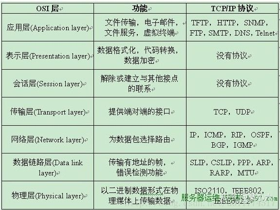

# <a name="_toc31928"></a><a name="_toc28575"></a>**Js面试题**
## <a name="_toc32136"></a><a name="_toc26413"></a>**说说js数据类型？存储差别？**
基本类型主要六种：Number、String、Boolean、Undefind、null、symbol还有一种bigint

引用类型：三种：Object、Array、Function、除了以上三种还有Date、RegExp、Map、Set

区别：基本数据类型存储在栈中，引用类型的对象存储于堆中

[说说JavaScript中的数据类型？存储上的差别？](https://vue3js.cn/interview/JavaScript/data_type.html)
## <a name="_toc10819"></a><a name="_toc13029"></a>**数组常用方法**
增：Push()、unshift()、splice()、concat()

删：pop()、shift()、splice()、slice()

改：splice()

查：indexOf()、includes()、find()

排序方法：reverse()、sort()

转换方法：join()

迭代方法：some()、every()、forEach()、filter()、map() 、reduce()
## reduce()
1. 介绍
	reduce为数组中的每一个元素依次执行回调函数，不包括数组中被删除或未被赋值的元素，接受四个参数：初始值（或者上一次回调函数的返回值），当前元素值，当前索引，调用reduce的数组。
2. 参数
```javascript
callback （执行数组中每个值的函数，包含四个参数）

    1、previousValue （上一次调用回调返回的值，或者是提供的初始值（initialValue））
    2、currentValue （数组中当前被处理的元素）
    3、index （当前元素在数组中的索引）
    4、array （调用 reduce 的数组）

initialValue （作为第一次调用 callback 的第一个参数。）
```
3. reduce的用法
	1. 计算数组中每个元素出现的次数
	2. 数组去重
	3. 将二维数组转化为一维
	4. 递归将多维数组转化为一维
	5. 对象里的属性求和

[数组的常用方法有哪些？](https://vue3js.cn/interview/JavaScript/array_api.html)

## <a name="_toc1341"></a><a name="_toc29896"></a>**字符串常用方法**
增：concat()

删：slice()、substr()、substring()

改：trim()、trimLeft()、trimRight()、repeat()、padStart()、padEnd()、toLowerCase()、 toUpperCase()

查：chatAt()、indexOf()、startWith()、includes()

转换方法：split()

模板匹配方法：match()、search()、replace()

[JavaScript字符串的常用方法有哪些？](https://vue3js.cn/interview/JavaScript/string_api.html)
## <a name="_toc17595"></a><a name="_toc19306"></a>**类型转换机制**
显式转换：Number()、parseInt()、String()、Boolean()

隐式转换：比较运算（==、!=、>、<）、if、while需要布尔值地方、算术运算（+、-、\*、/、%）

[谈谈 JavaScript 中的类型转换机制](https://vue3js.cn/interview/JavaScript/type_conversion.html)
## <a name="_toc31023"></a><a name="_toc4178"></a>**== 和 ===区别**
<a name="_toc20002"></a>相等操作符（==）会做类型转换，再进行值的比较，全等运算符不会做类型转换，对于Array、Object等高级类型==与===没有区别都是进行指针地址比较，除了在比较对象属性为null或者undefined的情况下，我们可以使用相等操作符（==），其他情况建议一律使用全等操作符（===）

[== 和 ===区别，分别在什么情况使用](https://vue3js.cn/interview/JavaScript/== _===.html)
## <a name="_toc31305"></a><a name="_toc5755"></a>**深拷贝和浅拷贝，手写深拷贝**
浅拷贝：如果属性是基本类型，拷贝的就是基本类型的值。如果属性是引用类型，拷贝的就是内存地址

function shallowClone(obj) {

`    `const newObj = {};

`    `for(let prop in obj) {

`        `if(obj.hasOwnProperty(prop)){

`            `newObj[prop] = obj[prop];

`        `}

`    `}

`    `return newObj;

}

Js中存在浅拷贝的方法：Object.assign、Array.prototype.slice(), Array.prototype.concat()、扩展运算符

深拷贝：深拷贝开辟一个新的栈，两个对象属完成相同，但是对应两个不同的地址，修改一个对象的属性，不会改变另一个对象的属性

深拷贝实现：lodash库的cloneDeep、JQ库中的extend、stringify（会忽略undefined、sumbol、函数）、**循环递归**（要能手写实现）

`  `function deepClone(obj, hash = new WeakMap()) {

`    `if (obj === null) return obj; // 如果是null或者undefined我就不进行拷贝操作

`    `if (obj instanceof Date) return new Date(obj);

`    `if (obj instanceof RegExp) return new RegExp(obj);

`    `// 可能是对象或者普通的值  如果是函数的话是不需要深拷贝

`    `if (typeof obj !== "object") return obj;

`    `// 是对象的话就要进行深拷贝

`    `if (hash.get(obj)) return hash.get(obj);

`    `let cloneObj = new obj.constructor();

`    `// 找到的是所属类原型上的constructor,而原型上的 constructor指向的是当前类本身

`    `hash.set(obj, cloneObj);

`    `for (let key in obj) {

`      `if (obj.hasOwnProperty(key)) {

`        `// 实现一个递归拷贝

`        `cloneObj[key] = deepClone(obj[key], hash);

`      `}

`    `}

`    `return cloneObj;

`  `}

[深拷贝浅拷贝的区别？如何实现一个深拷贝？](https://vue3js.cn/interview/JavaScript/copy.html#%E4%B8%80%E3%80%81%E6%95%B0%E6%8D%AE%E7%B1%BB%E5%9E%8B%E5%AD%98%E5%82%A8)
## <a name="_toc5205"></a><a name="_toc25477"></a>**闭包**
定义：它涉及到`函数`和`作用域`的特性。**闭包**（closure）是一个函数以及其捆绑的周边环境状态（**lexical environment**，**词法环境**）的引用的组合。

词法作用域：词法作用域根据源代码中声明变量的位置来确定该变量在何处可用

形成原理：作用域链，当前作用域可以访问上级作用域中的变量

使用场景：创建私有变量、延长变量的生命周期

例：柯里化函数、闭包模拟私有方法

注意事项：在很多底层代码里可以看到闭包，但是平时开发要正确使用闭包，防止对性能造成影响

具体来说，闭包可以在函数内部创建一个独立的作用域，并且该作用域可以访问函数定义时所在的词法作用域中的变量。这意味着即使外部函数执行完毕，闭包仍然可以访问并保留对这些变量的引用。

闭包的最常见用途之一是创建私有变量。通过使用闭包，可以创建一个函数和其内部变量的封闭空间，外部无法直接访问这些变量，从而实现数据的隐藏和封装。这种特性对于模块化开发和防止变量污染非常有用。

另外，闭包还可以用于创建函数工厂，即返回函数的函数。通过在一个函数内部定义并返回另一个函数，可以捕获并保留该函数所在作用域中的变量，从而实现函数的定制和复用。

需要注意的是，闭包在使用过程中需要注意内存管理，因为闭包会持有对外部变量的引用，可能导致内存泄漏。在不再需要使用闭包时，需要手动释放对外部变量的引用，以便垃圾回收机制可以回收相关的内存。

[说说你对闭包的理解？闭包使用场景](https://vue3js.cn/interview/JavaScript/closure.html#%E4%B8%80%E3%80%81%E6%98%AF%E4%BB%80%E4%B9%88)
## <a name="_toc18552"></a><a name="_toc17260"></a>**Promise**
Promise的作用：Promise是异步微任务，解决了异步多层嵌套回调的问题，让代码的可读性更高，更容易维护。

Promise使用：Promise是ES6提供的一个构造函数，可以使用Promise构造函数new一个实例，Promise构造函数接收一个函数作为参数，这个函数有两个参数，分别是两个函数 `resolve`和`reject`，`resolve`将Promise的状态由等待变为成功，将异步操作的结果作为参数传递过去；`reject`则将状态由等待转变为失败，在异步操作失败时调用，将异步操作报出的错误作为参数传递过去。实例创建完成后，可以使用`then`方法分别指定成功或失败的回调函数，也可以使用catch捕获失败，then和catch最终返回的也是一个Promise，所以可以链式调用。 

Promise的特点： 1. 对象的状态不受外界影响（Promise对象代表一个异步操作，有三种状态）。 - pending（执行中） - Resolved（成功，又称Fulfilled） - rejected（拒绝） 其中pending为初始状态，fulfilled和rejected为结束状态（结束状态表示promise的生命周期已结束）。 2. 一旦状态改变，就不会再变，任何时候都可以得到这个结果。 Promise对象的状态改变，只有两种可能（状态凝固了，就不会再变了，会一直保持这个结果）： - 从Pending变为Resolved - 从Pending变为Rejected 3. resolve 方法的参数是then中回调函数的参数，reject 方法中的参数是catch中的参数 4. then 方法和 catch方法 只要不报错，返回的都是一个fullfilled状态的promise 加分回答 Promise的其他方法： Promise.resolve() :返回的Promise对象状态为fulfilled，并且将该value传递给对应的then方法。 Promise.reject()：返回一个状态为失败的Promise对象，并将给定的失败信息传递给对应的处理方法。 Promise.all()：返回一个新的promise对象，该promise对象在参数对象里所有的promise对象都成功的时候才会触发成功，一旦有任何一个iterable里面的promise对象失败则立即触发该promise对象的失败。 Promise.any()：接收一个Promise对象的集合，当其中的一个 promise 成功，就返回那个成功的promise的值。 Promise.race()：当参数里的任意一个子promise被成功或失败后，父promise马上也会用子promise的成功返回值或失败详情作为参数调用父promise绑定的相应句柄，并返回该promise对象。
## <a name="_toc22055"></a><a name="_toc25300"></a>**作用域链**
作用域：变量（变量作用域又称上下文）和函数生效（能被访问）的区域或集合

全局作用域：任何不在函数中或是大括号中声明的变量，都是在全局作用域下，全局作用域下声明的变量可以在程序的任意位置访问

函数作用域：函数作用域也叫局部作用域，如果一个变量是在函数内部声明的它就在一个函数作用域下面。这些变量只能在函数内部访问，不能在函数以外去访问

块级作用域：ES6引入了let和const关键字,和var关键字不同，在大括号中使用let和const声明的变量存在于块级作用域中。在大括号之外不能访问这些变量

词法作用域：词法作用域，又叫静态作用域，变量被创建时就确定好了，而非执行阶段确定的。也就是说我们写好代码时它的作用域就确定了，JavaScript 遵循的就是词法作用域

作用域链：当在Javascript中使用一个变量的时候，首先Javascript引擎会尝试在当前作用域下去寻找该变量，如果没找到，再到它的上层作用域寻找，以此类推直到找到该变量或是已经到了全局作用域，如果在全局作用域里仍然找不到该变量，它就会在全局范围内隐式声明该变量(非严格模式下)或是直接报错

[说说你对作用域链的理解](https://vue3js.cn/interview/JavaScript/scope.html#%E4%BA%8C%E3%80%81%E8%AF%8D%E6%B3%95%E4%BD%9C%E7%94%A8%E5%9F%9F)
## <a name="_toc21829"></a><a name="_toc20852"></a>**原型、原型链**
原型：js常被描述为是一种基于原型的语言，每个对象拥有一个原型对象，当试图访问一个对象的属性时，它不仅仅在该对象上搜寻，还会搜寻该对象的原型，以及该对象的原型的原型，依次层层向上搜索，直到找到一个名字匹配的属性或到达原型链的末尾准确地说，这些属性和方法定义在Object的构造器函数（constructor functions）之上的prototype属性上，而非实例对象本身

Constructor：这个属性指向该函数

Prototype：指向原型

\_\_proto\_\_：实例对象的proto指向构造函数的prototype

[JavaScript原型，原型链 ? 有什么特点？](https://vue3js.cn/interview/JavaScript/prototype.html#%E4%B8%80%E3%80%81%E5%8E%9F%E5%9E%8B)
## <a name="_toc11290"></a><a name="_toc16505"></a>**Js实现继承**
es6之前没有extend，使用组合寄生式继承来实现继承，而es6的extend通过babel转换可以看到采用的也是寄生组合继承

`  `function clone(parent, child) {

`    `// 这里改用 Object.create 就可以减少组合继承中多进行一次构造的过程

`    `child.prototype = Object.create(parent.prototype);

`    `child.prototype.constructor = child;

`  `}

`  `function Parent6() {

`    `this.name = "parent6";

`    `this.play = [1, 2, 3];

`  `}

`  `Parent6.prototype.getName = function () {

`    `return this.name;

`  `};

`  `function Child6() {

`    `Parent6.call(this);

`    `this.friends = "child5";

`  `}

`  `clone(Parent6, Child6);

`  `Child6.prototype.getFriends = function () {

`    `return this.friends;

`  `};

`  `let person6 = new Child6();

`  `console.log(person6); //{friends:"child5",name:"child5",play:[1,2,3],\_\_proto\_\_:Parent6}

`  `console.log(person6.getName()); // parent6

`  `console.log(person6.getFriends()); // child5

[Javascript如何实现继承？](https://vue3js.cn/interview/JavaScript/inherit.html#%E4%B8%80%E3%80%81%E6%98%AF%E4%BB%80%E4%B9%88)
## <a name="_toc7791"></a><a name="_toc1280"></a>**This对象理解**
默认绑定：严格模式下，不能将全局对象用于默认绑定，this会绑定到undefined，只有函数运行在非严格模式下，默认绑定才能绑定到全局对象

隐式绑定：this永远指向的是最后调用它的对象，虽然fn是对象b的方法，但是fn赋值给j时候并没有执行，所以最终指向window

显示修改：apply()、call()、bind()是函数的一个方法，作用是改变函数的调用对象。它的第一个参数就表示改变后的调用这个函数的对象。因此，这时this指的就是这第一个参数

New绑定：通过构建函数new关键字生成一个实例对象，此时this指向这个实例对象

箭头函数：在 ES6 的语法中还提供了箭头函语法，让我们在代码书写时就能确定 this 的指向（编译时绑定）

[谈谈this对象的理解](https://vue3js.cn/interview/JavaScript/this.html#%E4%B8%80%E3%80%81%E5%AE%9A%E4%B9%89)
## <a name="_toc5195"></a><a name="_toc12395"></a>**执行上下文和执行栈**
[JavaScript中执行上下文和执行栈是什么？](https://vue3js.cn/interview/JavaScript/context_stack.html#%E4%B8%80%E3%80%81%E6%89%A7%E8%A1%8C%E4%B8%8A%E4%B8%8B%E6%96%87)
## <a name="_toc12304"></a><a name="_toc16872"></a>**事件模型**
事件流：事件捕获阶段(capture phase)、处于目标阶段(target phase)、事件冒泡阶段(bubbling phase)

事件模型：

1. 原始事件模型btn.onclick
   1. 只支持冒泡，不支持捕获
   1. 同一个类型的事件只能绑定一次
1. 标准事件模型 btn.adEventListerner
   1. 有捕获、处理、冒泡三个过程
1. IE事件模型attachEvent（很少用）

[说说JavaScript中的事件模型](https://vue3js.cn/interview/JavaScript/event_Model.html#%E4%BA%8C%E3%80%81%E4%BA%8B%E4%BB%B6%E6%A8%A1%E5%9E%8B)
## <a name="_toc27208"></a><a name="_toc9411"></a>**Typeof与instanceof**
如果我们想要判断一个变量是否存在，可以使用typeof

instanceof 运算符用于检测构造函数的 prototype 属性是否出现在某个实例对象的原型链上

typeof会返回一个变量的基本类型，instanceof返回的是一个布尔值

instanceof 可以准确地判断复杂引用数据类型，但是不能正确判断基础数据类型

而typeof 也存在弊端，它虽然可以判断基础数据类型（null 除外），但是引用数据类型中，除了function 类型以外，其他的也无法判断

如果需要通用检测数据类型，可以采用Object.prototype.toString，调用该方法，统一返回格式“[object Xxx]”的字符串

[typeof 与 instanceof 区别](https://vue3js.cn/interview/JavaScript/typeof_instanceof.html#%E4%B8%80%E3%80%81typeof)
## <a name="_toc21103"></a><a name="_toc28280"></a>**事件代理**
事件代理：就是把一个元素响应事件（click、keydown......）的函数委托到另一个元素

两个好处：1.减少整个页面所需的内存，提升整体性能2.动态绑定，减少重复工作

局限：1.focus、blur这些事件没有事件冒泡机制，所以无法进行委托绑定事件

2\.mousemove、mouseout这样的事件，虽然有事件冒泡，但是只能不断通过位置去计算定位，对性能消耗高，因此也是不适合于事件委托的

[解释下什么是事件代理？应用场景？](https://vue3js.cn/interview/JavaScript/event_agent.html#%E4%B8%80%E3%80%81%E6%98%AF%E4%BB%80%E4%B9%88)
## <a name="_toc22357"></a><a name="_toc20961"></a>**New操作符**
new操作符用于创建一个给定构造函数的实例对象

New干了什么

1. <a name="_toc11519"></a><a name="_toc32317"></a>创建一个新的对象obj
1. 将对象与构建函数通过原型链连接起来
1. 将构建函数中的this绑定到新建的对象obj上
1. 根据构建函数返回类型作判断，如果是原始值则被忽略，如果是返回对象，需要正常处理

[说说new操作符具体干了什么？](https://vue3js.cn/interview/JavaScript/new.html#%E4%B8%80%E3%80%81%E6%98%AF%E4%BB%80%E4%B9%88)
## <a name="_toc27860"></a>**Ajax原理及实现**
Ajax：异步的JavaScript 和XML，是一种创建交互式网页应用的网页开发技术，可以在不重新加载整个网页的情况下，与服务器交换数据，并且更新部分网页

原理：Ajax的原理简单来说通过XmlHttpRequest对象来向服务器发异步请求，从服务器获得数据，然后用JavaScript来操作DOM而更新页面

步骤

1. 创建 Ajax的核心对象 XMLHttpRequest对象
1. 通过 XMLHttpRequest 对象的 open() 方法与服务端建立连接
1. 构建请求所需的数据内容，并通过XMLHttpRequest 对象的 send() 方法发送给服务器端
1. 通过 XMLHttpRequest 对象提供的 onreadystatechange 事件监听服务器端你的通信状态
1. 接受并处理服务端向客户端响应的数据结果
1. 将处理结果更新到 HTML页面中

[ajax原理是什么？如何实现？](https://vue3js.cn/interview/JavaScript/ajax.html#%E4%B8%80%E3%80%81%E6%98%AF%E4%BB%80%E4%B9%88)
## <a name="_toc8125"></a>**Apply、bind、call的区别**
相同点：

1. <a name="_toc27040"></a><a name="_toc15842"></a>三者都可以改变函数的this对象指向
1. 三者第一个参数都是this要指向的对象，如果如果没有这个参数或参数为undefined或null，则默认指向全局window
1. 不同点：
1. 三者都可以传参，但是apply是数组，而call是参数列表，且apply和call是一次性传入参数，而bind可以分为多次传入
1. bind是返回绑定this之后的函数，apply、call 则是立即执行

[bind、call、apply 区别？如何实现一个bind?](https://vue3js.cn/interview/JavaScript/bind_call_apply.html#%E4%B8%80%E3%80%81%E4%BD%9C%E7%94%A8)
## <a name="_toc26117"></a>**正则表达式**
作用：匹配字符串

应用场景：验证帐号密码合法性、对url等进行解析

[说说你对正则表达式的理解？应用场景？](https://vue3js.cn/interview/JavaScript/regexp.html#%E4%B8%80%E3%80%81%E6%98%AF%E4%BB%80%E4%B9%88)
## <a name="_toc12380"></a>**事件循环EventLoop**
Js是单线程语言，使用事件循环解决单线程阻塞问题

先执行宏任务，遇到异步宏任务先搁置，遇到微任务放入微任务队列，执行同步完宏任务执行微任务，再执行异步宏任务

[说说你对事件循环的理解](https://vue3js.cn/interview/JavaScript/event_loop.html#%E4%B8%80%E3%80%81%E6%98%AF%E4%BB%80%E4%B9%88)
## <a name="_toc27076"></a>**DOM常见操作**
[DOM常见的操作有哪些？](https://vue3js.cn/interview/JavaScript/Dom.html#%E4%BA%8C%E3%80%81%E6%93%8D%E4%BD%9C)
## <a name="_toc4655"></a>**常见的BOM对象**
window：在浏览器中，window对象有双重角色，即是浏览器窗口的一个接口，又是全局对象，因此所有在全局作用域中声明的变量、函数都会变成window对象的属性和方法

Location：

Navigator：navigator 对象主要用来获取浏览器的属性，区分浏览器类型。属性较多，且兼容性比较复杂

Screen：保存的纯粹是客户端能力信息，也就是浏览器窗口外面的客户端显示器的信息，比如像素宽度和像素高度

History：history对象主要用来操作浏览器URL的历史记录，可以通过参数向前，向后，或者向指定URL跳转

[说说你对BOM的理解，常见的BOM对象你了解哪些？](https://vue3js.cn/interview/JavaScript/BOM.html#%E4%BA%94%E3%80%81screen)
## <a name="_toc308"></a>**尾递归**
尾递归：即在函数尾位置调用自身（或是一个尾调用本身的其他函数等等）。尾递归也是递归的一种特殊情形。尾递归是一种特殊的尾调用，即在尾部直接调用自身的递归函数

[举例说明你对尾递归的理解，有哪些应用场景](https://vue3js.cn/interview/JavaScript/tail_recursion.html#%E4%B8%80%E3%80%81%E9%80%92%E5%BD%92)
## <a name="_toc2248"></a>**内存泄漏**
垃圾回收：1. 标记清除 2. 引用计数

常见的内存泄露：

1. 意外的全局变量
1. 定时器造成内存泄露
1. 闭包
1. 没有清理DOM元素的引用

[说说 JavaScript 中内存泄漏的几种情况？](https://vue3js.cn/interview/JavaScript/memory_leak.html#%E4%B8%80%E3%80%81%E6%98%AF%E4%BB%80%E4%B9%88)
## <a name="_toc3028"></a>**本地存储**
Cookie、SessionStorage、 LocalStorage都是浏览器的本地存储。 

共同点：都是存储在浏览器本地的

它们的区别：

写入方式

cookie是由服务器端写入的，而SessionStorage、 LocalStorage都是由前端写入的。

生命周期

cookie的生命周期是由服务器端在写入的时候就设置好的，LocalStorage是写入就一直存在，除非手动清除，SessionStorage是页面关闭的时候就会自动清除。

存储大小

cookie的存储空间比较小大概4KB，SessionStorage、 LocalStorage存储空间比较大，大概5M。

数据共享

Cookie、SessionStorage、 LocalStorage数据共享都遵循同源原则，SessionStorage还限制必须是同一个页面。

是否携带

在前端给后端发送请求的时候会自动携带Cookie中的数据，但是SessionStorage、 LocalStorage不会

加分回答 由于它们的以上区别，所以它们的应用场景也不同，Cookie一般用于存储登录验证信息SessionID或者token，LocalStorage常用于存储不易变动的数据，减轻服务器的压力，SessionStorage可以用来检测用户是否是刷新进入页面，如音乐播放器恢复播放进度条的功能。

[Javascript本地存储的方式有哪些？区别及应用场景？](https://vue3js.cn/interview/JavaScript/cache.html#%E4%B8%80%E3%80%81%E6%96%B9%E5%BC%8F)
## <a name="_toc11844"></a>**精度丢失 | 0.1+0.2 === 0.3**
Js使用64位双精度浮点数编码，优点是可以归一化处理整数和小数，节省存储空间，缺点就是小数需要用二进制科学计数法表示小数二进制表示法就会丢失精度，因为会有无限值就像十进制没法表示三分之一样，会造成无限循环，需要舍入操作，再转换为十进制就造成了误差

解决：使用toPrecision凑成并用parseFloat转成数字再显示

[说说 Javascript 数字精度丢失的问题，如何解决？](https://vue3js.cn/interview/JavaScript/loss_accuracy.html)
## <a name="_toc6505"></a>**防抖和节流**
节流: n 秒内只运行一次，若在 n 秒内重复触发，只有一次生效

防抖: n 秒后在执行该事件，若在 n 秒内被重复触发，则重新计时

相同点：

都可以通过使用 setTimeout 实现

目的都是，降低回调执行频率。节省计算资源

不同点：

函数防抖，在一段连续操作结束后，处理回调，利用clearTimeout和 setTimeout实现。函数节流，在一段连续操作中，每一段时间只执行一次，频率较高的事件中使用来提高性能

函数防抖关注一定时间连续触发的事件，只在最后执行一次，而函数节流一段时间内只执行一次

[什么是防抖和节流？有什么区别？如何实现？](https://vue3js.cn/interview/JavaScript/debounce_throttle.html#%E4%B8%80%E3%80%81%E6%98%AF%E4%BB%80%E4%B9%88)
## <a name="_toc8457"></a>**Web攻击**
1. XSS：跨站脚本攻击，允许攻击者将恶意代码植入到提供给其它用户使用的页面中
1. CSRF：跨站请求伪造：攻击者诱导受害者进入第三方网站，在第三方网站中，向被攻击网站发送跨站请求
1. SQL注入：通过将恶意的 Sql查询或添加语句插入到应用的输入参数中，再在后台 Sql服务器上解析执行进行的攻击

[web常见的攻击方式有哪些？如何防御？](https://vue3js.cn/interview/JavaScript/security.html#%E4%B8%80%E3%80%81%E6%98%AF%E4%BB%80%E4%B9%88)
## <a name="_toc11690"></a>**跨域**
跨域：当前页面中的某个接口请求的地址和当前页面的地址如果协议、域名、端口其中有一项不同，就说该端口跨域了

跨域的原因：浏览器为了保证网页的安全，出的同源协议策略

解决方案：

1. <a name="_toc31439"></a><a name="_toc24889"></a>Cors：目前常用的解决方案，通过设置后端允许跨域实现

res.setHeader('Access-Control-Allow-Origin', '\*');
res.setHeader("Access-Control-Allow-Methods", "GET, PUT, OPTIONS, POST");

1. Node中间件、nginx反向代理：跨域限制的时候浏览器不能跨域访问服务器，node中间件和nginx反向代理都是让请求发给代理服务器，静态页面和代理服务器是同源的，然后代理服务器再向后端服务器发请求，服务器和服务器之间不存在同源限制
1. JSONP：利用的原理是是script标签可以跨域请求资源，将回调函数作为参数拼接在url中。后端收到请求，调用该回调函数，并将数据作为参数返回去，注意设置响应头返回文档类型，应该设置成JavaScript。
1. Postmessage：H5新增API，通过发送和接收API实现跨域通信。

[跨域](https://www.nowcoder.com/exam/interview/detail?questionClassifyId=0&questionId=2412570&questionJobId=156&type=1)
## <a name="_toc11886"></a>**Cookie、sessionstorage、localStorage区别**
存储大小：cookie数据大小不能超过4K，sessionStorage和localStorage可以达到5M或更大

有效时间：localStorage存储持久数据，浏览器关闭后数据不丢失除非主动删除数据

数据与服务器之间的交互方式，cookie的数据会自动传递到服务器，服务器端也可以写cookie到客户端，sessionStorage和localStorage不会自动把数据发给服务器仅在本地保存

应用场景

标记用户与跟踪用户行为的情况，推荐使用cookie

适合长期保存在本地的数据（令牌），推荐使用localStorage

敏感帐号一次性登录，推荐使用sessionStorage

存储大量数据的情况，在线文档（富文本编辑器）保存编辑历史的情况，推荐使用indexedDB

## <a name="_toc29336"></a>**可视区域**
[如何判断一个元素是否在可视区域中？](https://vue3js.cn/interview/JavaScript/visible.html#%E4%BA%8C%E3%80%81%E5%AE%9E%E7%8E%B0%E6%96%B9%E5%BC%8F)
## <a name="_toc14444"></a>**断点续传**
[大文件上传如何做断点续传？](https://vue3js.cn/interview/JavaScript/continue_to_upload.html#%E4%B8%80%E3%80%81%E6%98%AF%E4%BB%80%E4%B9%88)
## <a name="_toc12006"></a>**上拉加载**
[如何实现上拉加载，下拉刷新？](https://vue3js.cn/interview/JavaScript/pull_up_loading_pull_down_refresh.html)
## <a name="_toc14021"></a>**单点登录**
[什么是单点登录？如何实现？](https://vue3js.cn/interview/JavaScript/single_sign.html#%E4%BA%8C%E3%80%81%E5%A6%82%E4%BD%95%E5%AE%9E%E7%8E%B0)
# <a name="_toc21431"></a><a name="_toc12860"></a>**Vue面试题**
## <a name="_toc15331"></a>**Vuex**
Vuex是集中管理项目公共数据的。

Vuex 有state、mutations 、getters、actions、module属性。 

state 属性用来存储公共管理的数据。 

mutations 属性定义改变state中数据的方法， 注意：不要在mutation中的方法中写异步方法ajax，那样数据就不可跟踪了 。 

getters 属性可以认为是定义 store 的计算属性。就像计算属性一样，getter 的返回值会根据它的依赖被缓存起来，且只有当它的依赖值发生了改变才会被重新计算。 

action属性类似于 mutation，不同在于：Action 提交的是 mutation，而不是直接变更状态。Action 可以包含任意异步操作。 

moudle属性是将store分割成模块。每个模块拥有自己的 state、mutation、action、getter、甚至是嵌套子模块，从上至下进行同样方式的分割 

使用方法： state ：直接以对象方式添加属性 mutations ：通过`store.commit`调用 action：通过 `store.dispatch` 方法触发 getters：直接通过store.getters.调用 

加分回答 可以使用mapState、mapMutations、mapAction、mapGetters一次性获取每个属性下对应的多个方法。 VueX在大型项目中比较常用，非关系组件传递数据比较方便。

[vuex](https://www.nowcoder.com/exam/interview/detail?questionClassifyId=0&questionId=2412650&questionJobId=156&type=1)
## <a name="_toc28746"></a>**生命周期**
\- beforeCreate：执行时组件实例还未创建，通常用于插件开发中执行一些**初始化任务**

\- created：组件初始化完毕，各种数据可以使用，常用于**异步数据获取**

\- beforeMount：未执行渲染、更新、dom未创建

\- mounted：初始化结束，dom已创建，可用于**获取访问数据和dom元素**

\- beforeUpdate：更新前，可用于获取更新前各种状态

\- updated：更新后，所有状态已是最新

\- beforeDestroy：销毁前，可用于一些**定时器或订阅的取消**

\- destroyed：组件已销毁，作用同beforeDestroy

\- actived：keep-alive缓存的组件激活时

\- deactivated：keep-alive缓存的组件停用时调用

\- errorCaptured：捕获一个来自子孙组件的错误时被调用

[请描述下你对vue生命周期的理解？在created和mounted这两个生命周期中请求数据有什么区别呢？](https://vue3js.cn/interview/vue/lifecycle.html#%E4%B8%80%E3%80%81%E7%94%9F%E5%91%BD%E5%91%A8%E6%9C%9F%E6%98%AF%E4%BB%80%E4%B9%88)
## <a name="_toc20099"></a>**Computed与watch**
computed值有缓存、触发条件是依赖值发生更改、 watch无缓存支持异步、监听数据变化

[computed与watch](https://www.nowcoder.com/exam/interview/detail?questionClassifyId=0&questionId=2412594&questionJobId=156&type=1)
## <a name="_toc15097"></a>**组件通信**


1. 通过 props 传递
1. 通过 $emit 触发自定义事件
1. 使用 ref
1. EventBus
1. $parent 或$root
1. attrs 与 listeners
1. Provide 与 Inject
1. Vuex

[Vue组件之间的通信方式都有哪些？](https://vue3js.cn/interview/vue/communication.html#%E4%B8%80%E3%80%81%E7%BB%84%E4%BB%B6%E9%97%B4%E9%80%9A%E4%BF%A1%E7%9A%84%E6%A6%82%E5%BF%B5)
## **响应式原理**
**vue2**
1. Vue 使用 Object.defineProperty() 方法来实现数据劫持。在初始化时，Vue 会递归地遍历数据对象，将每个属性转换为 getter 和 setter，并将其添加到对象中。这样，当访问或修改这些属性时，Vue 就能捕获到，并触发相应的更新。
    
2. 当访问被劫持的属性时，Vue 会收集依赖，并建立一个依赖关系图。每个属性都有一个依赖追踪器（Dep），用于存储依赖于该属性的所有观察者（Watcher）。
    
3. 当属性被修改时，setter 会被调用。setter 会通知依赖追踪器（Dep），告知相关的观察者需要更新。然后，依赖追踪器会遍历所有的观察者，并通知它们执行更新操作。
    
4. 观察者（Watcher）是一个用于更新视图的对象。每个观察者与一个特定的表达式相关联，该表达式定义了它所依赖的数据。当观察者收到更新通知时，它会重新求值表达式，并触发视图的更新。
**vue3**
1. Vue 3 使用 ES6 的 Proxy 对象来实现数据劫持。在初始化时，Vue 会创建一个根级的响应式代理对象，该对象会包裹整个数据对象。当访问或修改数据时，Proxy 会捕获这些操作并进行处理。
2. 当访问被代理对象的属性时，Proxy 会收集依赖并建立一个依赖关系图，类似于 Vue 2 中的依赖追踪器。
3. 当属性被修改时，Proxy 会拦截 setter 操作，并通知相关的观察者进行更新。
4. 观察者（Watcher）在 Vue 3 中被替换为 Reactive Effect。Reactive Effect 是一个用于更新视图的函数，它会被自动执行，并且能够自动追踪依赖。
5. 在 Vue 3 中，我们可以使用 `reactive` 函数将一个普通对象转换为响应式对象。`reactive` 函数会使用 Proxy 对象对对象进行包装，使其成为响应式的。
无虚拟DOM不适用
## <a name="_toc13284"></a>**双向数据绑定**
MVVM模型

ViewModel

主要职责

数据变化后更新视图

视图变化后更新数据

两个重要组成部分

监听器（Observer）：对所有数据的属性进行监听

解析器（Compiler）：对每个元素节点的指令进行扫描跟解析，根据指令摸板替换数据以及绑定相应的跟新函数

名词解释

Obsever：用来劫持并监听所有属性，如果有变动的，就通知订阅者。

实现：通过递归方法遍历所有属性值，并对其进行Object.defineProperty()处理

Watcher：可以收到属性的变化通知并执行相应的函数，从而更新视图。 

Compile：可以扫描和解析每个节点的相关指令，并根据初始化摸板数据以及初始化相应的订阅器。
## <a name="_toc21294"></a>**NextTick**
定义：在下次DOM更新循环结束之后执行延迟回调。在修改数据之后立即使用这个方法，获取更新后的DOM。

也就是说Vue在更新DOM时是异步执行的。当数据发生变化，vue将开启一个异步更新队列，视图需要等队列中所有数据变化完成之后，再统一进行更新。

实现原理：

通过事件循环中的宏任务与微任务机制，首先判断当前浏览器是否支持Promise，如果不支持，则降级到判断是否支持MutaionObserver，还不支持就再降级到判断是否支持setImmediate，最后降级使用setTimeout

[Vue中的$nextTick有什么作用？](https://vue3js.cn/interview/vue/nexttick.html#%E4%B8%89%E3%80%81%E5%AE%9E%E7%8E%B0%E5%8E%9F%E7%90%86)
## <a name="_toc18530"></a>**Axios**
axios 是一个轻量的 HTTP客户端

基于 XMLHttpRequest 服务来执行 HTTP 请求，支持丰富的配置，支持 Promise，支持浏览器端和 Node.js 端。自Vue2.0起，尤大宣布取消对 vue-resource 的官方推荐，转而推荐 axios。现在 axios 已经成为大部分 Vue 开发者的首选

特性

从浏览器中创建 XMLHttpRequests

从 node.js 创建 http请求

支持 Promise API

拦截请求和响应

转换请求数据和响应数据

取消请求

自动转换JSON 数据

客户端支持防御XSRF

为什么要封装axios

axios 的 API 很友好，你完全可以很轻松地在项目中直接使用。

不过随着项目规模增大，如果每发起一次HTTP请求，就要把这些比如设置超时时间、设置请求头、根据项目环境判断使用哪个请求地址、错误处理等等操作，都需要写一遍

这种重复劳动不仅浪费时间，而且让代码变得冗余不堪，难以维护。为了提高我们的代码质量，我们应该在项目中二次封装一下 axios 再使用
## <a name="_toc23556"></a>**Router与route**
$route：是一个跳转的路由对象，每一个路由都会有一个$route对象，可以获取当前路由的path，name，params，query等属性

$router：是VueRouter的一个对象，通过Vue.use(VueRouter)和Vue构造函数得到一个router的实例对象，这个对象中是一个全局的对象，他包含了所有的路由，包含了许多关键的对象和属性
## <a name="_toc16911"></a>**Hash和history**
history和hash的差异主要有以下点：

1\.history和hash都是利用浏览器的两种特性实现前端路由，history是利用浏览历史记录栈的API实现，hash是监听location对象hash值变化事件来实现

2\.history的url没有'#'号，hash反之

3\.history修改的url可以是同域的任意url，hash是同文档的url

4\.相同的url，history会触发添加到浏览器历史记录栈中，hash不会触发。
## **按钮权限管理**

1. 获取权限码
	使用映射表判断是否有权限再用v-if决定是否显示
2. 组件方式
	使用组件包裹需要权限控制的按钮，该按钮需要的权限码通过value属性传入。
3. 自定义指令
	自定义指令由一个包含类似组件声明周期钩子的对象来定义。钩子函数会接收到指令所绑定元素作为其参数。参数一般包括el和binding。
	[自定义指令 | Vue.js (vuejs.org)](https://cn.vuejs.org/guide/reusability/custom-directives.html#custom-directives)
## **keep-alive**
- 作用和用法
开发中缓存组件使用keep-alive组件，keep-alive包裹动态组件时会缓存不活动的组件实例，而不销毁它们，防止重复渲染DOM。
使用include白名单、exclude黑名单属性来匹配或排除组件缓存。使用max属性限定最多缓存多少个实例，一旦达到这个数字，新实例被创建之前，会销毁一缓存组件中最久没有被访问的实例（LRU算法）
- 缓存后获取数据
	- 路由守卫beforeRouterEnter
	- actived声明周期钩子
- 原理
它内部定义了一个map，缓存创建过的组件实例，它返回的渲染函数内部会查找内嵌的component组件对应组件的vnode，如果该组件在map中存在就直接返回它。由于component的is属性是个响应式数据，因此只要它变化，keep-alive的render函数就会重新执行。
## **mixin与组合式函数对比**
mixin缺点
1. 不清晰的数据源：当使用了多个mixin时，实例上的数据属性来自哪个mixin变得不清晰，这使追溯实现和理解组件行为变得困难。
2. 命名空间冲突：多个来自不同的mixin可能会注册相同的属性名，造成命名冲突。若使用组合式函数，我们可以通过结构变量时对变量进行重命名来避免相同的键名。
3. 隐式的跨mixin交流，多个mixin需要依赖共享的谁姓名来进行相互作用，这使得它们隐形的耦合在一起。而一个组合式函数的返回值可以作为另一个组合式函数的参数被传入，像普通函数那样。
## **组合式API**
与选项式API对比
- 选项式API：优点：简单，各选项各司其职；缺点：不方便功能复用；功能代码分散维护代码到处跳
- 组合式API：优点
	- 更好的逻辑复用
	- 更灵活的代码组织
	- 更好的类型推导：组合式 API 主要利用基本的变量和函数，它们本身就是类型友好的。
	- 更小的生产包体积：搭配 `<script setup>` 使用组合式 API 比等价情况下的选项式 API 更高效，对代码压缩也更友好。这是由于 `<script setup>` 形式书写的组件模板被编译为了一个内联函数，和 `<script setup>` 中的代码位于同一作用域。不像选项式 API 需要依赖 `this` 上下文对象访问属性，被编译的模板可以直接访问 `<script setup>` 中定义的变量，无需从实例中代理。这对代码压缩更友好，因为本地变量的名字可以被压缩，但对象的属性名则不能。

# <a name="_toc19066"></a><a name="_toc32005"></a>**http面试题**
## <a name="_toc21777"></a>**http与https**
http：超文本传输协议，是实现网络通信的一种规范

**特点**

1. <a name="_toc2016"></a><a name="_toc406"></a>支持cs模式
1. 简单快速：客户向服务端qi请求服务时，只需传送请求方法和路径。http协议简单使得http服务器的程序规模小，因而通信速度快
1. 灵活：http允许传输任意类型的数据对象。有content-type加以标记
1. 无连接：限制每次连接只处理一个请求，处理完客户的请求并收到客户的应答后即断开连接
1. <a name="_toc14393"></a><a name="_toc12221"></a>无状态：HTTP协议无法根据之前的状态进行本次的请求处理

https：在http协议的基础上加了SSL/TLS协议，通过SSL证书来验证服务器的身份，并为浏览器和服务器之间的通信加密

**区别**

HTTPS是HTTP协议的安全版本，HTTP协议的数据传输是明文的，是不安全的，HTTPS使用了SSL/TLS协议进行了加密处理，相对更安全

HTTP 和 HTTPS 使用连接方式不同，默认端口也不一样，HTTP是80，HTTPS是443

HTTPS 由于需要设计加密以及多次握手，性能方面不如 HTTP

HTTPS需要SSL，SSL 证书需要钱，功能越强大的证书费用越高

[什么是HTTP? HTTP 和 HTTPS 的区别?](https://vue3js.cn/interview/http/HTTP_HTTPS.html#%E4%B8%80%E3%80%81http)

[](https://vue3js.cn/interview/http/HTTP_HTTPS.html#%E4%B8%80%E3%80%81http)[为什么说HTTPS比HTTP安全? HTTPS是如何保证安全的？](https://vue3js.cn/interview/http/HTTPS.html#%E4%B8%80%E3%80%81%E5%AE%89%E5%85%A8%E7%89%B9%E6%80%A7)

<a name="_toc21783"></a>**三次握手四次挥手
四次挥手原因**
----------------------------------
服务端在收到客户端断开连接Fin报文后，并不会立即关闭连接，而是先发送一个ACK包先告诉客户端收到关闭连接的请求，只有当服务器的所有报文发送完毕之后，才发送FIN报文断开连接，因此需要四次挥手

## <a name="_toc13518"></a>**http1.0/1.1/2.0的区别**
HTTP1.0：浏览器与服务器只保持短暂的连接，浏览器的每次请求都需要与服务器建立一个TCP连接。

HTTP1.1：

1. 引入了持久连接，TCP连接默认不关闭，可以被多个请求复用，客户端也可以发送多个请求，但是TCP连接里数据通信是同步的，只有处理完一个请求才会接着处理下一个请求。
1. 新增了一些请求方法
1. 新增了一些请求头和响应头

http2.0:

1. 采用了二进制格式而非文本格式
1. 完全多路复用，而非有序并阻塞的、只需一个连接即可实现并行
1. 使用报头压缩，降低开销
1. 服务器推送
## <a name="_toc18630"></a>**常见的状态码**
1表示消息

2表示成功

3表示重定向

4表示请求错误

5表示服务器错误

状态码含义200请求成功。

301永久重定向，请求的网页已永久移动到新位置，浏览器会自动重定向到新的 url 地址。

302临时重定向，服务器目前从不同位置的网页响应请求，可使用原有 url 地址。

303查看其它位置，重定向。

304Not Modified，资源未作修改。协商缓存。

305所访问资源必须通过代理访问。

401要求用户要进行身份验证，未登录等情形。

403请求已发出，但服务端禁止访问。

404页面无法找到。

500服务器内部错误。

501服务器不支持请求的功能。

502网关错误，通常需要后端找原因。

503服务器超载或系统维护。

[说说HTTP 常见的状态码有哪些，适用场景？](https://vue3js.cn/interview/http/status.html#%E4%BA%8C%E3%80%81%E5%88%86%E7%B1%BB)
## <a name="_toc19507"></a>**常见的请求头**
[说说 HTTP 常见的请求头有哪些? 作用？](https://vue3js.cn/interview/http/headers.html#%E4%BA%8C%E3%80%81%E5%88%86%E7%B1%BB)
## <a name="_toc14814"></a>**TCP、UDP**
TCP：传输控制协议

UDP：用户数据包协议

区别：TCP有连接，UDP无连接

[如何理解UDP 和 TCP? 区别? 应用场景?](https://vue3js.cn/interview/http/UDP_TCP.html#%E4%B8%80%E3%80%81udp)
## <a name="_toc10039"></a>**TCP/IP**

[如何理解TCP/IP协议?](https://vue3js.cn/interview/http/TCP_IP.html)
## <a name="_toc8589"></a>**GET/POST**
GET方法请求一个指定资源的表示形式，使用GET的请求应该只被用于获取数据

POST方法用于将实体提交到指定的资源，通常导致在服务器上的状态变化或副作用

**参数长度**：浏览器和服务器会对URL长度进行限制

**安全**：post比get安全，因为数据在地址栏上不可见，从传输的角度来看一样不安全，因为http在网络上是明文传输的，只要在网络节点上抓包就能获取数据报文

**数据包**：对于GET方式的请求，浏览器会把http header和data一并发送出去，服务器响应200（返回数据）

对于POST，浏览器先发送header，服务器响应100 continue，浏览器再发送data，服务器响应200 ok

[说一下 GET 和 POST 的区别？](https://vue3js.cn/interview/http/GET_POST.html#%E4%B8%80%E3%80%81%E6%98%AF%E4%BB%80%E4%B9%88)
## <a name="_toc31516"></a>**地址栏敲下URL**
1. <a name="_toc9648"></a><a name="_toc15552"></a>URL解析

首先判断你输入的是一个合法的URL 还是一个待搜索的关键词，并且根据你输入的内容进行对应操作

1. <a name="_toc16615"></a><a name="_toc3421"></a>DNS查询

将域名翻译为IP地址

1. <a name="_toc18418"></a><a name="_toc14468"></a>TCP连接

建立TCP连接

1. <a name="_toc1846"></a><a name="_toc24125"></a>HTTP请求

发送请求

1. 响应请求
1. 页面渲染

解析HTML，构建 DOM 树

解析 CSS ，生成 CSS 规则树

合并 DOM 树和 CSS 规则，生成 render 树

布局 render 树（ Layout / reflow ），负责各元素尺寸、位置的计算

绘制 render 树（ paint ），绘制页面像素信息

浏览器会将各层的信息发送给 GPU，GPU 会将各层合成（ composite ），显示在屏幕上

[说说地址栏输入 URL 敲下回车后发生了什么?](https://vue3js.cn/interview/http/after_url.html#%E4%B8%80%E3%80%81%E7%AE%80%E5%8D%95%E5%88%86%E6%9E%90)
## <a name="_toc1695"></a>**OSI七层模型**

## <a name="_toc29211"></a>**TCP/IP五层模型**


# <a name="_toc10050"></a><a name="_toc11759"></a>**CSS面试题**
## <a name="_toc3403"></a>**BFC**
定义：块级格式上下文，它是一个独立的渲染区域，规定了内部的元素如何布局，且与这个区域外部毫不相干。

触发条件

1. <a name="_toc19870"></a><a name="_toc15856"></a>内部的盒子会在垂直方向上一个接一个的放置。
1. 对于同一个BFC的两个相邻的盒子的margin会发生重叠，与方向无关。
1. 每个元素的左外边距与包含块的左边界相接触（从左到右），即使浮动元素也是如此。
1. BFC的区域不会与float的元素区域重叠。
1. 计算BFC的高度时，浮动子元素也参与计算。
1. BFC就是页面上的一个隔离的独立容器，容器里面的子元素不会影响到外面的元素。

应用场景

1. 自适应两栏布局
1. 可以阻止元素被浮动元素覆盖
1. 防止margin重叠
1. 清除内部浮动
## <a name="_toc27814"></a><a name="_toc9316"></a>**BFC**
【什么情况下可以让元素产生BFC】
1、float属性不为none
2、position为absolute或fixed
3、display为inline-block、table-cell、table-caption、flex、inline-flex
4、overflow不为visible

【BFC元素具有的特性】
1、在BFC中，盒子从顶部开始垂直地一个接一个排列
2、盒子垂直方向的距离由margin决定。同一个BFC的两个相邻盒子margin会重叠
3、BFC中，margin-left会触碰到border-left（对于从左至右的方式，反之）
4、BFC区域不会与浮动的盒子产生交集，而是紧贴边缘浮动
5、计算BFC高度时，自然会检测浮动的盒子高度

【主要用途】
1、清除内部浮动，父元素设置为BFC可以清除子元素的浮动（最常用overflow:hidden，IE6需加上\*zoom:1）：计算BFC高度时会检测浮动子盒子高度
2、解决外边距合并问题
3、右侧盒子自适应：BFC区域不会与浮动盒子产生交集，而是紧贴浮动边缘

[BFC](https://www.nowcoder.com/exam/interview/detail?questionClassifyId=0&questionId=2412314&questionJobId=156&type=1)
# <a name="_toc12933"></a><a name="_toc15867"></a>**杂项**
# <a name="_toc16602"></a><a name="_toc4963"></a>**前端性能优化**


[前端性能优化 24 条建议](https://segmentfault.com/a/1190000022205291)
# <a name="_toc13348"></a><a name="_toc30949"></a>**算法**
## <a name="_toc26136"></a><a name="_toc4452"></a>**快排**
实现的基本思想是：通过一次排序将整个无序表分成相互独立的两部分，其中一部分中的数据都比另一部分中包含的数据的值小

然后继续沿用此方法分别对两部分进行同样的操作，直到每一个小部分不可再分，所得到的整个序列就变成有序序列

function quickSort (arr) {

`  `const rec = (arr) => {

`    `if (arr.length <= 1) { return arr; }

`    `const left = [];

`    `const right = [];

`    `const mid = arr[0]; // 基准元素

`    `for (let i = 1; i < arr.length; i++){

`      `if (arr[i] < mid) {

`        `left.push(arr[i]);

`      `} else {

`        `right.push(arr[i]);

`      `}

`    `}

`    `return [...rec(left), mid, ...rec(right)]

`  `}

`  `return res(arr)

};

